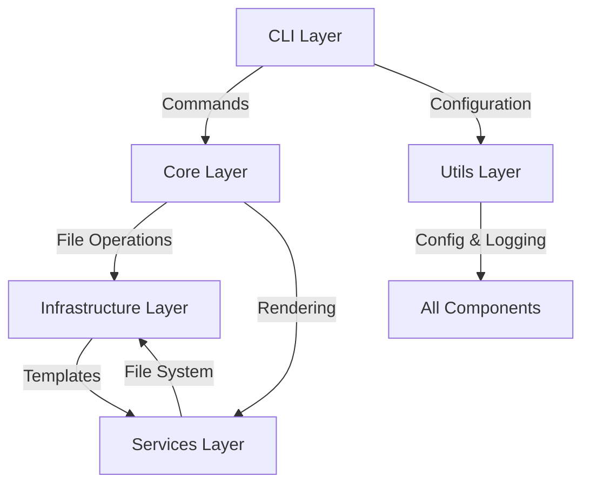

# CodeWrangler Architecture Documentation

## Table of Contents

- [Overview](#overview)
- [Architectural Principles](#architectural-principles)
- [Branching Strategy](#branching-strategy)
- [Core Components](#core-components)
- [Design Patterns](#design-patterns)
- [Data Flow](#data-flow)
- [Extension Points](#extension-points)
- [Configuration](#configuration)
- [Getting Started for Contributors](#getting-started-for-contributors)
- [Next Steps](#next-steps)

## Overview

CodeWrangler is a TypeScript-based library designed to generate documentation from code repositories using regex patterns. It employs a modular architecture that separates concerns into distinct layers, making it both maintainable and extensible.

## Architectural Principles

The library follows several key architectural principles:

- **Separation of Concerns**: Each major component has a specific responsibility and is isolated in its own module.
- **Open/Closed Principle**: The system is open for extension but closed for modification, particularly in the rendering strategies.
- **Dependency Injection**: Components receive their dependencies through constructor injection, promoting loose coupling.
- **Single Responsibility**: Each class has a single, well-defined purpose within the system.

## Test Driven Development

Test Driven Development is a core principle in the development of CodeWrangler:

- The library is designed to be highly testable, with a focus on:
  - Unit testing
  - Integration testing
- Each class has its own dedicated test file that:
  - Contains the test cases for that class
  - Is located in the `__tests__` folder
  - Uses the same name as the class file with `.test.ts` extension

## Branching Strategy

- The library uses a feature-based branching strategy.
- Each feature should have its own branch.
- The main branch is protected and requires a code review before merging.

- `feature/*`: Feature development branches
- `main`: Protected branch for stable releases

## Core Components

### Component Architecture Diagram



### Layer Responsibility

### 1. CLI Layer

**Purpose:** Provides the command-line interface for the library

**Key Components:**

- **CodeWrangler:** Main entry point and command orchestrator
- **ProgramBuilder:** Constructs the CLI program with all available commands
- **GenerateCommand:** Handles document generation requests

### 2. Core Layer

**Purpose:** Contains the domain models and core business logic

**Key Components:**

- **NodeBase:** Abstract base class for file system nodes
- **NodeFile:** Represents file entities
- **NodeDirectory:** Represents directory entities
- **Error Handlers:** Specialized error types for different scenarios

### 3. Infrastructure Layer

**Purpose:** Handles external system interactions and provides core services

**Key Components:**

- **DocumentFactory:** Manages file system operations
- **Template:** Handles template loading and rendering
- **Data validation schemas:** Using Zod for schema validation

### 4. Services Layer

**Purpose:** Implements business logic and processing algorithms

**Key Components:**

- **DocumentTreeBuilder:** Constructs the document tree representation
- **FileTreeBuilder:** Builds the file system tree
- **RenderStrategy:** Abstract rendering strategy
- **Rendering Implementations:** Concrete implementations for different formats

### 5. Utils Layer

**Purpose:** Provides cross-cutting concerns and utilities

**Key Components:**

- **Config:** Configuration management system
- **Logger:** Logging service
- **Common Utilities:** Helper functions and shared utilities

## Design Patterns

The library implements several design patterns to solve common architectural challenges:

### 1. Strategy Pattern

Used in the rendering system to allow different output formats:

```typescript
classDiagram
    class RenderStrategy {
        <<interface>>
        +renderFile()
        +renderDirectory()
        +loadTemplates()
    }
    RenderStrategy <|-- MarkdownStrategy
    RenderStrategy <|-- HTMLStrategy
```

### 2. Factory Pattern

Implemented in DocumentFactory to handle file system operations:

```typescript
classDiagram
    class DocumentFactory {
        +static create()
        +static readFile()
        +static writeFile()
        +static getStats()
    }
```

### 3. Singleton Pattern

Used in configuration and logging services:

```typescript
classDiagram
    class Config {
        -static instance: Config
        +static load()
        -constructor()
    }
```

## Data Flow

The typical data flow through the system follows these steps:

1. Command Initialization

   - CLI parses command-line arguments
   - Configuration is loaded and validated

2. Tree Building

   - File system is scanned based on provided patterns
   - Document tree is constructed from file system nodes

3. Processing

   - Templates are loaded and validated
   - Content is processed according to file types

4. Rendering
   - Appropriate rendering strategy is selected
   - Output is generated in the requested format

## Extension Points

The library provides several extension points for customization:

### Rendering Strategies

- Create new strategies by implementing the RenderStrategy interface
- Add support for new output formats

### Template System

- Custom template definitions
- New template types and schemas

### Command System

- Additional CLI commands
- New command options and flags

## Configuration

The system is configured through multiple layers:

- Default Configuration: Built-in defaults for all settings
- Config File: Local configuration file (codewrangler.json)
- Command Line: Runtime arguments that override other settings

## Getting Started for Contributors

### Prerequisites

- Node.js and npm installed
- TypeScript development environment
- Basic understanding of file system operations

### Setup

```bash
git clone https://github.com/aminesayagh/Code-Wrangler
cd Code-Wrangler
npm install
```

### Development workflow

```bash
npm run build
npm run test
npm run lint
```

### Best Practices

When contributing to the codebase:

- Follow the established architectural patterns
- Maintain clear separation of concerns
- Write unit tests for new functionality
- Document public APIs and significant changes
- Use dependency injection for new components
- Handle errors appropriately at each layer

## Next Steps

- CLI Documentation
- Template System Guide
- Rendering Strategy Guide
- Configuration Guide
