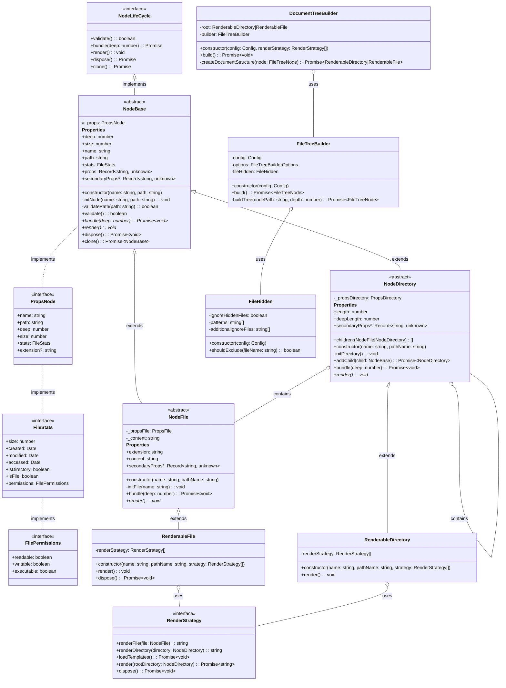
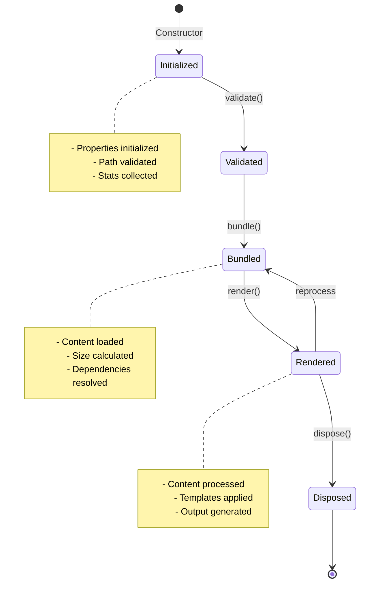
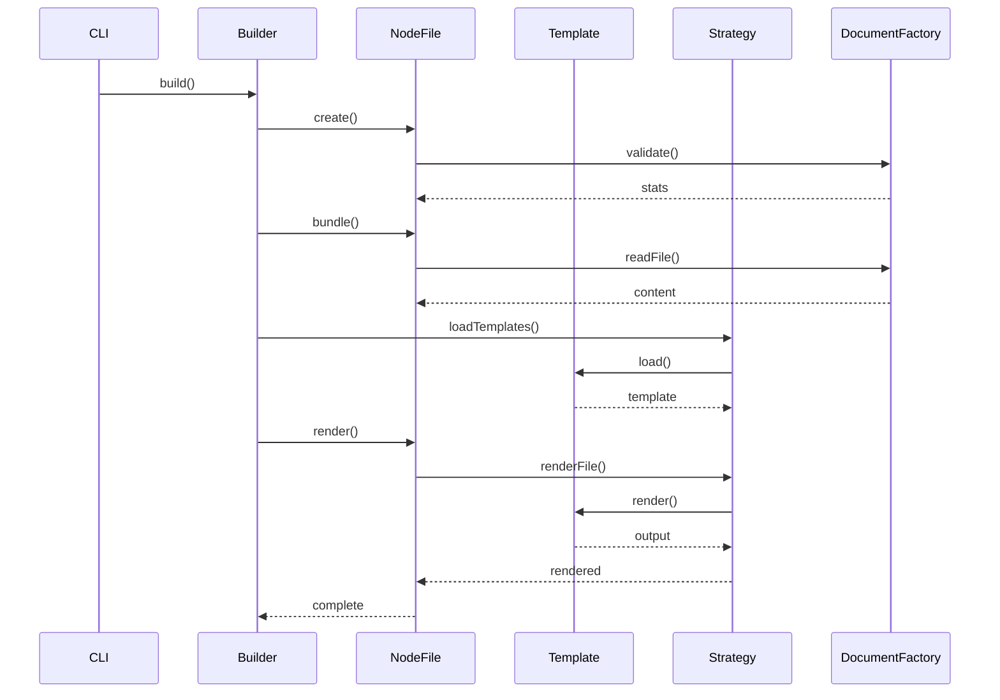

# Detailed Class Diagrams and Component Lifecycle

## Core Entity Relationships

```mermaid
classDiagram
    %% Interfaces
    class FileStats {
        <<interface>>
        +size: number
        +created: Date
        +modified: Date
        +accessed: Date
        +isDirectory: boolean
        +isFile: boolean
        +permissions: FilePermissions
    }

    class FilePermissions {
        <<interface>>
        +readable: boolean
        +writable: boolean
        +executable: boolean
    }

    class PropsNode {
        <<interface>>
        +name: string
        +path: string
        +deep: number
        +size: number
        +stats: FileStats
        +extension?: string
    }

    class NodeLifeCycle {
        <<interface>>
        +validate(): boolean
        +bundle(deep: number): Promise<void>
        +render(): void
        +dispose(): Promise<void>
        +clone(): Promise<NodeBase>
    }

    class RenderStrategy {
        <<interface>>
        +renderFile(file: NodeFile): string
        +renderDirectory(directory: NodeDirectory): string
        +loadTemplates(): Promise~void~
        +render(rootDirectory: NodeDirectory): Promise~string~
        +dispose(): Promise~void~
    }

    %% Abstract Base Classes
    class NodeBase {
        <<abstract>>
        #_props: PropsNode
        +constructor(name: string, path: string)
        -initNode(name: string, path: string): void
        -validatePath(path: string): boolean
        +validate(): boolean
        +bundle(deep: number)*: Promise~void~
        +render()*: void
        +dispose(): Promise~void~
        +clone(): Promise~NodeBase~
        __Properties__
        +deep: number
        +size: number
        +name: string
        +path: string
        +stats: FileStats
        +props: Record~string, unknown~
        +secondaryProps*: Record~string, unknown~
    }

    class NodeDirectory {
        <<abstract>>
        +children: (NodeFile|NodeDirectory)[]
        -_propsDirectory: PropsDirectory
        +constructor(name: string, pathName: string)
        -initDirectory(): void
        +addChild(child: NodeBase): Promise~NodeDirectory~
        +bundle(deep: number): Promise~void~
        +render()*: void
        __Properties__
        +length: number
        +deepLength: number
        +secondaryProps*: Record~string, unknown~
    }

    class NodeFile {
        <<abstract>>
        -_propsFile: PropsFile
        -_content: string
        +constructor(name: string, pathName: string)
        -initFile(name: string): void
        +bundle(deep: number): Promise~void~
        +render()*: void
        __Properties__
        +extension: string
        +content: string
        +secondaryProps*: Record~string, unknown~
    }

    %% Concrete Classes
    class RenderableDirectory {
        -renderStrategy: RenderStrategy[]
        +constructor(name: string, pathName: string, strategy: RenderStrategy[])
        +render(): void
    }

    class RenderableFile {
        -renderStrategy: RenderStrategy[]
        +constructor(name: string, pathName: string, strategy: RenderStrategy[])
        +render(): void
        +dispose(): Promise~void~
    }

    %% Builder Classes
    class DocumentTreeBuilder {
        -root: RenderableDirectory|RenderableFile
        -builder: FileTreeBuilder
        +constructor(config: Config, renderStrategy: RenderStrategy[])
        +build(): Promise~void~
        -createDocumentStructure(node: FileTreeNode): Promise~RenderableDirectory|RenderableFile~
    }

    class FileTreeBuilder {
        -config: Config
        -options: FileTreeBuilderOptions
        -fileHidden: FileHidden
        +constructor(config: Config)
        +build(): Promise~FileTreeNode~
        -buildTree(nodePath: string, depth: number): Promise~FileTreeNode~
    }

    class FileHidden {
        -ignoreHiddenFiles: boolean
        -patterns: string[]
        -additionalIgnoreFiles: string[]
        +constructor(config: Config)
        +shouldExclude(fileName: string): boolean
    }

    %% Relationships
    NodeLifeCycle <|-- NodeBase: implements
    NodeBase <|-- NodeFile: extends
    NodeBase <|-- NodeDirectory: extends
    NodeFile <|-- RenderableFile: extends
    NodeDirectory <|-- RenderableDirectory: extends
    NodeBase .. PropsNode: implements
    PropsNode .. FileStats: implements
    FileStats .. FilePermissions: implements
    FileTreeBuilder o-- FileHidden: uses
    DocumentTreeBuilder o-- FileTreeBuilder: uses
    RenderableFile o-- RenderStrategy: uses
    RenderableDirectory o-- RenderStrategy: uses
    NodeDirectory o-- NodeFile: contains
    NodeDirectory o-- NodeDirectory: contains
```

## State Transitions and Lifecycle

```mermaid
stateDiagram-v2
    [*] --> Initialized: Constructor
    Initialized --> Validated: validate()
    Validated --> Bundled: bundle()
    Bundled --> Rendered: render()
    Rendered --> Disposed: dispose()
    Rendered --> Bundled: reprocess
    Disposed --> [*]

    note right of Initialized
        - Properties initialized
        - Path validated
        - Stats collected
    end note

    note right of Bundled
        - Content loaded
        - Size calculated
        - Dependencies resolved
    end note

    note right of Rendered
        - Content processed
        - Templates applied
        - Output generated
    end note
```

## Component Interactions Flow

```mermaid
sequenceDiagram
    participant CLI
    participant Builder
    participant NodeFile
    participant Template
    participant Strategy
    participant DocumentFactory

    CLI->>Builder: build()
    Builder->>NodeFile: create()
    NodeFile->>DocumentFactory: validate()
    DocumentFactory-->>NodeFile: stats
    Builder->>NodeFile: bundle()
    NodeFile->>DocumentFactory: readFile()
    DocumentFactory-->>NodeFile: content
    Builder->>Strategy: loadTemplates()
    Strategy->>Template: load()
    Template-->>Strategy: template
    Builder->>NodeFile: render()
    NodeFile->>Strategy: renderFile()
    Strategy->>Template: render()
    Template-->>Strategy: output
    Strategy-->>NodeFile: rendered
    NodeFile-->>Builder: complete
```
