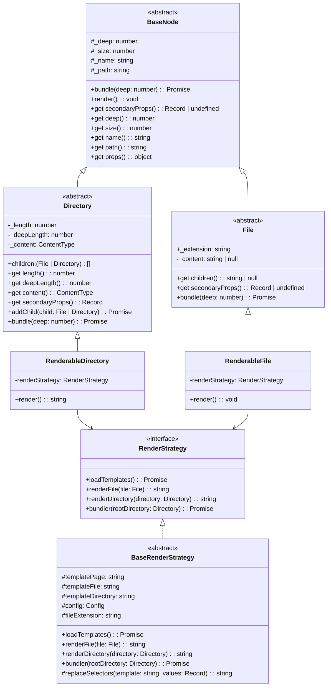

# CodeWrangler Class Diagram

```mermaid
classDiagram
    class BaseNode {
        <<abstract>>
        #_deep: number
        #_size: number
        #_name: string
        #_path: string
        +bundle(deep: number): Promise<void>
        +render(): void
        +get secondaryProps(): Record<string, unknown> | undefined
        +get deep(): number
        +get size(): number
        +get name(): string
        +get path(): string
        +get props(): object
    }

    class Directory {
        <<abstract>>
        +children: (File | Directory)[]
        -_length: number
        -_deepLength: number
        -_content: ContentType
        +get length(): number
        +get deepLength(): number
        +get content(): ContentType
        +get secondaryProps(): Record<string, unknown>
        +addChild(child: File | Directory): Promise<Directory>
        +bundle(deep: number): Promise<void>
    }

    class RenderableDirectory {
        -renderStrategy: RenderStrategy
        +render(): string
    }

    class File {
        <<abstract>>
        +_extension: string
        -_content: string | null
        +get children(): string | null
        +get secondaryProps(): Record<string, unknown> | undefined
        +bundle(deep: number): Promise<void>
    }

    class RenderableFile {
        -renderStrategy: RenderStrategy
        +render(): void
    }

    class RenderStrategy {
        <<interface>>
        +loadTemplates(): Promise<void>
        +renderFile(file: File): string
        +renderDirectory(directory: Directory): string
        +bundler(rootDirectory: Directory): Promise<string>
    }

    class BaseRenderStrategy {
        <<abstract>>
        #templatePage: string
        #templateFile: string
        #templateDirectory: string
        #config: Config
        #fileExtension: string
        +loadTemplates(): Promise<void>
        +renderFile(file: File): string
        +renderDirectory(directory: Directory): string
        +bundler(rootDirectory: Directory): Promise<string>
        #replaceSelectors(template: string, values: Record<string, string | number>): string
    }

    BaseNode <|-- Directory
    BaseNode <|-- File
    Directory <|-- RenderableDirectory
    File <|-- RenderableFile
    RenderStrategy <|.. BaseRenderStrategy
    RenderableDirectory --> RenderStrategy
    RenderableFile --> RenderStrategy
```
