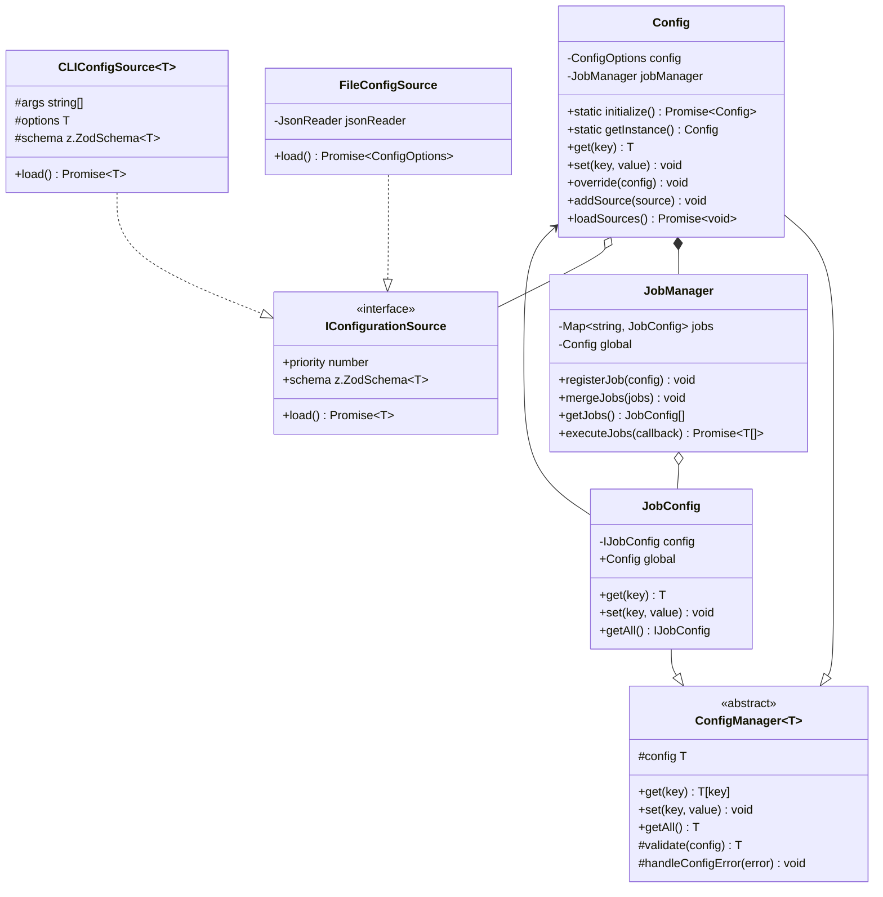

# Configuration System

The configuration system in CodeWrangler follows a modular design based on several design patterns to ensure flexibility, maintainability, and extensibility. This document outlines the core architecture, design patterns, and extension points.

## Table of Contents

- [Architecture Overview](#architecture-overview)
- [Design Patterns](#design-patterns)
- [Class Diagram](#class-diagram)
- [Extension Points](#extension-points)
- [Implementation Guidelines](#implementation-guidelines)
- [Testing Strategies](#testing-strategies)
- [Contributing](#contributing)

## Architecture Overview

The configuration system in CodeWrangler follows a modular design based on several design patterns to ensure flexibility, maintainability, and extensibility. This document outlines the core architecture, design patterns, and extension points.

## Design Patterns

### 1. Builder Pattern
The configuration system uses the Builder pattern through the `ConfigBuilder` class to construct complex configuration objects with a fluent interface. This pattern facilitates:

- Step-by-step construction of configuration objects
- Validation at each construction step
- Flexible composition of different configuration sources

Implementation Example:
```typescript
const config = await ConfigBuilder.create()
  .withDefaultConfig()
  .withFileConfig("codewrangler.json")
  .withCliConfig(cliOptions)
  .build();
```

### 2. Singleton Pattern
The `Config` class implements a singleton pattern to ensure a single source of truth for configuration across the application:

```typescript
export class Config {
  private static instance: Config | undefined;

  public static async initialize(): Promise<Config> {
    if (!Config.instance) {
      Config.instance = new Config();
      await Config.instance.loadSources();
    }
    return Config.instance;
  }

  public static getInstance(): Config {
    if (!Config.instance) {
      throw new Error("Config must be initialized before use");
    }
    return Config.instance;
  }
}
```

### 3. Strategy Pattern
The configuration system uses the Strategy pattern for different configuration sources, allowing new sources to be added without modifying existing code:

```typescript
interface IConfigurationSource<T extends Partial<ConfigOptions>> {
  readonly priority: number;
  load(): Promise<T>;
}
```

## Class Diagram



## Extension Points

### 1. Custom Configuration Sources

Create new configuration sources by implementing the `IConfigurationSource` interface:

```typescript
export class EnvironmentConfigSource implements IConfigurationSource<ConfigOptions> {
  public readonly priority = 1;

  public async load(): Promise<ConfigOptions> {
    return {
      name: process.env.PROJECT_NAME,
      logLevel: process.env.LOG_LEVEL as LogLevelString,
      // ... other environment mappings
    };
  }
}
```

### 2. Custom Job Types

Extend the job system by implementing new job types:

```typescript
export interface ICustomJobConfig extends IJobConfig {
  customField: string;
  // Additional job-specific fields
}

export class CustomJobManager extends JobManager {
  public registerCustomJob(config: ICustomJobConfig): void {
    // Custom job registration logic
    super.registerJob(config);
  }
}
```

### 3. Configuration Validators

Add custom validation rules by extending the configuration schema:

```typescript
export const customJobSchema = jobConfigSchema.extend({
  customField: z.string(),
  // Additional validation rules
});
```

## Implementation Guidelines

### Configuration Loading Order

1. Initialize default configuration
2. Load file-based configuration
3. Apply CLI overrides
4. Validate final configuration

```typescript
async function loadConfiguration(): Promise<void> {
  // Load defaults
  const defaultConfig = new DefaultConfigSource();
  
  // Load user config file
  const fileConfig = new FileConfigSource("codewrangler.json");
  
  // Apply CLI overrides
  const cliConfig = new CLIConfigSource(process.argv);
  
  // Build final configuration
  const builder = await ConfigBuilder.create();
  builder
    .withSource(defaultConfig)
    .withSource(fileConfig)
    .withSource(cliConfig);
    
  await builder.build();
}
```

### Error Handling

Configuration errors should be handled gracefully:

```typescript
try {
  const config = await ConfigBuilder.create()
    .withFileConfig(configPath)
    .build();
} catch (error) {
  if (error instanceof ConfigValidationError) {
    logger.error("Configuration validation failed", error.errors);
    // Handle validation errors
  } else if (error instanceof ConfigLoadError) {
    logger.error("Failed to load configuration", error);
    // Handle loading errors
  }
}
```

### Testing Strategies

1. Unit Testing Configuration Sources:
```typescript
describe('FileConfigSource', () => {
  it('should load and parse configuration file', async () => {
    const source = new FileConfigSource('test-config.json');
    const config = await source.load();
    expect(config).toMatchObject({
      // Expected configuration
    });
  });
});
```

2. Integration Testing Configuration Building:
```typescript
describe('ConfigBuilder Integration', () => {
  it('should build configuration from multiple sources', async () => {
    const builder = await ConfigBuilder.create();
    const config = await builder
      .withDefaultConfig()
      .withFileConfig('test-config.json')
      .build();
      
    expect(config.get('name')).toBe('TestProject');
  });
});
```

## Contributing

To contribute to the configuration system:

1. Follow the established patterns and architecture
2. Add comprehensive tests for new functionality
3. Update documentation when adding new features
4. Ensure backward compatibility
5. Use type-safe implementations
6. Follow the error handling guidelines

For questions or clarification, please refer to our contribution guidelines or open an issue in the repository.