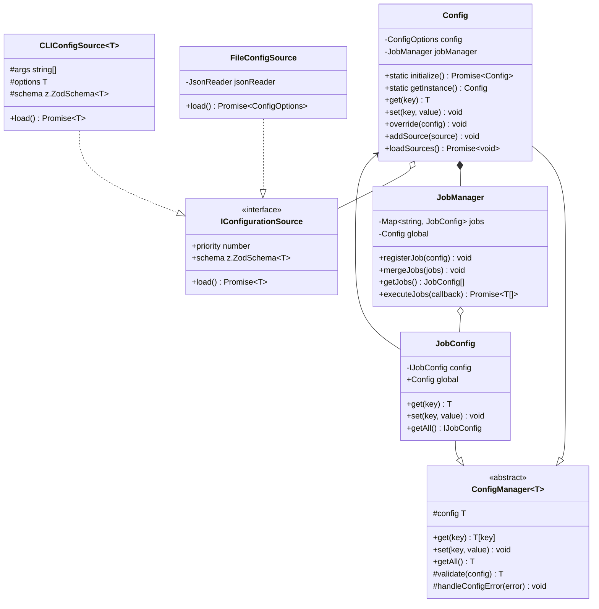

# Project Documentation: config-code-wrangler-1

## Overview

This documentation was automatically generated on 2024-12-10T17:26:01.751Z.

## Summary

- Total Files: 135
- Total Size: 211626

## Content of Files

### Directory: src

- **Path:** /root/git/codewrangler/src
- **Size:** 211626 bytes
- **Files:** 92
- **Total Files (including subdirectories):** 92
- **Depth:** 0

#### Contents:

### Directory: cli

- **Path:** /root/git/codewrangler/src/cli
- **Size:** 11372 bytes
- **Files:** 13
- **Total Files (including subdirectories):** 13
- **Depth:** 1

#### Contents:

### Directory: commands

- **Path:** /root/git/codewrangler/src/cli/commands
- **Size:** 7270 bytes
- **Files:** 8
- **Total Files (including subdirectories):** 8
- **Depth:** 2

#### Contents:

### Directory: base

- **Path:** /root/git/codewrangler/src/cli/commands/base
- **Size:** 1180 bytes
- **Files:** 3
- **Total Files (including subdirectories):** 3
- **Depth:** 3

#### Contents:

#### File: BaseCommand.ts

- **Path:** /root/git/codewrangler/src/cli/commands/base/BaseCommand.ts
- **Extension:** ts
- **Size:** 974 bytes
- **Depth:** 4
- **Lines:** 34

```ts
import { ICommand } from "./type";
import { Config } from "../../../utils/config";
import { logger } from "../../../utils/logger";

// T: Has to be the valid and parsed options provided by the CLI
export abstract class BaseCommand implements ICommand {
  public constructor(protected readonly config: Config) {}

  public async execute(): Promise<void> {
    try {
      await this.beforeExecution();
      await this.processExecution();
      await this.afterExecution();
    } catch (error) {
      this.handleError(error);
      throw error;
    }
  }

  protected abstract processExecution(): Promise<void>;
  protected abstract logVerbose(): void;

  protected async beforeExecution(): Promise<void> {
    if (this.config.get("verbose")) {
      await Promise.resolve(this.logVerbose());
    }
  }
  protected abstract afterExecution(): Promise<void>;

  protected handleError(error: unknown): void {
    logger.error("Command execution failed", error as Error);
  }
}

```
#### File: index.ts

- **Path:** /root/git/codewrangler/src/cli/commands/base/index.ts
- **Extension:** ts
- **Size:** 55 bytes
- **Depth:** 4
- **Lines:** 3

```ts
export * from "./BaseCommand";
export * from "./type";

```
#### File: type.ts

- **Path:** /root/git/codewrangler/src/cli/commands/base/type.ts
- **Extension:** ts
- **Size:** 151 bytes
- **Depth:** 4
- **Lines:** 9

```ts
// Command command interfaces
export interface ICommandOptions {
  verbose?: boolean;
}

export interface ICommand {
  execute: () => Promise<void>;
}

```
### Directory: document

- **Path:** /root/git/codewrangler/src/cli/commands/document
- **Size:** 6090 bytes
- **Files:** 5
- **Total Files (including subdirectories):** 5
- **Depth:** 3

#### Contents:

#### File: DocumentCommand.ts

- **Path:** /root/git/codewrangler/src/cli/commands/document/DocumentCommand.ts
- **Extension:** ts
- **Size:** 1584 bytes
- **Depth:** 4
- **Lines:** 47

```ts
import { DocumentOrchestratorBuilder } from "../../../orchestration/DocumentOrchestratorBuilder";
import { DocumentTreeBuilder } from "../../../services/builder/DocumentTreeBuilder";
import { logger } from "../../../utils/logger";
import { BaseCommand } from "../base";

export class DocumentCommand extends BaseCommand {
  protected override async beforeExecution(): Promise<void> {
    this.logVerbose();
    await super.beforeExecution();
  }

  protected override async processExecution(): Promise<void> {
    await this.config.jobManager.executeJobs(async job => {
      const builder = new DocumentTreeBuilder(job);
      const root = await builder.build();

      const orchestrator = new DocumentOrchestratorBuilder()
        .setRoot(root)
        .setConfig(this.config)
        .setJobs([job]);

      const orchestrators = await orchestrator.buildAndExecute();

      logger.info(`Generated ${orchestrators.length} documents`);
    });
  }

  protected override logVerbose(): void {
    logger.debug(
      `Searching for file matching pattern: ${this.config.defaultJob.get("pattern")}`
    );
    logger.debug(
      `Excluding patterns: ${(this.config.defaultJob.get("excludePatterns") as string[]).join(", ")}`
    );
    logger.debug(
      `Ignoring hidden files: ${this.config.defaultJob.get("ignoreHiddenFiles")}`
    );
    logger.debug(
      `Max file size: ${this.config.defaultJob.get("maxFileSize")} bytes`
    );
  }

  protected override async afterExecution(): Promise<void> {
    await Promise.resolve(logger.info("Document generation completed"));
  }
}

```
### Directory: config

- **Path:** /root/git/codewrangler/src/cli/commands/document/config
- **Size:** 4392 bytes
- **Files:** 3
- **Total Files (including subdirectories):** 3
- **Depth:** 4

#### Contents:

#### File: DocumentConfigSource.ts

- **Path:** /root/git/codewrangler/src/cli/commands/document/config/DocumentConfigSource.ts
- **Extension:** ts
- **Size:** 2913 bytes
- **Depth:** 5
- **Lines:** 90

```ts
import { z } from "zod";

import { IDocumentConfig, documentConfigSchema } from "./schema";
import { IDocumentCommandConfig, IDocumentCommandOptions } from "./types";
import { documentFactory } from "../../../../infrastructure/filesystem/DocumentFactory";
import {
  CLIConfigSource,
  Config,
  IConfig,
  IJobConfig,
  ILoadConfigResult,
  JobConfig
} from "../../../../utils/config";
import { normalizePattern } from "../../../../utils/pattern";

type IDocumentCommandInputOptions = Partial<IDocumentCommandOptions>;

export class DocumentConfigSource extends CLIConfigSource<
  IDocumentCommandOptions,
  IDocumentCommandConfig,
  IDocumentConfig
> {
  public constructor(args: string, options: IDocumentCommandInputOptions) {
    super(
      [args],
      options,
      documentConfigSchema as z.ZodSchema<IDocumentConfig>
    );
  }

  public async load(): Promise<ILoadConfigResult<IDocumentCommandConfig>> {
    const rawConfig = this.parseArgs(); // parse to a raw config of key value pairs
    const validConfig = this.validate(rawConfig); // validate the raw config
    const transformedConfig = this.transform(validConfig); // transform the valid config to the final config
    this.isLoaded = true;
    return await Promise.resolve({
      config: Config.merge<IConfig>(transformedConfig),
      jobConfig: [JobConfig.merge<IJobConfig>(transformedConfig)],
      input: transformedConfig
    });
  }

  public static create(
    args: string,
    options: IDocumentCommandInputOptions
  ): Promise<ILoadConfigResult<IDocumentCommandConfig>> {
    return new DocumentConfigSource(args, options).load();
  }

  private transform(config: IDocumentConfig): IDocumentCommandConfig {
    return {
      ...config,
      outputFormat: config.outputFormat,
      pattern: normalizePattern(config.pattern),
      excludePatterns: config.excludePatterns,
      additionalIgnore: config.additionalIgnore,
      rootDir: documentFactory.resolve(config.rootDir),
      ignoreHidden: config.ignoreHidden,
      followSymlinks: config.followSymlinks,
      verbose: config.verbose,
      outputFile: config.outputFile
        ? this.normalizeOutputFile(config.outputFile)
        : undefined
    };
  }

  private validate(config: IDocumentCommandInputOptions): IDocumentConfig {
    return this.schema.parse(config);
  }

  private parseArgs(): IDocumentCommandInputOptions {
    return {
      pattern: this.args[0],
      verbose: this.options.verbose,
      outputFormat: this.options.format,
      rootDir: this.options.dir,
      outputFile: this.options.output,
      excludePatterns: this.options.exclude,
      ignoreHidden: this.options.ignoreHidden,
      additionalIgnore: this.options.additionalIgnore
    };
  }

  private normalizeOutputFile(outputFile: string): string {
    return documentFactory.isAbsolute(outputFile)
      ? outputFile
      : documentFactory.resolve(outputFile ?? "");
  }
}

```
#### File: schema.ts

- **Path:** /root/git/codewrangler/src/cli/commands/document/config/schema.ts
- **Extension:** ts
- **Size:** 664 bytes
- **Depth:** 5
- **Lines:** 21

```ts
import { z } from "zod";

import { outputFormatSchema } from "../../../../utils/config";

export const documentConfigSchema = z
  .object({
    name: z.string().optional(),
    pattern: z.string().default("**/*"),
    outputFormat: z.array(outputFormatSchema),
    rootDir: z.string().default("."),
    outputFile: z.string().optional(),
    excludePatterns: z.array(z.string()).optional(),
    ignoreHidden: z.boolean().default(true),
    additionalIgnore: z.array(z.string()).optional(),
    followSymlinks: z.boolean().default(true),
    verbose: z.boolean().default(false)
  })
  .strict();

export type IDocumentConfig = z.infer<typeof documentConfigSchema>;

```
#### File: types.ts

- **Path:** /root/git/codewrangler/src/cli/commands/document/config/types.ts
- **Extension:** ts
- **Size:** 815 bytes
- **Depth:** 5
- **Lines:** 32

```ts
import { OutputFormat } from "../../../../utils/config";
import { ICommandOptions } from "../../base";

type ProgramOption = string | string[] | undefined;
export type ProgramRecord = Record<string, ProgramOption>;

export interface IDocumentCommandOptions extends ProgramRecord {
  name?: string;
  pattern?: string;
  format?: OutputFormat[];
  dir?: string;
  output?: string;
  exclude?: string;
  ignoreHidden?: string;
  additionalIgnore?: string;
  followSymlinks?: string;
  verbose?: string;
}

export interface IDocumentCommandConfig extends ICommandOptions {
  name?: string;
  pattern: string;
  outputFormat: OutputFormat[];
  rootDir: string;
  outputFile?: string;
  excludePatterns?: string[];
  ignoreHidden: boolean;
  additionalIgnore?: string[];
  followSymlinks: boolean;
  verbose: boolean;
}

```
#### File: index.ts

- **Path:** /root/git/codewrangler/src/cli/commands/document/index.ts
- **Extension:** ts
- **Size:** 114 bytes
- **Depth:** 4
- **Lines:** 4

```ts
export * from "./DocumentCommand";
export * from "./config/DocumentConfigSource";
export * from "./config/types";

```
#### File: index.ts

- **Path:** /root/git/codewrangler/src/cli/index.ts
- **Extension:** ts
- **Size:** 453 bytes
- **Depth:** 2
- **Lines:** 22

```ts
#!/usr/bin/env node
import { ConfigBuilder } from "../utils/config";
import { DocumentCLIBuilder } from "./program/singleJob/SingleJobProgram";

function errorHandler(error: unknown): void {
  console.error(error);
  process.exit(1);
}

async function main(): Promise<void> {
  try {
    await ConfigBuilder.create();
    await DocumentCLIBuilder.create();
  } catch (error) {
    errorHandler(error);
  }
}

main().catch(() => {
  process.exit(1);
});

```
### Directory: program

- **Path:** /root/git/codewrangler/src/cli/program
- **Size:** 3649 bytes
- **Files:** 4
- **Total Files (including subdirectories):** 4
- **Depth:** 2

#### Contents:

#### File: index.ts

- **Path:** /root/git/codewrangler/src/cli/program/index.ts
- **Extension:** ts
- **Size:** 42 bytes
- **Depth:** 3
- **Lines:** 2

```ts
export * as singleJob from "./singleJob";

```
### Directory: singleJob

- **Path:** /root/git/codewrangler/src/cli/program/singleJob
- **Size:** 3607 bytes
- **Files:** 3
- **Total Files (including subdirectories):** 3
- **Depth:** 3

#### Contents:

#### File: ProgramBuilder.ts

- **Path:** /root/git/codewrangler/src/cli/program/singleJob/ProgramBuilder.ts
- **Extension:** ts
- **Size:** 1955 bytes
- **Depth:** 4
- **Lines:** 77

```ts
import { Command } from "commander";

import { Config } from "../../../utils/config";

export class ProgramBuilder {
  private program: Command;

  public constructor(private config: Config) {
    this.program = new Command();
  }

  public build(): Command {
    return this.program;
  }

  public withVersion(version: string): ProgramBuilder {
    this.program.version(version);
    return this;
  }

  public withDescription(): ProgramBuilder {
    this.program.description("CodeWrangler is a tool for generating code");
    return this;
  }

  public withArguments(): ProgramBuilder {
    this.program.argument(
      "<pattern>",
      'File pattern to match (e.g., "\\.ts$" for TypeScript files)'
    );
    return this;
  }

  // eslint-disable-next-line max-lines-per-function
  public withOptions(): ProgramBuilder {
    this.program
      .option(
        "-d, --dir <dir>",
        "Directory to search",
        this.config.defaultJob.get("rootDir")
      )
      .option("-n, --name <name>", "Job name")
      .option(
        "-c, --config <config>",
        "Config file",
        this.config.get("codeConfigFile")
      )
      .option("-v, --verbose", "Verbose mode", this.config.get("logLevel"))
      .option(
        "-f, --format <format>",
        "Output format",
        this.config.defaultJob.get("outputFormat")
      )
      .option(
        "-o, --output <output>",
        "Output file",
        this.config.defaultJob.get("outputFile")
      )
      .option(
        "-e, --exclude <exclude>",
        "Exclude patterns",
        this.config.defaultJob.get("excludePatterns")
      )
      .option(
        "-i, --ignore-hidden",
        "Ignore hidden files",
        this.config.defaultJob.get("ignoreHiddenFiles")
      )
      .option(
        "-a, --additional-ignore <additional-ignore>",
        "Additional ignore patterns",
        this.config.defaultJob.get("additionalIgnoreFiles")
      );
    return this;
  }
}

```
#### File: SingleJobProgram.ts

- **Path:** /root/git/codewrangler/src/cli/program/singleJob/SingleJobProgram.ts
- **Extension:** ts
- **Size:** 1582 bytes
- **Depth:** 4
- **Lines:** 58

```ts
import { Command } from "commander";

import { ProgramBuilder } from "./ProgramBuilder";
import { Config, ConfigBuilder } from "../../../utils/config";
import {
  DocumentCommand,
  DocumentConfigSource,
  IDocumentCommandOptions
} from "../../commands/document";

export class DocumentCLIBuilder {
  private static instance: DocumentCLIBuilder | undefined;
  private config: Config;
  private program!: Command;
  private VERSION = "1.0.0";

  private constructor() {
    this.config = Config.getInstance();
  }

  public static async create(): Promise<DocumentCLIBuilder> {
    if (!DocumentCLIBuilder.instance) {
      DocumentCLIBuilder.instance = new DocumentCLIBuilder();
      DocumentCLIBuilder.instance.init();
      await DocumentCLIBuilder.instance.build();
    }
    return DocumentCLIBuilder.instance;
  }

  private init(): this {
    this.program = new ProgramBuilder(this.config)
      .withVersion(this.VERSION)
      .withDescription()
      .withArguments()
      .withOptions()
      .build();

    return this;
  }

  private async build(): Promise<void> {
    const configBuilder = await ConfigBuilder.create();
    this.program.action(
      async (pattern: string, options: IDocumentCommandOptions) => {
        const documentConfigSource = new DocumentConfigSource(pattern, options);
        
        configBuilder.withCLIConfig(documentConfigSource);
        this.config = configBuilder.build();

        const documentCLI = new DocumentCommand(this.config);
        await documentCLI.execute();
      }
    );

    this.program.parse(process.argv);
  }
}

```
#### File: index.ts

- **Path:** /root/git/codewrangler/src/cli/program/singleJob/index.ts
- **Extension:** ts
- **Size:** 70 bytes
- **Depth:** 4
- **Lines:** 3

```ts
export * from "./SingleJobProgram";
export * from "./ProgramBuilder";

```
### Directory: core

- **Path:** /root/git/codewrangler/src/core
- **Size:** 24172 bytes
- **Files:** 11
- **Total Files (including subdirectories):** 11
- **Depth:** 1

#### Contents:

### Directory: entities

- **Path:** /root/git/codewrangler/src/core/entities
- **Size:** 17392 bytes
- **Files:** 6
- **Total Files (including subdirectories):** 6
- **Depth:** 2

#### Contents:

#### File: NodeBase.ts

- **Path:** /root/git/codewrangler/src/core/entities/NodeBase.ts
- **Extension:** ts
- **Size:** 2775 bytes
- **Depth:** 3
- **Lines:** 125

```ts
import { documentFactory } from "../../infrastructure/filesystem/DocumentFactory";
import { IRenderStrategy } from "../../services/renderer/RenderStrategy";
import { IFileStats, IPropsNode } from "../../types/type";

const defaultProps: IPropsNode = {
  name: "",
  path: "",
  deep: 0,
  size: 0, // size of the node from the children nodes
  stats: {
    size: 0, // size of the node from the file system
    created: new Date(),
    modified: new Date(),
    accessed: new Date(),
    isDirectory: false,
    isFile: false,
    permissions: {
      readable: false,
      writable: false,
      executable: false
    }
  }
};

export interface INodeContent {
  content: string;
}

interface INodeLifeCycle {
  validate: () => boolean;
  bundle: (deep: number) => Promise<void>;
  render: (strategy: IRenderStrategy) => INodeContent;
  dispose: () => void;
  clone: () => NodeBase;
}

export abstract class NodeBase implements INodeLifeCycle {
  protected _props: IPropsNode = { ...defaultProps };

  public constructor(
    _name: string,
    private originalPath: string
  ) {
    this.initNode(_name, originalPath);
    this.validate();
  }

  public validate(): boolean {
    if (!documentFactory.exists(this.path)) {
      throw new Error(`Path ${this.originalPath} does not exist`);
    }
    if (!documentFactory.isAbsolute(this.path)) {
      throw new Error(`Path ${this.originalPath} is not absolute`);
    }
    return true;
  }

  // abstract methods
  public abstract bundle(deep: number): Promise<void>;
  public abstract render(strategy: IRenderStrategy): INodeContent;

  // getters and setters
  // deep
  public get deep(): number {
    return this._props.deep;
  }
  public set deep(deep: number) {
    this._props.deep = deep;
  }

  // size
  public get size(): number {
    return this._props.size;
  }
  public set size(size: number) {
    this._props.size = size;
  }

  // name
  public get name(): string {
    return this._props.name;
  }
  public set name(name: string) {
    this._props.name = name;
  }

  // path
  public get path(): string {
    return this._props.path;
  }
  public set path(path: string) {
    this._props.path = path;
  }

  // stats
  public get stats(): IFileStats | undefined {
    return this._props.stats;
  }
  public set stats(stats: IFileStats | undefined) {
    this._props.stats = stats;
  }

  // props
  public get props(): IPropsNode {
    return {
      ...this._props
    };
  }

  public dispose(): void {
    this._props = { ...defaultProps };
  }

  public clone(): NodeBase {
    return Object.assign(Object.create(this), this);
  }

  private initNode(name: string, path: string): void {
    this.deep = 0;
    this.size = 0;
    this.name = name;
    this.path = documentFactory.resolve(path);
  }
}

```
#### File: NodeDirectory.ts

- **Path:** /root/git/codewrangler/src/core/entities/NodeDirectory.ts
- **Extension:** ts
- **Size:** 3779 bytes
- **Depth:** 3
- **Lines:** 135

```ts
import { INodeContent, NodeBase } from "./NodeBase";
import { NodeFile } from "./NodeFile";
import { fileStatsService } from "../../infrastructure/filesystem/FileStats";
import { IRenderStrategy } from "../../services/renderer/RenderStrategy";
import { IPropsDirectoryNode } from "../../types/type";

interface IPropsDirectory {
  length: number;
  deepLength: number;
  numberOfFiles: number;
  numberOfDirectories: number;
}

const defaultPropsDirectory: IPropsDirectory = {
  length: 0,
  deepLength: 0,
  numberOfFiles: 0,
  numberOfDirectories: 0
};

export abstract class NodeDirectory extends NodeBase {
  public readonly type = "directory";
  public children: (NodeFile | NodeDirectory)[] = [];
  private _propsDirectory: IPropsDirectory = { ...defaultPropsDirectory };

  public constructor(name: string, pathName: string) {
    super(name, pathName);
    this.initDirectory();
  }
  // getters and setters
  public get length(): number {
    return this._propsDirectory.length;
  }
  public set length(length: number) {
    this._propsDirectory.length = length;
  }
  public get deepLength(): number {
    return this._propsDirectory.deepLength;
  }
  public set deepLength(deepLength: number) {
    this._propsDirectory.deepLength = deepLength;
  }
  public get numberOfFiles(): number {
    return this._propsDirectory.numberOfFiles;
  }
  public set numberOfFiles(numberOfFiles: number) {
    this._propsDirectory.numberOfFiles = numberOfFiles;
  }
  public get numberOfDirectories(): number {
    return this._propsDirectory.numberOfDirectories;
  }
  public set numberOfDirectories(numberOfDirectories: number) {
    this._propsDirectory.numberOfDirectories = numberOfDirectories;
  }
  public override get props(): IPropsDirectoryNode {
    return {
      ...super.props,
      ...this._propsDirectory
    };
  }

  public addChild(child: NodeFile | NodeDirectory): NodeDirectory {
    if (!(child instanceof NodeFile || child instanceof NodeDirectory)) {
      throw new Error("Invalid child type");
    }
    this.children.push(child);
    return this;
  }

  public async bundle(deep: number = 0): Promise<void> {
    // set the deep of the directory
    this.deep = deep;

    // bundle all children
    await Promise.all(this.children.map(child => child.bundle(deep + 1)));

    this.bundleMetrics();
    this.stats = await fileStatsService(this.path);
  }

  public abstract override render(strategy: IRenderStrategy): INodeContent;

  private countFiles(): number {
    return this.children.reduce(
      (acc, child) => acc + (child.type === "file" ? 1 : child.numberOfFiles),
      0
    );
  }

  private countDirectories(): number {
    return this.children.reduce(
      (acc, child) => acc + (child.type === "directory" ? 1 : 0),
      0
    );
  }

  private countDeepLength(): number {
    return this.children.reduce(
      (acc, child) =>
        acc + (child.type === "directory" ? child.deepLength + 1 : 1),
      0
    );
  }

  private countSize(): number {
    return this.children.reduce((acc, child): number => acc + child.size, 0);
  }

  private bundleMetrics(): void {
    // Calculate directory metrics in a single pass
    const metrics = {
      length: this.countFiles(),
      numberOfFiles: this.countFiles(),
      numberOfDirectories: this.countDirectories(),
      deepLength: this.countDeepLength(),
      size: this.countSize()
    };
    console.log(this.children);
    Object.assign(this, metrics);
  }

  private initDirectory(): void {
    this.children = [];
    this._propsDirectory = { ...defaultPropsDirectory };
  }
}

export class RenderableDirectory extends NodeDirectory {
  public override render(strategy: IRenderStrategy): INodeContent {
    return {
      content: strategy.renderDirectory(this)
    };
  }
}

```
#### File: NodeFile.ts

- **Path:** /root/git/codewrangler/src/core/entities/NodeFile.ts
- **Extension:** ts
- **Size:** 2001 bytes
- **Depth:** 3
- **Lines:** 74

```ts
import { INodeContent, NodeBase } from "./NodeBase";
import { documentFactory } from "../../infrastructure/filesystem/DocumentFactory";
import { fileStatsService } from "../../infrastructure/filesystem/FileStats";
import { IRenderStrategy } from "../../services/renderer/RenderStrategy";
import { IPropsFileNode } from "../../types/type";

export abstract class NodeFile extends NodeBase {
  public readonly type = "file";
  private _extension: string = "";
  private _content: string | null = null;

  public constructor(name: string, pathName: string) {
    super(name, pathName);
    this.initFile(name);
  }

  // getters and setters
  // extension
  public get extension(): string {
    return this._extension;
  }
  protected set extension(extension: string) {
    this._extension = extension;
  }
  // content
  public get content(): string | null {
    return this._content;
  }
  protected set content(content: string | null) {
    this._content = content;
  }
  // secondary props
  public override get props(): IPropsFileNode {
    return {
      ...super.props,
      extension: this.extension
    };
  }

  // bundle
  public async bundle(deep: number = 0): Promise<void> {
    // set the deep of the file
    this.deep = deep;
    // set the size of the file
    this.size = await documentFactory.size(this.path);
    // set the content of the file
    this.content = await documentFactory.readFile(this.path);
    // set the stats of the file
    this.stats = await fileStatsService(this.path);
  }

  // render
  public abstract override render(strategy: IRenderStrategy): INodeContent;

  private initFile(name: string): void {
    this.extension = documentFactory.extension(name);
    this._content = null;
  }
}

export class RenderableFile extends NodeFile {
  // render
  public override render(strategy: IRenderStrategy): INodeContent {
    return {
      content: strategy.renderFile(this)
    };
  }

  // dispose
  public override dispose(): void {
    super.dispose();
  }
}

```
### Directory: __tests__

- **Path:** /root/git/codewrangler/src/core/entities/__tests__
- **Size:** 8837 bytes
- **Files:** 3
- **Total Files (including subdirectories):** 3
- **Depth:** 3

#### Contents:

#### File: NodeBase.test.ts

- **Path:** /root/git/codewrangler/src/core/entities/__tests__/NodeBase.test.ts
- **Extension:** ts
- **Size:** 3375 bytes
- **Depth:** 4
- **Lines:** 125

```ts
import { documentFactory } from "../../../infrastructure/filesystem/DocumentFactory";
import { INodeContent, NodeBase } from "../NodeBase";

// Mock DocumentFactory
jest.mock("../../../infrastructure/filesystem/DocumentFactory", () => ({
  documentFactory: {
    exists: jest.fn(),
    isAbsolute: jest.fn(),
    resolve: jest.fn(),
    extension: jest.fn(),
    size: jest.fn(),
    readFile: jest.fn(),
    getStats: jest.fn()
  }
}));

class TestNode extends NodeBase {
  public async bundle(): Promise<void> {}
  public render(): INodeContent {
    return { content: "" };
  }
}

describe("NodeBase", () => {
  const TEST_PATH = "/test/path";
  beforeEach(() => {
    jest.clearAllMocks();
    (documentFactory.exists as jest.Mock).mockReturnValue(true);
    (documentFactory.isAbsolute as jest.Mock).mockReturnValue(true);
    (documentFactory.resolve as jest.Mock).mockImplementation(path => path);
  });

  describe("constructor", () => {
    it("should initialize node with correct props", () => {
      const testNode = new TestNode("test", TEST_PATH);
      expect(testNode.name).toBe("test");
      expect(testNode.path).toBe(TEST_PATH);
    });

    it("should throw error for non-existent path", () => {
      (documentFactory.exists as jest.Mock).mockReturnValue(false);
      expect(() => new TestNode("test", "/invalid/path")).toThrow(
        new Error("Path /invalid/path does not exist")
      );
    });

    it("should throw error for non-absolute path", () => {
      (documentFactory.isAbsolute as jest.Mock).mockReturnValue(false);
      expect(() => new TestNode("test", "relative/path")).toThrow(
        new Error("Path relative/path is not absolute")
      );
    });
  });

  describe("properties", () => {
    let node: TestNode;

    beforeEach(() => {
      node = new TestNode("test", TEST_PATH);
    });

    it("should get and set deep property", () => {
      node["deep"] = 2;
      expect(node.deep).toBe(2);
    });

    it("should get and set size property", () => {
      node["size"] = 100;
      expect(node.size).toBe(100);
    });

    it("should get combined props", () => {
      node["size"] = 100;
      node["deep"] = 2;
      expect(node.props).toEqual(
        expect.objectContaining({
          name: "test",
          path: TEST_PATH,
          size: 100,
          deep: 2
        })
      );
    });
  });

  describe("methods", () => {
    let node: TestNode;

    beforeEach(() => {
      node = new TestNode("test", TEST_PATH);
    });

    it("should dispose correctly", async () => {
      node["size"] = 100;
      await node.dispose();
      expect(node.size).toBe(0);
      expect(node.name).toBe("");
      expect(node.path).toBe("");
      expect(node.stats).toEqual(
        expect.objectContaining({
          size: expect.any(Number),
          isDirectory: false,
          isFile: false,
          created: expect.any(Date),
          accessed: expect.any(Date),
          modified: expect.any(Date),
          permissions: {
            executable: false,
            readable: false,
            writable: false
          }
        })
      );
    });

    it("should clone correctly", async () => {
      node["size"] = 100;
      const clone = await node.clone();
      expect(clone.size).toBe(100);
      expect(clone.name).toBe("test");
      expect(clone.path).toBe(TEST_PATH);
    });
  });
});

```
#### File: NodeDirectory.test.ts

- **Path:** /root/git/codewrangler/src/core/entities/__tests__/NodeDirectory.test.ts
- **Extension:** ts
- **Size:** 3407 bytes
- **Depth:** 4
- **Lines:** 109

```ts
import * as fs from "fs/promises";
import * as path from "path";

import { IRenderStrategy } from "../../../services/renderer/RenderStrategy";
import { INodeContent } from "../NodeBase";
import { NodeDirectory } from "../NodeDirectory";
import { NodeFile } from "../NodeFile";

class TestDirectory extends NodeDirectory {
  public render(_: IRenderStrategy): INodeContent {
    return {
      content: "render"
    };
  }
}

class TestFile extends NodeFile {
  public render(_: IRenderStrategy): INodeContent {
    return {
      content: "render"
    };
  }
}

describe("Directory", () => {
  let testDirectory: TestDirectory;
  const pwd = process.cwd();
  const MOCK_PATH = path.resolve(
    `${pwd}/src/core/entities/__tests__/__node_directory_mocks__`
  );

  beforeEach(async () => {
    jest.clearAllMocks();
    await fs.mkdir(MOCK_PATH, { recursive: true });
    await fs.mkdir(path.join(MOCK_PATH, "dir"), { recursive: true });
    testDirectory = new TestDirectory("dir", path.join(MOCK_PATH, "dir"));
  });

  afterEach(async () => {
    await fs.rm(MOCK_PATH, { recursive: true, force: true });
  });

  it("constructor initializes name, path, and extension correctly", () => {
    expect(testDirectory.name).toBe("dir");
    expect(testDirectory.path).toBe(path.join(MOCK_PATH, "dir"));
    expect(testDirectory.children).toEqual([]);
  });

  it("addChild throws error for invalid child type", () => {
    expect(() => testDirectory.addChild({} as NodeFile)).toThrow(
      "Invalid child type"
    );
  });

  it("Check props value before bundle", () => {
    const props = testDirectory.props;
    expect(props).toMatchObject({
      name: "dir",
      path: path.join(MOCK_PATH, "dir")
    });
  });

  describe("bundle", () => {
    const dir = path.join(MOCK_PATH, "dir");
    beforeEach(async () => {
      await fs.mkdir(path.join(MOCK_PATH, "dir"), { recursive: true });
      // create file1, file2, file3, file4
      await fs.writeFile(path.join(MOCK_PATH, "file1.ts"), "");
      await fs.writeFile(path.join(MOCK_PATH, "file2.js"), "");
      await fs.writeFile(path.join(dir, "file3.ts"), "");
      await fs.writeFile(path.join(dir, "file4.js"), "");
      jest.clearAllMocks();
    });

    it("bundle updates directory properties correctly", async () => {
      const mockFile1 = new TestFile(
        "file1.ts",
        path.join(MOCK_PATH, "file1.ts")
      );
      const mockFile2 = new TestFile(
        "file2.js",
        path.join(MOCK_PATH, "file2.js")
      );
      const mockSubDir = new TestDirectory("dir", path.join(MOCK_PATH, "dir"));
      const mockFile3 = new TestFile(
        "file3.ts",
        path.join(MOCK_PATH, "dir/file3.ts")
      );
      const mockFile4 = new TestFile(
        "file4.js",
        path.join(MOCK_PATH, "dir/file4.js")
      );

      testDirectory.addChild(mockFile1);
      testDirectory.addChild(mockFile2);
      testDirectory.addChild(mockSubDir);
      mockSubDir.addChild(mockFile3);
      mockSubDir.addChild(mockFile4);

      await testDirectory.bundle(1);

      expect(testDirectory.deep).toEqual(expect.any(Number));
      expect(testDirectory.length).toEqual(expect.any(Number)); // Only direct files
      expect(testDirectory.deepLength).toEqual(expect.any(Number)); // Including subdirectory and its file
      expect(testDirectory.size).toEqual(expect.any(Number)); // Sum of all file sizes
    });
  });
});

```
#### File: NodeFile.test.ts

- **Path:** /root/git/codewrangler/src/core/entities/__tests__/NodeFile.test.ts
- **Extension:** ts
- **Size:** 2055 bytes
- **Depth:** 4
- **Lines:** 79

```ts
import * as fs from "fs/promises";
import * as path from "path";

import { IRenderStrategy } from "../../../services/renderer/RenderStrategy";
import { INodeContent } from "../NodeBase";
import { NodeFile } from "../NodeFile";

class TestFile extends NodeFile {
  public render(_: IRenderStrategy): INodeContent {
    return {
      content: "render"
    };
  }
}

describe("NodeFile", () => {
  let testFile: TestFile;
  const pwd = process.cwd();
  const MOCK_PATH = path.resolve(
    `${pwd}/src/core/entities/__tests__/__node_file_mocks__`
  );
  const testName = "file1.ts";
  const testPath = path.join(MOCK_PATH, testName);

  beforeEach(async () => {
    jest.clearAllMocks();
    try {
      await fs.mkdir(MOCK_PATH, { recursive: true });
      await fs.writeFile(testPath, "");
    } catch (error) {
      console.error(error);
    }
    testFile = new TestFile(testName, testPath);
  });

  afterEach(async () => {
    await fs.rm(MOCK_PATH, { recursive: true, force: true });
  });

  describe("constructor", () => {
    it("initializes name, path, and extension correctly", () => {
      expect(testFile.name).toBe(testName);
      expect(testFile.path).toBe(testPath);
      expect(testFile.extension).toBe(".ts");
    });
  });

  describe("bundle", () => {
    it("Check props value before bundle", () => {
      const props = testFile.props;
      expect(props).toMatchObject({
        name: testName,
        path: testPath,
        deep: 0,
        size: 0,
        extension: ".ts"
      });
    });

    it("Bundle method sets content correctly", async () => {
      await testFile.bundle();
      const content = "";
      expect(testFile.content).toBe(content);
    });

    it("Check props value after bundle", async () => {
      await testFile.bundle();
      const props = testFile.props;
      expect(props).toMatchObject({
        name: expect.any(String),
        path: expect.any(String),
        deep: expect.any(Number),
        size: expect.any(Number),
        extension: expect.any(String)
      });
    });
  });
});

```
### Directory: errors

- **Path:** /root/git/codewrangler/src/core/errors
- **Size:** 6780 bytes
- **Files:** 5
- **Total Files (including subdirectories):** 5
- **Depth:** 2

#### Contents:

#### File: DirectoryNotFoundError.ts

- **Path:** /root/git/codewrangler/src/core/errors/DirectoryNotFoundError.ts
- **Extension:** ts
- **Size:** 235 bytes
- **Depth:** 3
- **Lines:** 9

```ts
import { DocumentError } from "./DocumentError";

export class DirectoryNotFoundError extends DocumentError {
  public constructor(path: string) {
    super("Directory not found", path);
    this.name = "DirectoryNotFoundError";
  }
}

```
#### File: DocumentError.ts

- **Path:** /root/git/codewrangler/src/core/errors/DocumentError.ts
- **Extension:** ts
- **Size:** 216 bytes
- **Depth:** 3
- **Lines:** 10

```ts
export class DocumentError extends Error {
  public constructor(
    message: string,
    public readonly path: string
  ) {
    super(`Document error at ${path}: ${message}`);
    this.name = "DocumentError";
  }
}

```
#### File: FileNotFoundError.ts

- **Path:** /root/git/codewrangler/src/core/errors/FileNotFoundError.ts
- **Extension:** ts
- **Size:** 220 bytes
- **Depth:** 3
- **Lines:** 9

```ts
import { DocumentError } from "./DocumentError";

export class FileNotFoundError extends DocumentError {
  public constructor(path: string) {
    super("File not found", path);
    this.name = "FileNotFoundError";
  }
}

```
### Directory: __tests__

- **Path:** /root/git/codewrangler/src/core/errors/__tests__
- **Size:** 5936 bytes
- **Files:** 1
- **Total Files (including subdirectories):** 1
- **Depth:** 3

#### Contents:

#### File: DocumentError.test.ts

- **Path:** /root/git/codewrangler/src/core/errors/__tests__/DocumentError.test.ts
- **Extension:** ts
- **Size:** 5936 bytes
- **Depth:** 4
- **Lines:** 169

```ts
import { DirectoryNotFoundError } from "../DirectoryNotFoundError";
import { DocumentError } from "../DocumentError";
import { FileNotFoundError } from "../FileNotFoundError";

describe("Error Classes", () => {
  const TEST_PATH = "/path/to/file";

  describe("DocumentError", () => {
    it("should create an instance with the correct properties for DocumentError", () => {
      const message = "Test error message";
      const error = new DocumentError(message, TEST_PATH);

      expect(error).toBeInstanceOf(Error);
      expect(error).toBeInstanceOf(DocumentError);
      expect(error.name).toBe("DocumentError");
      expect(error.path).toBe(TEST_PATH);
      expect(error.message).toBe(`Document error at ${TEST_PATH}: ${message}`);
    });

    it("should handle empty message and path", () => {
      const error = new DocumentError("", "");

      expect(error.name).toBe("DocumentError");
      expect(error.path).toBe("");
      expect(error.message).toBe("Document error at : ");
    });

    it("should preserve stack trace", () => {
      const error = new DocumentError("message", "path");

      expect(error.stack).toBeDefined();
      expect(error.stack).toContain("DocumentError");
    });
  });

  describe("FileNotFoundError", () => {
    it("should create an instance with the correct properties for DocumentError", () => {
      const error = new FileNotFoundError(TEST_PATH);

      expect(error).toBeInstanceOf(Error);
      expect(error).toBeInstanceOf(DocumentError);
      expect(error).toBeInstanceOf(FileNotFoundError);
      expect(error.name).toBe("FileNotFoundError");
      expect(error.path).toBe(TEST_PATH);
      expect(error.message).toBe(
        `Document error at ${TEST_PATH}: File not found`
      );
    });

    it("should handle empty path", () => {
      const error = new FileNotFoundError("");

      expect(error.name).toBe("FileNotFoundError");
      expect(error.path).toBe("");
      expect(error.message).toBe("Document error at : File not found");
    });

    it("should preserve stack trace for FileNotFoundError", () => {
      const error = new FileNotFoundError("path");

      expect(error.stack).toBeDefined();
      expect(error.stack).toContain("FileNotFoundError");
    });

    it("should be catchable as DocumentError", () => {
      const error = new FileNotFoundError(TEST_PATH);

      try {
        throw error;
      } catch (e) {
        expect(e instanceof DocumentError).toBe(true);
      }
    });
  });

  describe("DirectoryNotFoundError", () => {
    it("should create an instance with the correct properties for DirectoryNotFoundError", () => {
      const path = "/path/to/directory";
      const error = new DirectoryNotFoundError(path);

      expect(error).toBeInstanceOf(Error);
      expect(error).toBeInstanceOf(DocumentError);
      expect(error).toBeInstanceOf(DirectoryNotFoundError);
      expect(error.name).toBe("DirectoryNotFoundError");
      expect(error.path).toBe(path);
      expect(error.message).toBe(
        `Document error at ${path}: Directory not found`
      );
    });

    it("should handle empty path", () => {
      const error = new DirectoryNotFoundError("");

      expect(error.name).toBe("DirectoryNotFoundError");
      expect(error.path).toBe("");
      expect(error.message).toBe("Document error at : Directory not found");
    });

    it("should preserve stack trace for DirectoryNotFoundError", () => {
      const error = new DirectoryNotFoundError("path");

      expect(error.stack).toBeDefined();
      expect(error.stack).toContain("DirectoryNotFoundError");
    });

    it("should be catchable as DocumentError", () => {
      const error = new DirectoryNotFoundError("/path/to/directory");

      try {
        throw error;
      } catch (e: any) {
        expect(e instanceof DocumentError).toBe(true);
      }
    });
  });

  describe("Error Hierarchy", () => {
    it("should maintain proper inheritance chain", () => {
      const docError = new DocumentError("message", "path");
      const fileError = new FileNotFoundError("path");
      const dirError = new DirectoryNotFoundError("path");

      expect(docError instanceof Error).toBe(true);
      expect(docError instanceof DocumentError).toBe(true);
      expect(fileError instanceof Error).toBe(true);
      expect(fileError instanceof DocumentError).toBe(true);
      expect(fileError instanceof FileNotFoundError).toBe(true);
      expect(dirError instanceof Error).toBe(true);
      expect(dirError instanceof DocumentError).toBe(true);
      expect(dirError instanceof DirectoryNotFoundError).toBe(true);
    });

    it("should allow type checking in catch blocks", () => {
      const errors = [
        new DocumentError("message", "path"),
        new FileNotFoundError("path"),
        new DirectoryNotFoundError("path")
      ];

      errors.forEach(error => {
        try {
          throw error;
        } catch (e) {
          if (e instanceof DirectoryNotFoundError) {
            expect(e.name).toBe("DirectoryNotFoundError");
          } else if (e instanceof FileNotFoundError) {
            expect(e.name).toBe("FileNotFoundError");
          } else if (e instanceof DocumentError) {
            expect(e.name).toBe("DocumentError");
          }
        }
      });
    });

    it("should handle error comparison correctly", () => {
      const docError = new DocumentError("message", "path");
      const fileError = new FileNotFoundError("path");
      const dirError = new DirectoryNotFoundError("path");

      expect(fileError instanceof DocumentError).toBe(true);
      expect(dirError instanceof DocumentError).toBe(true);
      expect(docError instanceof FileNotFoundError).toBe(false);
      expect(docError instanceof DirectoryNotFoundError).toBe(false);
      expect(fileError instanceof DirectoryNotFoundError).toBe(false);
      expect(dirError instanceof FileNotFoundError).toBe(false);
    });
  });
});

```
#### File: index.ts

- **Path:** /root/git/codewrangler/src/core/errors/index.ts
- **Extension:** ts
- **Size:** 173 bytes
- **Depth:** 3
- **Lines:** 4

```ts
export { DocumentError } from "./DocumentError";
export { DirectoryNotFoundError } from "./DirectoryNotFoundError";
export { FileNotFoundError } from "./FileNotFoundError";

```
### Directory: demo

- **Path:** /root/git/codewrangler/src/demo
- **Size:** 8185 bytes
- **Files:** 1
- **Total Files (including subdirectories):** 1
- **Depth:** 1

#### Contents:

#### File: demo.ts

- **Path:** /root/git/codewrangler/src/demo/demo.ts
- **Extension:** ts
- **Size:** 8185 bytes
- **Depth:** 2
- **Lines:** 353

```ts
/* eslint-disable no-magic-numbers */
/* eslint-disable max-lines-per-function */
import { Stats } from "fs";
import * as fs from "fs/promises";
import * as path from "path";

interface IFileInfo {
  name: string;
  path: string;
  content: string;
  ext: string;
  size: number;
  lines: number;
}

interface ITreeNode {
  name: string;
  path: string;
  type: "file" | "directory";
  children: ITreeNode[];
}

interface IDocumentConfig {
  pattern: RegExp;
  rootDir: string;
  outputPath: string;
  excludePatterns: string[];
  maxFileSize: number;
  ignoreHidden: boolean;
  compress: boolean;
}

const DEFAULT_CONFIG: IDocumentConfig = {
  pattern: /.*/,
  rootDir: process.cwd(),
  outputPath: "documentation.md",
  excludePatterns: ["node_modules/**", "**/dist/**", "**/*.test.ts"],
  maxFileSize: 1024 * 1024, // 1MB
  ignoreHidden: true,
  compress: false
};

// Tree visualization functions
const generateTreeSymbols = (depth: number, isLast: boolean[]): string => {
  if (depth === 0) return "";

  return (
    isLast
      .slice(0, -1)
      .map(last => (last ? "    " : "│   "))
      .join("") + (isLast[isLast.length - 1] ? "└── " : "├── ")
  );
};

const createTreeNode = async (
  nodePath: string,
  config: IDocumentConfig,
  relativePath = ""
): Promise<ITreeNode | null> => {
  const stats = await fs.stat(nodePath);
  const name = path.basename(nodePath);

  if (!shouldInclude(nodePath, config)) {
    return null;
  }

  if (stats.isDirectory()) {
    const entries = await fs.readdir(nodePath, { withFileTypes: true });
    const children: ITreeNode[] = [];

    for (const entry of entries) {
      const childNode = await createTreeNode(
        path.join(nodePath, entry.name),
        config,
        path.join(relativePath, name)
      );
      if (childNode) children.push(childNode);
    }

    return {
      name,
      path: relativePath || name,
      type: "directory",
      children
    };
  } else if (isMatchingFile(nodePath, config)) {
    return {
      name,
      path: relativePath || name,
      type: "file",
      children: []
    };
  }

  return null;
};

const renderTreeNode = (
  node: ITreeNode,
  isLast: boolean[] = [],
  result: string[] = []
): string[] => {
  const prefix = generateTreeSymbols(isLast.length, isLast);
  result.push(prefix + node.name);

  if (node.type === "directory") {
    node.children.forEach((child, index) => {
      renderTreeNode(
        child,
        [...isLast, index === node.children.length - 1],
        result
      );
    });
  }

  return result;
};

const isHidden = (filePath: string): boolean => {
  const baseName = path.basename(filePath);
  return baseName.startsWith(".");
};

const shouldInclude = (
  filePath: string,
  { excludePatterns, ignoreHidden }: IDocumentConfig
): boolean => {
  // Check for hidden files if ignoreHidden is enabled
  if (ignoreHidden && isHidden(filePath)) {
    return false;
  }

  // Check against exclude patterns
  const isExcluded = excludePatterns.some(pattern =>
    new RegExp(pattern.replace(/\*/g, ".*")).test(filePath)
  );

  return !isExcluded;
};

// Pure functions for file operations
const isMatchingFile = (filePath: string, config: IDocumentConfig): boolean => {
  if (!config.pattern) {
    throw new Error("Pattern is not defined in the config");
  }

  if (!shouldInclude(filePath, config)) {
    return false;
  }

  return config.pattern.test(filePath);
};

const formatSize = (bytes: number): string => {
  const units = ["B", "KB", "MB", "GB"];
  let size = bytes;
  let unitIndex = 0;

  while (size >= 1024 && unitIndex < units.length - 1) {
    size /= 1024;
    unitIndex++;
  }

  return `${size.toFixed(2)} ${units[unitIndex]}`;
};

// Core file processing functions

async function* walkDirectory(dir: string): AsyncGenerator<string> {
  const entries = await fs.readdir(dir, { withFileTypes: true });

  for (const entry of entries) {
    const fullPath = path.join(dir, entry.name);

    if (entry.isDirectory()) {
      yield* walkDirectory(fullPath);
    } else {
      yield fullPath;
    }
  }
}

const formatContentWithLineNumbers = (content: string): string => {
  const lines = content.split("\n");
  const lineNumberWidth = lines.length.toString().length;

  return lines
    .map((line, index) => {
      const lineNumber = (index + 1).toString().padStart(lineNumberWidth, " ");
      return `${lineNumber} | ${line}`;
    })
    .join("\n");
};

// Markdown generation functions
const generateFileSection = (
  file: IFileInfo,
  compress: boolean = false
): string =>
  !compress
    ? `
## File: ${file.name}
- Path: \`${file.path}\`
- Size: ${formatSize(Number(file.size))}
- Extension: ${file.ext}
- Lines of code: ${file.lines}
- Content:

\`\`\`${file.ext.slice(1) || "plaintext"}
${formatContentWithLineNumbers(file.content)}
\`\`\`

---------------------------------------------------------------------------
`
    : `
## File: ${file.name}, Path: \`${file.path}\`
\`\`\`${file.ext.slice(1) || "plaintext"}
${formatContentWithLineNumbers(file.content)}
\`\`\``;

const generateMarkdownContent = (
  files: IFileInfo[],
  treeContent: string,
  compress: boolean
): string =>
  !compress
    ? `
# Code Documentation
Generated on: ${new Date().toISOString()}
Total files: ${files.length}

## Project Structure

\`\`\`
${treeContent}
\`\`\`

${files.map(file => generateFileSection(file, compress)).join("\n")}
`
    : `
# Code documentation
\`\`\`
${treeContent}
\`\`\`
${files.map(file => generateFileSection(file, compress)).join("\n")}
`;

const compressContent = (content: string): string =>
  content
    .split("\n")
    .map(line => line.trim())
    .filter(line => line !== "")
    .filter(line => !line.startsWith("//"))
    .join("\n");

async function generateFileInfo(
  filePath: string,
  stats: Stats,
  compress: boolean
): Promise<IFileInfo> {
  const content = await fs.readFile(filePath, "utf-8");
  return {
    name: path.basename(filePath),
    path: filePath,
    content: compress ? compressContent(content) : content,
    ext: path.extname(filePath),
    size: stats.size,
    lines: content.split("\n").filter(line => line.trim() !== "").length
  };
}

// Main function
async function generateDocumentation(
  userConfig: Partial<IDocumentConfig> = {}
): Promise<void> {
  try {
    const config: IDocumentConfig = { ...DEFAULT_CONFIG, ...userConfig };
    const files: IFileInfo[] = [];

    // Generate tree structure
    const rootNode = await createTreeNode(config.rootDir, config);
    const treeContent = rootNode
      ? renderTreeNode(rootNode).join("\n")
      : "No matching files found";

    for await (const filePath of walkDirectory(config.rootDir)) {
      if (!isMatchingFile(filePath, config)) {
        continue;
      }
      const stats = await fs.stat(filePath);
      if (stats.size > config.maxFileSize) {
        continue;
      }
      const fileInfo = await generateFileInfo(filePath, stats, config.compress);
      files.push(fileInfo);
    }

    const markdownContent = generateMarkdownContent(
      files,
      treeContent,
      config.compress
    );
    await fs.writeFile(config.outputPath, markdownContent, "utf-8");
  } catch (error) {
    console.error("Error generating documentation", error);
    throw error;
  }
}

if (require.main === module) {
  generateDocumentation({
    pattern: /\.ts$/,
    outputPath: "demo_compressed.md",
    ignoreHidden: true,
    excludePatterns: [
      "node_modules",
      "dist",
      "coverage",
      "**/__tests__",
      "**/*.test.ts"
    ],
    compress: false
  }).catch(console.error);
  generateDocumentation({
    pattern: /\.test.ts$/,
    outputPath: "demo_test.md",
    ignoreHidden: true,
    excludePatterns: [
      "node_modules",
      "dist",
      "coverage",
      "**/__tests__/__mocks__"
    ],
    compress: false
  }).catch(console.error);
  generateDocumentation({
    pattern: /\.md$/,
    outputPath: "demo_md.md",
    ignoreHidden: true,
    excludePatterns: [
      "node_modules",
      "dist",
      "coverage",
      "*demo*",
      "src",
      "demo*",
      "demo",
      "LICENCE.md"
    ],
    compress: false
  }).catch(console.error);
}

```
### Directory: infrastructure

- **Path:** /root/git/codewrangler/src/infrastructure
- **Size:** 50442 bytes
- **Files:** 9
- **Total Files (including subdirectories):** 9
- **Depth:** 1

#### Contents:

### Directory: filesystem

- **Path:** /root/git/codewrangler/src/infrastructure/filesystem
- **Size:** 37088 bytes
- **Files:** 6
- **Total Files (including subdirectories):** 6
- **Depth:** 2

#### Contents:

#### File: DocumentFactory.ts

- **Path:** /root/git/codewrangler/src/infrastructure/filesystem/DocumentFactory.ts
- **Extension:** ts
- **Size:** 10215 bytes
- **Depth:** 3
- **Lines:** 358

```ts
import { ObjectEncodingOptions } from "fs";
import * as fsSync from "fs";
import * as fs from "fs/promises";
import * as path from "path";

import { fileStatsService } from "./FileStats";
import { DocumentError, FileNotFoundError } from "../../core/errors";
import {
  FILE_TYPE,
  FileType,
  IDirectoryOptions,
  IReadOptions,
  IWriteOptions
} from "../../types/type";

export const documentFactory = {
  /**
   * Gets the type of a file system entry
   * @param filePath - The path to check
   * @returns The type of the file system entry (File or Directory)
   * @throws {FileNotFoundError} If the path doesn't exist
   * @throws {DocumentError} For other file system errors
   */
  async type(filePath: string): Promise<FileType> {
    try {
      const stats = await fs.stat(filePath);
      return stats.isDirectory() ? FILE_TYPE.Directory : FILE_TYPE.File;
    } catch (error) {
      if ((error as NodeJS.ErrnoException).code === "ENOENT") {
        throw new FileNotFoundError(filePath);
      }
      throw new DocumentError(String(error), filePath);
    }
  },

  /**
   * Gets file size in bytes
   * @param filePath - The path to the file
   * @returns The size of the file in bytes
   * @throws {FileNotFoundError} If the file doesn't exist
   * @throws {DocumentError} For other file system errors or if path is a directory
   */
  async size(filePath: string): Promise<number> {
    const isDirectory = (await this.type(filePath)) === FILE_TYPE.Directory;
    if (isDirectory) {
      throw new DocumentError("Path is a directory", filePath);
    }
    const stats = await fileStatsService(filePath);
    return stats.size;
  },

  /**
   * Resolves a path to an absolute path
   * @param filePath - The path to resolve
   * @returns The absolute path
   */
  resolve(filePath: string): string {
    return path.resolve(filePath);
  },

  async check(filePath: string, mode: number): Promise<boolean> {
    try {
      await fs.access(filePath, mode);
      return true;
    } catch {
      return false;
    }
  },

  /**
   * Checks various access flags for a path
   * @private
   * @param filePath - The path to check access for
   * @returns An object containing readable, writable, and executable permission flags
   */
  async checkAccess(filePath: string): Promise<{
    readable: boolean;
    writable: boolean;
    executable: boolean;
  }> {
    return {
      readable: await this.check(filePath, fs.constants.R_OK),
      writable: await this.check(filePath, fs.constants.W_OK),
      executable: await this.check(filePath, fs.constants.X_OK)
    };
  },

  /**
   * Reads the entire contents of a file synchronously
   * @param filePath - The path to the file
   * @param options - The options for the read operation
   * @returns The contents of the file as a string
   * @throws {Error} If the file cannot be read
   */
  readFileSync(filePath: string, options: IReadOptions = {}): string {
    return fsSync.readFileSync(filePath, {
      encoding: options.encoding ?? "utf-8",
      flag: options.flag
    });
  },

  /**
   * Reads the entire contents of a file
   * @param filePath - The path to the file
   * @param options - The options for the read operation
   * @returns The contents of the file as a string
   * @throws {FileNotFoundError} If the file doesn't exist
   * @throws {DocumentError} For other file system errors
   */
  async readFile(
    filePath: string,
    options: IReadOptions = {}
  ): Promise<string> {
    try {
      return await fs.readFile(filePath, {
        encoding: options.encoding ?? "utf-8",
        flag: options.flag
      });
    } catch (error) {
      this.handleError(error, filePath);
      throw null;
    }
  },

  /**
   * Writes data to a file, replacing the file if it already exists
   * @param filePath - The path to the file
   * @param data - The data to write
   * @param options - The options for the write operation
   * @throws {DocumentError} For file system errors
   */
  async writeFile(
    filePath: string,
    data: string | Buffer,
    options: IWriteOptions = {}
  ): Promise<void> {
    try {
      // Write the file
      await fs.writeFile(filePath, data, {
        encoding: options.encoding ?? "utf-8",
        mode: options.mode,
        flag: options.flag
      });
    } catch (error) {
      this.handleError(error, filePath);
    }
  },

  /**
   * Appends data to a file
   * @param filePath - The path to the file
   * @param content - The content to append
   * @param options - The options for the write operation
   * @throws {DocumentError} For file system errors
   */
  async appendFile(
    filePath: string,
    content: string,
    options: IWriteOptions = {}
  ): Promise<void> {
    try {
      await fs.appendFile(filePath, content, {
        encoding: options.encoding ?? "utf-8",
        mode: options.mode,
        flag: options.flag
      });
    } catch (error) {
      this.handleError(error, filePath);
    }
  },

  /**
   * Reads the contents of a directory
   * @param dirPath - The path to the directory
   * @param options - The options for the read operation
   * @returns An array of file and directory names in the directory
   * @throws {Error} If the directory cannot be read
   */
  async readDir(
    dirPath: string,
    options?: { withFileTypes?: boolean }
  ): Promise<string[]> {
    return await fs.readdir(dirPath, options as ObjectEncodingOptions);
  },

  /**
   * Creates a directory if it doesn't exist
   * @param dirPath - The path where to create the directory
   * @param recursive - Whether to create parent directories if they don't exist
   * @throws {DocumentError} For file system errors
   */
  async createDir(dirPath: string, recursive = true): Promise<void> {
    await fs.mkdir(dirPath, { recursive });
  },

  /**
   * Gets the base name of a file
   * @param filePath - The path to the file
   * @returns The base name of the file (last portion of the path)
   */
  baseName(filePath: string): string {
    return path.basename(filePath);
  },

  /**
   * Gets the extension of a file
   * @param filePath - The path to the file
   * @returns The extension of the file including the dot (e.g., '.txt')
   */
  extension(filePath: string): string {
    return path.extname(filePath);
  },

  /**
   * Checks if a file or directory exists
   * @param filePath - The path to check
   * @returns True if the file or directory exists, false otherwise
   */
  exists(filePath: string): boolean {
    try {
      fsSync.accessSync(filePath);
      return true;
    } catch {
      return false;
    }
  },

  /**
   * Checks if a path is absolute
   * @param filePath - The path to check
   * @returns True if the path is absolute, false otherwise
   */
  isAbsolute(filePath: string): boolean {
    return path.isAbsolute(filePath);
  },

  /**
   * Gets directory contents with type information
   * @param dirPath - The path to the directory
   * @returns An array of objects containing name and type information for each entry
   * @throws {DocumentError} If path is not a directory or other errors occur
   */
  async readDirectory(
    dirPath: string
  ): Promise<Array<{ name: string; type: FileType }>> {
    try {
      const entries = await fs.readdir(dirPath, { withFileTypes: true });
      return entries.map(entry => ({
        name: entry.name,
        type: entry.isDirectory() ? FILE_TYPE.Directory : FILE_TYPE.File
      }));
    } catch (error) {
      this.handleError(error, dirPath);
      return [];
    }
  },

  /**
   * Creates a directory if it doesn't exist
   * @param dirPath - The path where to create the directory
   * @param options - Options for directory creation including recursive and mode
   * @throws {DocumentError} For file system errors
   */
  async ensureDirectory(
    dirPath: string,
    options: IDirectoryOptions = {}
  ): Promise<void> {
    try {
      if (!this.exists(dirPath)) {
        await fs.mkdir(dirPath, {
          recursive: options.recursive ?? true,
          mode: options.mode
        });
      }
    } catch (error) {
      this.handleError(error, dirPath);
    }
  },

  /**
   * Removes a file or directory
   * @param filePath - The path to remove
   * @throws {DocumentError} For file system errors
   */
  async remove(filePath: string): Promise<void> {
    const stats = await fs.stat(filePath);
    if (stats.isDirectory()) {
      await fs.rm(filePath, { recursive: true, force: true });
    } else {
      await fs.unlink(filePath);
    }
  },

  /**
   * Copies a file or directory
   * @param src - The source path
   * @param dest - The destination path
   * @throws {DocumentError} For file system errors
   */
  async copy(src: string, dest: string): Promise<void> {
    const stats = await fs.stat(src);

    if (stats.isDirectory()) {
      await this.copyDir(src, dest);
    } else {
      await fs.copyFile(src, dest);
    }
  },

  /**
   * Copies a directory recursively
   * @private
   * @param src - The source directory path
   * @param dest - The destination directory path
   * @throws {DocumentError} For file system errors
   */
  async copyDir(src: string, dest: string): Promise<void> {
    await this.ensureDirectory(dest);
    const entries = await fs.readdir(src, { withFileTypes: true });

    for (const entry of entries) {
      const srcPath = path.join(src, entry.name);
      const destPath = path.join(dest, entry.name);

      if (entry.isDirectory()) {
        await this.copyDir(srcPath, destPath);
      } else {
        await fs.copyFile(srcPath, destPath);
      }
    }
  },

  /**
   * Joins an array of paths into a single path
   * @param paths - The paths to join
   * @returns The joined path
   */
  join(...paths: string[]): string {
    return path.join(...paths);
  },

  /**
   * Handles errors
   * @param error - The error to handle
   * @param filePath - The path to the file
   * @throws {DocumentError} If the error is not an instance of DocumentError
   */
  handleError(error: unknown, filePath: string): void {
    if (error instanceof DocumentError) {
      throw error;
    }
    if (error instanceof FileNotFoundError) {
      throw error;
    }
    throw new DocumentError(String(error), filePath);
  }
};

```
#### File: FileStats.ts

- **Path:** /root/git/codewrangler/src/infrastructure/filesystem/FileStats.ts
- **Extension:** ts
- **Size:** 1987 bytes
- **Depth:** 3
- **Lines:** 72

```ts
import { Stats } from "fs";
import fs from "fs/promises";

import { DocumentError } from "../../core/errors/DocumentError";
import { FileNotFoundError } from "../../core/errors/FileNotFoundError";
import { IAccessFlags, IFileStats } from "../../types/type";

class FileStatsService {
  public async getStats(filePath: string): Promise<IFileStats> {
    const stats = await this.getBasicStats(filePath);
    const accessFlags = await this.checkAccess(filePath);
    return this.mapStatsToFileInfo(stats, accessFlags);
  }
  private async getBasicStats(filePath: string): Promise<Stats> {
    try {
      return await fs.stat(filePath);
    } catch (error) {
      this.handleStatError(error as NodeJS.ErrnoException, filePath);
      throw error; // TypeScript requires this
    }
  }

  private handleStatError(
    error: NodeJS.ErrnoException,
    filePath: string
  ): never {
    if (error.code === "ENOENT") {
      throw new FileNotFoundError(filePath);
    }
    throw new DocumentError(String(error), filePath);
  }

  private async checkAccess(filePath: string): Promise<IAccessFlags> {
    const check = async (mode: number): Promise<boolean> => {
      try {
        await fs.access(filePath, mode);
        return true;
      } catch {
        return false;
      }
    };

    return {
      readable: await check(fs.constants.R_OK),
      writable: await check(fs.constants.W_OK),
      executable: await check(fs.constants.X_OK)
    };
  }

  private mapStatsToFileInfo(
    stats: Stats,
    accessFlags: IAccessFlags
  ): IFileStats {
    return {
      size: stats.size,
      created: stats.birthtime,
      modified: stats.mtime,
      accessed: stats.atime,
      isDirectory: stats.isDirectory(),
      isFile: stats.isFile(),
      permissions: accessFlags
    };
  }
}

export const fileStatsService = async (
  filePath: string
): Promise<IFileStats> => {
  const fileStatsService = new FileStatsService();
  return await fileStatsService.getStats(filePath);
};

```
#### File: JsonReader.ts

- **Path:** /root/git/codewrangler/src/infrastructure/filesystem/JsonReader.ts
- **Extension:** ts
- **Size:** 1568 bytes
- **Depth:** 3
- **Lines:** 52

```ts
import fs from "fs/promises";

import { documentFactory } from "./DocumentFactory";
import { DocumentError } from "../../core/errors/DocumentError";
import { FileNotFoundError } from "../../core/errors/FileNotFoundError";

export class JsonReader {
  public async readJsonSync(filePath: string): Promise<object> {
    try {
      const absolutePath = this.validatePath(filePath);
      const content = await this.readFileContent(absolutePath, filePath);
      return this.parseJsonContent(content, filePath);
    } catch (error) {
      if (error instanceof DocumentError) {
        throw error;
      }
      throw new DocumentError(String(error), filePath);
    }
  }
  private validatePath(filePath: string): string {
    const absolutePath = documentFactory.resolve(filePath);
    if (!documentFactory.exists(absolutePath)) {
      throw new FileNotFoundError(filePath);
    }
    return absolutePath;
  }

  private async readFileContent(
    absolutePath: string,
    filePath: string
  ): Promise<string> {
    const content = await fs.readFile(absolutePath, "utf-8");
    if (!content) {
      throw new DocumentError(`File is empty`, filePath);
    }
    return content;
  }

  private parseJsonContent(content: string, filePath: string): object {
    try {
      return JSON.parse(content);
    } catch (error) {
      throw new DocumentError(`Invalid JSON: ${String(error)}`, filePath);
    }
  }
}

export const jsonReader = async (path: string): Promise<object> => {
  const jsonReader = new JsonReader();
  return await jsonReader.readJsonSync(path);
};

```
### Directory: __tests__

- **Path:** /root/git/codewrangler/src/infrastructure/filesystem/__tests__
- **Size:** 23318 bytes
- **Files:** 3
- **Total Files (including subdirectories):** 3
- **Depth:** 3

#### Contents:

#### File: DocumentFactory.test.ts

- **Path:** /root/git/codewrangler/src/infrastructure/filesystem/__tests__/DocumentFactory.test.ts
- **Extension:** ts
- **Size:** 20577 bytes
- **Depth:** 4
- **Lines:** 601

```ts
import * as fs from "fs/promises";
import * as path from "path";

import { FILE_TYPE } from "../../../types/type";
import { documentFactory } from "../DocumentFactory";
import { fileStatsService } from "../FileStats";
describe("DocumentFactory", () => {
  const pwd = process.cwd();
  const MOCK_PATH = path.resolve(
    `${pwd}/src/infrastructure/filesystem/__tests__/__mocks__/documentFactory`
  );
  const tempDir = path.join(MOCK_PATH, "temp_test");
  const testFilePath = path.join(tempDir, "test.txt");
  const emptyFilePath = path.join(tempDir, "empty.txt");
  const TEST_CONTENT = "test content";
  const DOCUMENT_ERROR_MESSAGE =
    "Document error at nonexistent: File not found";

  beforeEach(async () => {
    jest.clearAllMocks();
    await fs.mkdir(MOCK_PATH, { recursive: true });
    await fs.mkdir(tempDir, { recursive: true });
    await fs.writeFile(testFilePath, TEST_CONTENT);
    await fs.writeFile(emptyFilePath, "");
  });

  afterEach(async () => {
    await fs.rm(MOCK_PATH, { recursive: true });
  });

  describe("type", () => {
    it('should return "file" for a file path', async () => {
      const result = await documentFactory.type(testFilePath);
      expect(result).toBe(FILE_TYPE.File);
    });

    it('should return "directory" for a directory path', async () => {
      const result = await documentFactory.type(MOCK_PATH);
      expect(result).toBe(FILE_TYPE.Directory);
    });

    it("should throw an error if the path doesn't exist on type method", async () => {
      await expect(documentFactory.type("nonexistent")).rejects.toThrow(
        DOCUMENT_ERROR_MESSAGE
      );
    });

    it("should throw an error if the path is a file", async () => {
      await expect(
        documentFactory.type(path.join(MOCK_PATH, "file2.ts"))
      ).rejects.toThrow(
        `Document error at ${path.join(MOCK_PATH, "file2.ts")}: File not found`
      );
    });
  });

  describe("size", () => {
    it("should return the size of a file", async () => {
      const result = await documentFactory.size(testFilePath);
      expect(result).toStrictEqual(expect.any(Number));
    });

    it("should throw an error if the path doesn't exist on size method", async () => {
      await expect(documentFactory.size("nonexistent")).rejects.toThrow(
        DOCUMENT_ERROR_MESSAGE
      );
    });

    it("should throw an error if the path is a directory", async () => {
      await expect(documentFactory.size(MOCK_PATH)).rejects.toThrow(
        `Document error at ${MOCK_PATH}: Path is a directory`
      );
    });

    it("should throw a zero size if the file is empty", async () => {
      const result = await documentFactory.size(emptyFilePath);
      expect(result).toBe(0);
    });
  });

  describe("readFile", () => {
    it("should read file content iwth default options", async () => {
      const content = await documentFactory.readFile(testFilePath);
      expect(content).toBeDefined();
      expect(content).toBeTruthy();
      expect(typeof content).toBe("string");
    });

    it("should read file with custom escoding", async () => {
      const content = await documentFactory.readFile(testFilePath, {
        encoding: "utf-8"
      });
      expect(content).toBeDefined();
      expect(content).toBeTruthy();
      expect(typeof content).toBe("string");
    });

    it("should throw an error if the path doesn't exist on readFile method", async () => {
      await expect(documentFactory.readFile("nonexistent")).rejects.toThrow(
        expect.any(Error)
      );
    });

    it("should throw an error if the path is a directory", async () => {
      await expect(documentFactory.readFile(MOCK_PATH)).rejects.toThrow(
        `Document error at ${MOCK_PATH}: Error: EISDIR: illegal operation on a directory, read`
      );
    });
  });

  describe("readDirectory", () => {
    it("should return directory contents with type information", async () => {
      const contents = await documentFactory.readDirectory(MOCK_PATH);
      expect(Array.isArray(contents)).toBe(true);
      expect(contents.length).toBeGreaterThan(0);
      contents.forEach(item => {
        expect(item).toMatchObject({
          name: expect.any(String),
          type: expect.stringMatching(/^(file|directory)$/)
        });
      });
    });

    it("should throw error for non-existent directory", async () => {
      await expect(
        documentFactory.readDirectory("nonexistent")
      ).rejects.toThrow();
    });

    it("should throw error when trying to read a file as directory", async () => {
      await expect(
        documentFactory.readDirectory(path.join(MOCK_PATH, "file1.ts"))
      ).rejects.toThrow();
    });
  });

  describe("exists", () => {
    it("should return true for existing file", () => {
      const exists = documentFactory.exists(testFilePath);
      expect(exists).toBe(true);
    });

    it("should return true for existing directory", () => {
      const exists = documentFactory.exists(MOCK_PATH);
      expect(exists).toBe(true);
    });

    it("should return false for non-existent path", () => {
      const exists = documentFactory.exists("nonexistent");
      expect(exists).toBe(false);
    });
  });

  describe("remove", () => {
    const tempDir = path.join(MOCK_PATH, "temp_remove");

    beforeEach(async () => {
      // Create temp directory and test files
      await fs.mkdir(tempDir, { recursive: true });
      await fs.writeFile(path.join(tempDir, "test.txt"), TEST_CONTENT);
    });

    afterEach(async () => {
      // Cleanup
      if (await documentFactory.exists(tempDir)) {
        await fs.rm(tempDir, { recursive: true });
      }
    });

    it("should remove a file", async () => {
      const filePath = path.join(tempDir, "test.txt");
      await documentFactory.remove(filePath);
      expect(await documentFactory.exists(filePath)).toBe(false);
    });

    it("should remove a directory recursively", async () => {
      await documentFactory.remove(tempDir);
      expect(await documentFactory.exists(tempDir)).toBe(false);
    });

    it("should throw error when path doesn't exist", async () => {
      await expect(
        documentFactory.remove(path.join(tempDir, "nonexistent"))
      ).rejects.toThrow();
    });
  });

  describe("isAbsolute", () => {
    it("should return true for absolute path", () => {
      expect(documentFactory.isAbsolute(MOCK_PATH)).toBe(true);
    });

    it("should return false for relative path", () => {
      expect(documentFactory.isAbsolute(path.join("file1.ts"))).toBe(false);
    });

    it("should return false for non-existent path", () => {
      expect(documentFactory.isAbsolute("nonexistent")).toBe(false);
    });
  });

  describe("extension", () => {
    it("should return extension for file", () => {
      expect(documentFactory.extension("file1.ts")).toBe(".ts");
    });

    it("should return empty string for directory", () => {
      expect(documentFactory.extension("directory")).toBe("");
    });

    it("should return empty string for non-existent file", () => {
      expect(documentFactory.extension("nonexistent")).toBe("");
    });

    it("should return extension for file without two . characters", () => {
      expect(documentFactory.extension("file1.test.ts")).toBe(".ts");
    });
  });

  describe("copy", () => {
    const tempDir = path.join(MOCK_PATH, "temp_copy");

    beforeEach(async () => {
      await fs.mkdir(tempDir, { recursive: true });
    });

    afterEach(async () => {
      await fs.rm(tempDir, { recursive: true });
    });

    it("should copy a file", async () => {
      await documentFactory.copy(testFilePath, path.join(tempDir, "file1.ts"));
      expect(documentFactory.exists(path.join(tempDir, "file1.ts"))).toBe(true);
    });
  });

  describe("readFileSync", () => {
    const testFilePath = path.join(MOCK_PATH, "temp_test", "test.txt");
    beforeEach(async () => {
      await fs.mkdir(path.join(MOCK_PATH, "temp_test"), { recursive: true });
      await fs.writeFile(testFilePath, TEST_CONTENT);
    });

    afterEach(async () => {
      await fs.rm(path.join(MOCK_PATH, "temp_test"), { recursive: true });
    });

    it("should read file content synchronously with default options", () => {
      const content = documentFactory.readFileSync(testFilePath);
      expect(content).toBe(TEST_CONTENT);
    });

    it("should read file with custom encoding", () => {
      const content = documentFactory.readFileSync(testFilePath, {
        encoding: "utf8"
      });
      expect(content).toBe(TEST_CONTENT);
    });

    it("should throw error for non-existent file", () => {
      expect(() => documentFactory.readFileSync("nonexistent")).toThrow();
    });

    it("should throw error when reading directory", () => {
      expect(() => documentFactory.readFileSync(tempDir)).toThrow();
    });
  });

  describe("writeFile", () => {
    const tempDir = path.join(MOCK_PATH, "temp_write");
    const testFilePath = path.join(tempDir, "test.txt");
    beforeEach(async () => {
      await fs.mkdir(tempDir, { recursive: true });
      await fs.writeFile(testFilePath, TEST_CONTENT);
    });

    afterEach(async () => {
      await fs.rm(tempDir, { recursive: true });
    });

    it("should write content to file with default options", async () => {
      const newContent = "new content";
      const newFile = path.join(tempDir, "new.txt");

      await documentFactory.writeFile(newFile, newContent);
      const content = await fs.readFile(newFile, "utf8");
      expect(content).toBe(newContent);
    });

    it("should write content with custom encoding", async () => {
      const newContent = "новый контент"; // non-ASCII content
      const newFile = path.join(tempDir, "encoded.txt");

      await documentFactory.writeFile(newFile, newContent, {
        encoding: "utf8"
      });
      const content = await fs.readFile(newFile, "utf8");
      expect(content).toBe(newContent);
    });

    it("should overwrite existing file", async () => {
      const newContent = "overwritten content";
      await documentFactory.writeFile(testFilePath, newContent);
      const content = await fs.readFile(testFilePath, "utf8");
      expect(content).toBe(newContent);
    });

    it("should throw error when writing to a directory", async () => {
      await expect(
        documentFactory.writeFile(tempDir, "content")
      ).rejects.toThrow();
    });
  });

  describe("appendFile", () => {
    const tempDir = path.join(MOCK_PATH, "temp_append");
    const testFilePath = path.join(tempDir, "test.txt");
    beforeEach(async () => {
      await fs.mkdir(tempDir, { recursive: true });
      await fs.writeFile(testFilePath, TEST_CONTENT);
    });

    afterEach(async () => {
      await fs.rm(tempDir, { recursive: true });
    });

    it("should append content to existing file", async () => {
      const appendContent = " additional content";
      await documentFactory.appendFile(testFilePath, appendContent);
      const content = await fs.readFile(testFilePath, "utf8");
      expect(content).toBe(TEST_CONTENT + appendContent);
    });

    it("should create new file if it doesn't exist", async () => {
      const newFile = path.join(tempDir, "append.txt");
      await documentFactory.appendFile(newFile, TEST_CONTENT);
      const content = await fs.readFile(newFile, "utf8");
      expect(content).toBe(TEST_CONTENT);
    });

    it("should throw error when appending to a directory", async () => {
      await expect(
        documentFactory.appendFile(tempDir, "content")
      ).rejects.toThrow();
    });
  });

  describe("readDir", () => {
    const tempDir = path.join(MOCK_PATH, "temp_readdir");
    beforeEach(async () => {
      await fs.mkdir(tempDir, { recursive: true });
      await fs.writeFile(path.join(tempDir, "file1.txt"), "content1");
      await fs.writeFile(path.join(tempDir, "file2.txt"), "content2");
      await fs.mkdir(path.join(tempDir, "subdir"));
    });

    afterEach(async () => {
      await fs.rm(tempDir, { recursive: true });
    });

    it("should list directory contents", async () => {
      const contents = await documentFactory.readDir(tempDir);
      expect(contents).toHaveLength(3); // test.txt, file1.txt, file2.txt, subdir
      expect(contents).toContain("file1.txt");
      expect(contents).toContain("file2.txt");
      expect(contents).toContain("subdir");
    });

    it("should support withFileTypes option", async () => {
      const contents = await documentFactory.readDir(tempDir, {
        withFileTypes: true
      });
      expect(contents).toHaveLength(3);
    });

    it("should throw error for non-existent directory", async () => {
      await expect(documentFactory.readDir("nonexistent")).rejects.toThrow();
    });

    it("should throw error when reading a file as directory", async () => {
      await expect(documentFactory.readDir(testFilePath)).rejects.toThrow();
    });
  });

  describe("createDir", () => {
    const testFilePath = path.join(MOCK_PATH, "temp_test", "test.txt");
    beforeEach(async () => {
      await fs.mkdir(path.join(MOCK_PATH, "temp_test"), { recursive: true });
      await fs.writeFile(testFilePath, TEST_CONTENT);
    });

    afterEach(async () => {
      await fs.rm(path.join(MOCK_PATH, "temp_test"), { recursive: true });
    });

    it("should create new directory", async () => {
      const newDir = path.join(tempDir, "newdir");
      await documentFactory.createDir(newDir);
      expect(documentFactory.exists(newDir)).toBe(true);
    });

    it("should create nested directories with recursive option", async () => {
      const nestedDir = path.join(tempDir, "nested/deep/dir");
      await documentFactory.createDir(nestedDir, true);
      expect(documentFactory.exists(nestedDir)).toBe(true);
    });

    it("should throw error when creating directory with existing file path", async () => {
      await expect(documentFactory.createDir(testFilePath)).rejects.toThrow();
    });
  });

  describe("ensureDirectory", () => {
    it("should create directory if it doesn't exist", async () => {
      const newDir = path.join(tempDir, "ensure");
      await documentFactory.ensureDirectory(newDir);
      expect(documentFactory.exists(newDir)).toBe(true);
    });

    it("should not throw error if directory already exists", async () => {
      await expect(
        documentFactory.ensureDirectory(tempDir)
      ).resolves.not.toThrow();
    });

    it("should respect custom mode option", async () => {
      const newDir = path.join(tempDir, "mode-test");
      await documentFactory.ensureDirectory(newDir, { mode: 0o755 });
      const stats = await fs.stat(newDir);
      const expectedMode =
        process.platform === "win32" // on windows, the default mode is 0o666
          ? 0o666
          : 0o755;
      expect(stats.mode & 0o777).toBe(expectedMode);
    });
  });

  describe("baseName", () => {
    it("should return file name from path", () => {
      expect(documentFactory.baseName("/path/to/file.txt")).toBe("file.txt");
    });

    it("should return directory name from path", () => {
      expect(documentFactory.baseName("/path/to/dir/")).toBe("dir");
    });

    it("should handle paths with multiple extensions", () => {
      expect(documentFactory.baseName("/path/file.test.ts")).toBe(
        "file.test.ts"
      );
    });
  });

  describe("join", () => {
    it("should join path segments", () => {
      const joined = documentFactory.join("path", "to", "file.txt");
      expect(joined).toBe(path.join("path", "to", "file.txt"));
    });

    it("should handle absolute paths", () => {
      const joined = documentFactory.join("/root", "path", "file.txt");
      expect(joined).toBe(path.join("/root", "path", "file.txt"));
    });

    it("should normalize path separators", () => {
      const joined = documentFactory.join("path/to", "file.txt");
      expect(joined).toBe(path.join("path/to", "file.txt"));
    });
  });

  // Additional edge cases for existing methods
  describe("edge cases", () => {
    const tempDir = path.join(MOCK_PATH, "temp_edge");
    const testFilePath = path.join(tempDir, "test.txt");
    const symlink = path.join(tempDir, "symlink");

    beforeEach(async () => {
      await fs.mkdir(tempDir, { recursive: true });
      // Create the test file before creating the symlink
      await fs.writeFile(testFilePath, TEST_CONTENT);
    });

    afterEach(async () => {
      await fs.rm(tempDir, { recursive: true });
    });

    it("should handle symlinks when copying", async () => {
      await fs.symlink(testFilePath, symlink); // Create the symlink after the file exists
      const copyPath = path.join(tempDir, "copied-symlink");
      await documentFactory.copy(symlink, copyPath);
      expect(documentFactory.exists(copyPath)).toBe(true);
    });

    it("should handle empty directory copying", async () => {
      const emptyDir = path.join(tempDir, "empty");
      await fs.mkdir(emptyDir);
      const copyPath = path.join(tempDir, "copied-empty");
      await documentFactory.copy(emptyDir, copyPath);
      expect(documentFactory.exists(copyPath)).toBe(true);
    });

    it("should handle files with special characters", async () => {
      const specialFile = path.join(tempDir, "special$#@!.txt");
      await fs.writeFile(specialFile, "content");
      expect(documentFactory.exists(specialFile)).toBe(true);
      const stats = await fileStatsService(specialFile);
      expect(stats.isFile).toBe(true);
    });
  });

  // Test for line 33 (error handling in type method)
  describe("type error handling", () => {
    it("should handle system errors correctly", async () => {
      // Mock the entire fs module
      jest.mock("fs/promises", () => ({
        ...jest.requireActual("fs/promises"),
        stat: jest.fn().mockRejectedValue(new Error("System error"))
      }));

      await expect(documentFactory.type("/some/path")).rejects.toThrow(
        "Document error at /some/path: File not found"
      );
    });
  });

  describe("checkAccess", () => {
    it("should handle access check failures", async () => {
      const result = await documentFactory.checkAccess("/nonexistent/path");
      expect(result).toEqual({
        readable: false,
        writable: false,
        executable: false
      });
    });
  });

  // Test for line 337 (error handling in appendFile)
  describe("appendFile error handling", () => {
    it("should handle appendFile errors", async () => {
      const invalidPath = path.join(tempDir, "nonexistent", "test.txt");
      await expect(
        documentFactory.appendFile(invalidPath, "content")
      ).rejects.toThrow("Document error at");
    });
  });

  // Tests for lines 383-389 (directory copying edge cases)
  describe("copyDir edge cases", () => {
    const tempDir = path.join(MOCK_PATH, "temp_edge");
    const sourceDir = path.join(tempDir, "source");
    const targetDir = path.join(tempDir, "target");

    beforeEach(async () => {
      // Clean up before each test
      await fs.rm(tempDir, { recursive: true, force: true });
      await fs.mkdir(tempDir, { recursive: true });
    });

    afterEach(async () => {
      // Cleanup after each test
      await fs.rm(tempDir, { recursive: true, force: true });
    });

    it("should handle errors during directory creation while copying", async () => {
      // Create a source directory with content
      await fs.mkdir(sourceDir);
      await fs.writeFile(path.join(sourceDir, "test.txt"), TEST_CONTENT);

      // Mock ensureDirectory to simulate failure
      const originalEnsureDirectory = documentFactory.ensureDirectory;
      documentFactory.ensureDirectory = jest
        .fn()
        .mockRejectedValue(new Error("Permission denied"));

      await expect(
        documentFactory.copyDir(sourceDir, targetDir)
      ).rejects.toThrow();

      documentFactory.ensureDirectory = originalEnsureDirectory;
    });

    it("should handle nested directory structures correctly", async () => {
      const nestedDir = path.join(sourceDir, "nested");

      await fs.mkdir(sourceDir);
      await fs.mkdir(nestedDir);
      await fs.writeFile(path.join(sourceDir, "test1.txt"), "content1");
      await fs.writeFile(path.join(nestedDir, "test2.txt"), "content2");

      await documentFactory.copyDir(sourceDir, targetDir);

      expect(documentFactory.exists(path.join(targetDir, "test1.txt"))).toBe(
        true
      );
      expect(
        documentFactory.exists(path.join(targetDir, "nested", "test2.txt"))
      ).toBe(true);
    });
  });
});

```
#### File: FileStats.test.ts

- **Path:** /root/git/codewrangler/src/infrastructure/filesystem/__tests__/FileStats.test.ts
- **Extension:** ts
- **Size:** 1622 bytes
- **Depth:** 4
- **Lines:** 57

```ts
import * as fs from "fs/promises";
import * as path from "path";

import { fileStatsService } from "../FileStats";

describe("FileStatsService", () => {
  const pwd = process.cwd();
  const MOCK_PATH = path.resolve(
    `${pwd}/src/infrastructure/filesystem/__tests__/__mocks__/stats`
  );
  const TEST_CONTENT = "test content";
  const testFilePath = path.join(MOCK_PATH, "test.txt");

  beforeEach(async () => {
    await fs.mkdir(MOCK_PATH, { recursive: true });
    await fs.writeFile(testFilePath, TEST_CONTENT);
  });

  afterEach(async () => {
    await fs.rm(MOCK_PATH, { recursive: true });
  });

  describe("getStats", () => {
    it("should return complete file statistics", async () => {
      const stats = await fileStatsService(testFilePath);
      expect(stats).toMatchObject({
        size: expect.any(Number),
        created: expect.any(Object),
        modified: expect.any(Object),
        accessed: expect.any(Object),
        isDirectory: false,
        isFile: true,
        permissions: {
          readable: true,
          writable: expect.any(Boolean),
          executable: expect.any(Boolean)
        }
      });
    });

    it("should return directory statistics", async () => {
      const stats = await fileStatsService(MOCK_PATH);
      expect(stats).toMatchObject({
        size: expect.any(Number),
        isDirectory: true,
        isFile: false
      });
    });

    it("should throw error for non-existent path", async () => {
      await expect(fileStatsService("nonexistent")).rejects.toThrow(
        "Document error at nonexistent: File not found"
      );
    });
  });
});

```
#### File: JsonReadert.test.ts

- **Path:** /root/git/codewrangler/src/infrastructure/filesystem/__tests__/JsonReadert.test.ts
- **Extension:** ts
- **Size:** 1119 bytes
- **Depth:** 4
- **Lines:** 38

```ts
import * as fs from "fs/promises";
import * as path from "path";

import { jsonReader } from "../JsonReader";

describe("jsonReader", () => {
  const pwd = process.cwd();
  const MOCK_PATH = path.resolve(
    `${pwd}/src/infrastructure/filesystem/__tests__/__mocks__/json`
  );
  const TEST_CONTENT = JSON.stringify({ key: "value" });
  const TEST_FILE_NAME = "test.json";

  beforeEach(async () => {
    await fs.mkdir(MOCK_PATH, { recursive: true });
    await fs.writeFile(path.join(MOCK_PATH, TEST_FILE_NAME), TEST_CONTENT);
  });

  afterEach(async () => {
    await fs.rm(MOCK_PATH, { recursive: true });
  });

  describe("readJsonSync", () => {
    const jsonFilePath = path.join(MOCK_PATH, TEST_FILE_NAME);

    it("should successfully read and parse JSON file", async () => {
      const result = await jsonReader(jsonFilePath);
      expect(result).toEqual({ key: "value" });
    });

    it("should throw error for non-existent file", async () => {
      await expect(jsonReader("/nonexistent.json")).rejects.toThrow(
        `Document error at /nonexistent.json: File not found`
      );
    });
  });
});

```
### Directory: __mocks__

- **Path:** /root/git/codewrangler/src/infrastructure/filesystem/__tests__/__mocks__
- **Size:** 0 bytes
- **Files:** 0
- **Total Files (including subdirectories):** 0
- **Depth:** 4

#### Contents:

### Directory: templates

- **Path:** /root/git/codewrangler/src/infrastructure/templates
- **Size:** 13354 bytes
- **Files:** 3
- **Total Files (including subdirectories):** 3
- **Depth:** 2

#### Contents:

#### File: TemplateEngine.ts

- **Path:** /root/git/codewrangler/src/infrastructure/templates/TemplateEngine.ts
- **Extension:** ts
- **Size:** 4382 bytes
- **Depth:** 3
- **Lines:** 157

```ts
import { ZodObject, z } from "zod";

import { TemplateType } from "../../types/template";
import { JobConfig } from "../../utils/config";
import { logger } from "../../utils/logger";
import { documentFactory } from "../filesystem/DocumentFactory";

type TemplateValue = z.ZodType<string | number | boolean | undefined>;

export class Template<
  T extends Record<string, TemplateValue> = Record<string, TemplateValue>
> {
  private _content: string = "";
  private schema: ZodObject<T>;

  public constructor(
    private type: TemplateType,
    schema: ZodObject<T>
  ) {
    // convert all fields to optional
    const optionalFields = Object.fromEntries(
      Object.entries(schema.shape).map(([key, value]) => [
        key,
        value.optional()
      ])
    );
    this.schema = schema.extend(optionalFields) as unknown as ZodObject<T>;
  }

  public async load(
    path: string,
    additionalFields?: Record<string, z.ZodSchema<string>>
  ): Promise<void> {
    this._content = await documentFactory.readFile(path);
    if (additionalFields) {
      this.schema = this.schema.extend(additionalFields) as ZodObject<T>;
    }
    this.validate();
  }

  public static getTemplateDir(config: JobConfig): string {
    const dir = documentFactory.join(
      config.get("rootDir") as string,
      config.global.get("templatesDir") as string
    );
    if (!documentFactory.exists(dir)) {
      throw new Error(`Templates directory not found: ${dir}`);
    }
    return dir;
  }

  public get content(): string {
    if (!this._content) {
      throw new Error(`Template content is not loaded for ${this.type}`);
    }
    return this._content;
  }

  public static async create<T extends Record<string, TemplateValue>>(
    type: TemplateType,
    schema: ZodObject<T>,
    path: string,
    additionalFields?: Record<string, z.ZodSchema<string>>
  ): Promise<Template<T>> {
    const template = new Template(type, schema);
    await template.load(path, additionalFields);
    return template;
  }

  public render(data: Record<string, string | number | boolean>): string {
    try {
      this.validateData(data);
      return this.replaceTokens(data);
    } catch (error) {
      if (error instanceof Error) {
        throw new Error(`Template content validation failed for ${this.type}`);
      }
      throw error;
    }
  }

  public dispose(): void {
    this._content = "";
  }

  private validateData(data: Record<string, string | number | boolean>): void {
    this.schema.parse(data);
    this.validateRequiredTokens(data);
  }

  private validateRequiredTokens(
    data: Record<string, string | number | boolean>
  ): void {
    const contentTokens = this.getTemplateTokens();
    const missingTokens = this.findMissingRequiredTokens(contentTokens, data);

    if (missingTokens.length > 0) {
      throw new Error(
        `Missing required values for tokens: ${missingTokens.join(", ")}`
      );
    }
  }

  private findMissingRequiredTokens(
    tokens: string[],
    data: Record<string, string | number | boolean>
  ): string[] {
    return tokens.filter(token => {
      const isRequired = this.schema.shape[token]?.isOptional() === false;
      return isRequired && !(token in data);
    });
  }

  private getTemplateTokens(): string[] {
    const tokenRegex = /\{\{(\w+)\}\}/g;
    const tokens: string[] = [];
    let match;

    while ((match = tokenRegex.exec(this.content)) !== null) {
      const token = match[1];
      if (token === undefined) {
        throw new Error(`Invalid template content for ${this.type}`);
      }
      tokens.push(token);
    }

    return tokens;
  }

  private replaceTokens(
    data: Record<string, string | number | boolean>
  ): string {
    const contentTokens = this.getTemplateTokens();
    const pattern = new RegExp(`\\{\\{(${contentTokens.join("|")})\\}\\}`, "g");

    return this.content.replace(pattern, (_, key) =>
      key in data ? String(data[key]) : `{{${key}}}`
    );
  }

  private validate(): void {
    const tokens = this.getTemplateTokens();
    const requiredFields = Object.keys(this.schema.shape);
    const missingRequired = requiredFields.filter(
      field => !tokens.includes(field)
    );

    if (missingRequired.length > 0) {
      logger.warn(
        `Missing required tokens in ${this.type} template: ${missingRequired.join(
          ", "
        )}`
      );
    }
  }
}

```
### Directory: __tests__

- **Path:** /root/git/codewrangler/src/infrastructure/templates/__tests__
- **Size:** 7760 bytes
- **Files:** 1
- **Total Files (including subdirectories):** 1
- **Depth:** 3

#### Contents:

#### File: TemplateEngine.test.ts

- **Path:** /root/git/codewrangler/src/infrastructure/templates/__tests__/TemplateEngine.test.ts
- **Extension:** ts
- **Size:** 7760 bytes
- **Depth:** 4
- **Lines:** 253

```ts
import { z } from "zod";

import { logger } from "../../../utils/logger";
import { documentFactory } from "../../filesystem/DocumentFactory";
import { Template } from "../TemplateEngine";

// Mock DocumentFactory
jest.mock("../../filesystem/DocumentFactory", () => ({
  documentFactory: {
    readFile: jest.fn()
  }
}));

// Mock logger
jest.mock("../../../utils/logger", () => ({
  logger: {
    warn: jest.fn() // Mock the warn function
  }
}));

describe("Template", () => {
  // Basic schema for testing
  const basicSchema = z.object({
    TITLE: z.string(),
    COUNT: z.number(),
    ACTIVE: z.boolean().optional()
  });

  const TEMPLATE_PATH = "test/template";

  // Reset mocks before each test
  beforeEach(() => {
    jest.clearAllMocks();
  });

  describe("Constructor and Basic Properties", () => {
    it("should create a new template instance", () => {
      const template = new Template("page", basicSchema);
      expect(template).toBeInstanceOf(Template);
    });
  });

  describe("load", () => {
    const mockContent =
      "Hello {{TITLE}}, Count: {{COUNT}}, Active: {{ACTIVE}}, Extra: {{EXTRA}}";

    beforeEach(() => {
      (documentFactory.readFile as jest.Mock).mockResolvedValue(mockContent);
    });

    it("should load template content successfully", async () => {
      const template = new Template("page", basicSchema);
      await template.load(TEMPLATE_PATH);
      expect(template.content).toBe(mockContent);
    });

    it("should handle additional fields during load", async () => {
      const template = new Template("page", basicSchema);
      const additionalFields = {
        EXTRA: z.string()
      };
      await template.load(TEMPLATE_PATH, additionalFields);
      expect(template.content).toBe(mockContent);
    });

    it("should throw error when required tokens are missing", async () => {
      (documentFactory.readFile as jest.Mock).mockResolvedValue(
        "No tokens here"
      );
      const template = new Template("page", basicSchema);

      await template.load(TEMPLATE_PATH);
      // check if logger.warn was called
      expect(logger.warn).toHaveBeenCalledWith(
        "Missing required tokens in page template: TITLE, COUNT, ACTIVE"
      );
    });

    it("should throw error when DocumentFactory fails", async () => {
      (documentFactory.readFile as jest.Mock).mockRejectedValue(
        new Error("File read error")
      );
      const template = new Template("page", basicSchema);

      await expect(template.load(TEMPLATE_PATH)).rejects.toThrow(
        "File read error"
      );
    });
  });

  describe("content", () => {
    it("should throw error when accessing content before loading", () => {
      const template = new Template("page", basicSchema);
      expect(() => template.content).toThrow(
        "Template content is not loaded for page"
      );
    });

    it("should return content after loading", async () => {
      const mockContent = "Hello {{TITLE}}";
      (documentFactory.readFile as jest.Mock).mockResolvedValue(mockContent);

      const template = new Template("page", basicSchema);
      await template.load(TEMPLATE_PATH);
      expect(template.content).toBe(mockContent);
    });
  });

  describe("create", () => {
    it("should create and load template in one step", async () => {
      const mockContent =
        "Hello {{TITLE}}, Count: {{COUNT}}, Active: {{ACTIVE}}";
      (documentFactory.readFile as jest.Mock).mockResolvedValue(mockContent);

      const template = await Template.create(
        "page",
        basicSchema,
        TEMPLATE_PATH
      );
      expect(template).toBeInstanceOf(Template);
      expect(template.content).toBe(mockContent);
    });

    it("should create template with additional fields", async () => {
      const mockContent = "Hello {{TITLE}}, Extra: {{EXTRA}}";
      (documentFactory.readFile as jest.Mock).mockResolvedValue(mockContent);

      const additionalFields = {
        EXTRA: z.string()
      };

      const template = await Template.create(
        "page",
        basicSchema,
        TEMPLATE_PATH,
        additionalFields
      );
      expect(template).toBeInstanceOf(Template);
      expect(template.content).toBe(mockContent);
    });

    it("should throw error when creation fails", async () => {
      (documentFactory.readFile as jest.Mock).mockRejectedValue(
        new Error("Creation failed")
      );

      await expect(
        Template.create("page", basicSchema, TEMPLATE_PATH)
      ).rejects.toThrow("Creation failed");
    });
  });

  describe("render", () => {
    it("should render template with valid values", async () => {
      const mockContent =
        "Hello {{TITLE}}, Count: {{COUNT}}, Active: {{ACTIVE}}";
      (documentFactory.readFile as jest.Mock).mockResolvedValue(mockContent);

      const template = new Template("page", basicSchema);
      await template.load(TEMPLATE_PATH);

      const rendered = template.render({
        TITLE: "World",
        COUNT: 42,
        ACTIVE: true
      });

      expect(rendered).toBe("Hello World, Count: 42, Active: true");
    });

    it("should throw error for invalid values", async () => {
      const mockContent = "Hello {{TITLE}}, Count: {{COUNT}}";
      (documentFactory.readFile as jest.Mock).mockResolvedValue(mockContent);

      const template = new Template("page", basicSchema);
      await template.load(TEMPLATE_PATH);

      expect(() => template.render({ TITLE: 123, COUNT: "invalid" })).toThrow(
        "Template content validation failed for page"
      );
    });

    it("should handle missing optional values in template as error", async () => {
      const optionalSchema = z.object({
        REQUIRED: z.string(),
        OPTIONAL: z.string().optional()
      });

      const mockContent = "{{REQUIRED}} {{OPTIONAL}}";
      (documentFactory.readFile as jest.Mock).mockResolvedValue(mockContent);

      const template = new Template("page", optionalSchema);
      await template.load(TEMPLATE_PATH);

      try {
        template.render({ REQUIRED: "Hello" });
      } catch (error: unknown) {
        expect(error).toBeInstanceOf(Error);
        expect((error as Error).message).toBe(
          "Missing required values for tokens: OPTIONAL"
        );
      }
    });

    it("should handle complex token patterns", async () => {
      const mockContent = "{{TITLE}} {{TITLE}} {{COUNT}} {{TITLE}}";
      (documentFactory.readFile as jest.Mock).mockResolvedValue(mockContent);

      const template = new Template("page", basicSchema);
      await template.load(TEMPLATE_PATH);

      const rendered = template.render({
        TITLE: "Hello",
        COUNT: 42,
        ACTIVE: false
      });

      expect(rendered).toBe("Hello Hello 42 Hello");
    });
  });

  describe("Error Handling", () => {
    it("should handle template with no tokens", async () => {
      const mockContent = "Hello World";
      (documentFactory.readFile as jest.Mock).mockResolvedValue(mockContent);

      const template = new Template("page", basicSchema);

      await template.load(TEMPLATE_PATH);
      // template should be invalid
      const rendered = template.render({});
      expect(rendered).toBe(mockContent);
    });

    it("should handle undefined token values", async () => {
      const mockContent = "Hello {{TITLE}}";
      (documentFactory.readFile as jest.Mock).mockResolvedValue(mockContent);

      const template = new Template("page", basicSchema);
      await template.load(TEMPLATE_PATH);

      try {
        template.render({});
      } catch (error: unknown) {
        expect(error).toBeInstanceOf(Error);
        expect((error as Error).message).toBe(
          "Missing required values for tokens: TITLE"
        );
      }
    });
  });
});

```
#### File: zod.ts

- **Path:** /root/git/codewrangler/src/infrastructure/templates/zod.ts
- **Extension:** ts
- **Size:** 1212 bytes
- **Depth:** 3
- **Lines:** 42

```ts
import { z } from "zod";

export const baseTemplateSchema = z.object({
  PROJECT_NAME: z.string(),
  GENERATION_DATE: z.string().datetime(),
  DIRECTORY_STRUCTURE: z.string(),
  TOTAL_SIZE: z.number(),
  TOTAL_FILES: z.number(),
  TOTAL_DIRECTORIES: z.number(),
  CONTENT: z.string()
});

export type BaseTemplate = z.infer<typeof baseTemplateSchema>;
export type BaseTemplateString = keyof BaseTemplate;

export const fileTemplateSchema = z.object({
  FILE_NAME: z.string(),
  FILE_EXTENSION: z.string(),
  FILE_SIZE: z.number(),
  FILE_DEPTH: z.number(),
  FILE_LINES: z.number(),
  FILE_PATH: z.string(),
  FILE_CONTENTS: z.string()
});

export type FileTemplate = z.infer<typeof fileTemplateSchema>;
export type FileTemplateString = keyof FileTemplate;

export const directoryTemplateSchema = z.object({
  DIRECTORY_NAME: z.string(),
  DIRECTORY_PATH: z.string(),
  DIRECTORY_SIZE: z.number(),
  DIRECTORY_LENGTH: z.number(),
  DIRECTORY_DEEP_LENGTH: z.number(),
  DIRECTORY_DEPTH: z.number(),
  DIRECTORY_NUMBER_OF_FILES: z.number(),
  DIRECTORY_CONTENT: z.string()
});

export type DirectoryTemplate = z.infer<typeof directoryTemplateSchema>;
export type DirectoryTemplateString = keyof DirectoryTemplate;

```
### Directory: orchestration

- **Path:** /root/git/codewrangler/src/orchestration
- **Size:** 5471 bytes
- **Files:** 6
- **Total Files (including subdirectories):** 6
- **Depth:** 1

#### Contents:

#### File: DocumentOrchestrator.ts

- **Path:** /root/git/codewrangler/src/orchestration/DocumentOrchestrator.ts
- **Extension:** ts
- **Size:** 2775 bytes
- **Depth:** 2
- **Lines:** 93

```ts
import { IDocumentOrchestrator } from "./interfaces/IDocumentOrchestrator";
import { NodeDirectory } from "../core/entities/NodeDirectory";
import { NodeFile } from "../core/entities/NodeFile";
import { documentFactory } from "../infrastructure/filesystem/DocumentFactory";
import { IRenderStrategy } from "../services/renderer/RenderStrategy";
import { JobConfig } from "../utils/config";
import { OUTPUT_FORMATS, OutputFormat } from "../utils/config/schema";
import { logger } from "../utils/logger/Logger";

export class DocumentOrchestrator implements IDocumentOrchestrator {
  private strategy: IRenderStrategy | null = null;

  private constructor(
    private readonly root: NodeDirectory | NodeFile,
    private readonly job: JobConfig
  ) {}

  public static create(
    root: NodeDirectory | NodeFile,
    job: JobConfig
  ): DocumentOrchestrator {
    const orchestrator = new DocumentOrchestrator(root, job);
    orchestrator.initialize();
    return orchestrator;
  }

  public setStrategy(strategy: IRenderStrategy): this {
    this.strategy = strategy;
    return this;
  }

  public async build(): Promise<void> {
    try {
      if (!this.strategy) {
        throw new Error("Strategy is not set");
      }

      const content = this.strategy.render(this.root as NodeDirectory);
      const outputPath = this.resolveOutputPath(this.strategy.getName());
      await this.ensureOutputDirectory(outputPath);
      await this.writeOutput(outputPath, content);

      logger.success(`Document built successfully at ${outputPath}`);
    } catch (error) {
      logger.error("Failed to build document", error as Error);
      throw error;
    }
  }

  public getStrategyName(): string {
    return this.strategy?.getName() ?? "Unknown";
  }

  public dispose(): void {
    this.strategy?.dispose();
  }

  private initialize(): void {
    this.validateStructure();
  }

  private validateStructure(): void {
    if (!(this.root.type == "directory") && !(this.root.type == "file")) {
      throw new Error("Invalid root node type");
    }
  }

  private resolveOutputPath(outputFormat: OutputFormat): string {
    const outputFile = this.job.get("outputFile");
    return documentFactory.resolve(
      `${outputFile}.${OUTPUT_FORMATS[outputFormat]}`
    );
  }

  private async ensureOutputDirectory(outputPath: string): Promise<void> {
    const directory = documentFactory.baseName(outputPath);
    if (
      outputPath.endsWith(`.${OUTPUT_FORMATS.html}`) ||
      outputPath.endsWith(`.${OUTPUT_FORMATS.markdown}`)
    ) {
      return;
    }
    await documentFactory.ensureDirectory(directory);
  }

  private async writeOutput(
    outputPath: string,
    content: string
  ): Promise<void> {
    await documentFactory.writeFile(outputPath, content);
  }
}

```
#### File: DocumentOrchestratorBuilder.ts

- **Path:** /root/git/codewrangler/src/orchestration/DocumentOrchestratorBuilder.ts
- **Extension:** ts
- **Size:** 2160 bytes
- **Depth:** 2
- **Lines:** 77

```ts
import { DocumentOrchestrator } from "./DocumentOrchestrator";
import { NodeDirectory } from "../core/entities/NodeDirectory";
import { NodeFile } from "../core/entities/NodeFile";
import { renderStrategyFactory } from "../services/renderer/RenderStrategyFactory";
import { Config, JobConfig } from "../utils/config";
import { logger } from "../utils/logger/Logger";

export class DocumentOrchestratorBuilder {
  private root: NodeDirectory | NodeFile | null = null;
  private config: Config | null = null;
  private jobs: JobConfig[] = [];

  public setRoot(root: NodeDirectory | NodeFile): this {
    this.root = root;
    return this;
  }

  public setConfig(config: Config): this {
    this.config = config;
    return this;
  }

  public setJobs(jobs: JobConfig[]): this {
    this.jobs = jobs;
    return this;
  }

  public async build(): Promise<DocumentOrchestrator[]> {
    this.validate();
    const orchestrators: DocumentOrchestrator[] = [];

    for (const job of this.jobs) {
      const outputFormat = job.get("outputFormat");
      const strategies = await renderStrategyFactory.createStrategies(
        job,
        outputFormat
      );
      for (const strategy of strategies) {
        const orchestrator = DocumentOrchestrator.create(
          this.root as NodeDirectory | NodeFile,
          job as JobConfig
        );
        orchestrator.setStrategy(strategy);
        orchestrators.push(orchestrator);
      }
    }

    return orchestrators;
  }
  public async buildAndExecute(): Promise<DocumentOrchestrator[]> {
    const orchestrators = await this.build();

    for (const orchestrator of orchestrators) {
      try {
        await orchestrator.build();
      } catch (error) {
        logger.error(
          `Failed to build documentation with strategy ${orchestrator.getStrategyName()}`,
          error as Error
        );
      }
    }

    return orchestrators;
  }

  private validate(): void {
    if (!this.root || !this.config) {
      throw new Error("Missing required components for DocumentOrchestrator");
    }

    if (this.jobs.length === 0) {
      throw new Error("At least one job is required");
    }
  }
}

```
#### File: index.ts

- **Path:** /root/git/codewrangler/src/orchestration/index.ts
- **Extension:** ts
- **Size:** 70 bytes
- **Depth:** 2
- **Lines:** 3

```ts
export * from "./DocumentOrchestrator";
export * from "./interfaces";

```
### Directory: interfaces

- **Path:** /root/git/codewrangler/src/orchestration/interfaces
- **Size:** 466 bytes
- **Files:** 3
- **Total Files (including subdirectories):** 3
- **Depth:** 2

#### Contents:

#### File: IDocumentMetadata.ts

- **Path:** /root/git/codewrangler/src/orchestration/interfaces/IDocumentMetadata.ts
- **Extension:** ts
- **Size:** 132 bytes
- **Depth:** 3
- **Lines:** 8

```ts
export interface IDocumentMetadata {
  title: string;
  description: string;
  author: string;
  date: string;
  version: string;
}

```
#### File: IDocumentOrchestrator.ts

- **Path:** /root/git/codewrangler/src/orchestration/interfaces/IDocumentOrchestrator.ts
- **Extension:** ts
- **Size:** 256 bytes
- **Depth:** 3
- **Lines:** 9

```ts
import { IRenderStrategy } from "../../services/renderer/RenderStrategy";

export interface IDocumentOrchestrator {
  setStrategy: (strategy: IRenderStrategy) => this;
  getStrategyName: () => string;
  build: () => Promise<void>;
  dispose: () => void;
}

```
#### File: index.ts

- **Path:** /root/git/codewrangler/src/orchestration/interfaces/index.ts
- **Extension:** ts
- **Size:** 78 bytes
- **Depth:** 3
- **Lines:** 3

```ts
export * from "./IDocumentMetadata";
export * from "./IDocumentOrchestrator";

```
### Directory: public

- **Path:** /root/git/codewrangler/src/public
- **Size:** 1153 bytes
- **Files:** 7
- **Total Files (including subdirectories):** 7
- **Depth:** 1

#### Contents:

#### File: codewrangler.json

- **Path:** /root/git/codewrangler/src/public/codewrangler.json
- **Extension:** json
- **Size:** 414 bytes
- **Depth:** 2
- **Lines:** 20

```json
{
    "dir": "src",
    "rootDir": "",
    "templatesDir": "public/templates",
    "pattern": ".*",
    "outputFile": "output",
    "logLevel": "INFO",
    "outputFormat": [
        "markdown"
    ],
    "maxFileSize": 1048576,
    "maxDepth": 100,
    "excludePatterns": [
        "node_modules/**",
        "**/*.test.ts",
        "dist/**"
    ],
    "ignoreHiddenFiles": true,
    "additionalIgnoreFiles": []
}
```
### Directory: templates

- **Path:** /root/git/codewrangler/src/public/templates
- **Size:** 739 bytes
- **Files:** 6
- **Total Files (including subdirectories):** 6
- **Depth:** 2

#### Contents:

#### File: directory.html

- **Path:** /root/git/codewrangler/src/public/templates/directory.html
- **Extension:** html
- **Size:** 0 bytes
- **Depth:** 3
- **Lines:** 1

```html

```
#### File: directory.md

- **Path:** /root/git/codewrangler/src/public/templates/directory.md
- **Extension:** md
- **Size:** 284 bytes
- **Depth:** 3
- **Lines:** 11

```md
### Directory: {{DIRECTORY_NAME}}

- **Path:** {{DIRECTORY_PATH}}
- **Size:** {{DIRECTORY_SIZE}} bytes
- **Files:** {{DIRECTORY_LENGTH}}
- **Total Files (including subdirectories):** {{DIRECTORY_NUMBER_OF_FILES}}
- **Depth:** {{DIRECTORY_DEPTH}}

#### Contents:

{{DIRECTORY_CONTENT}}
```
#### File: file.html

- **Path:** /root/git/codewrangler/src/public/templates/file.html
- **Extension:** html
- **Size:** 0 bytes
- **Depth:** 3
- **Lines:** 1

```html

```
#### File: file.md

- **Path:** /root/git/codewrangler/src/public/templates/file.md
- **Extension:** md
- **Size:** 221 bytes
- **Depth:** 3
- **Lines:** 12

```md
#### File: {{FILE_NAME}}

- **Path:** {{FILE_PATH}}
- **Extension:** {{FILE_EXTENSION}}
- **Size:** {{FILE_SIZE}} bytes
- **Depth:** {{FILE_DEPTH}}
- **Lines:** {{FILE_LINES}}

```{{FILE_EXTENSION}}
{{FILE_CONTENTS}}
```

```
#### File: page.html

- **Path:** /root/git/codewrangler/src/public/templates/page.html
- **Extension:** html
- **Size:** 0 bytes
- **Depth:** 3
- **Lines:** 1

```html

```
#### File: page.md

- **Path:** /root/git/codewrangler/src/public/templates/page.md
- **Extension:** md
- **Size:** 234 bytes
- **Depth:** 3
- **Lines:** 15

```md
# Project Documentation: {{PROJECT_NAME}}

## Overview

This documentation was automatically generated on {{GENERATION_DATE}}.

## Summary

- Total Files: {{TOTAL_FILES}}
- Total Size: {{TOTAL_SIZE}}

## Content of Files

{{CONTENT}}

```
### Directory: services

- **Path:** /root/git/codewrangler/src/services
- **Size:** 50048 bytes
- **Files:** 15
- **Total Files (including subdirectories):** 15
- **Depth:** 1

#### Contents:

### Directory: builder

- **Path:** /root/git/codewrangler/src/services/builder
- **Size:** 24836 bytes
- **Files:** 6
- **Total Files (including subdirectories):** 6
- **Depth:** 2

#### Contents:

#### File: DocumentTreeBuilder.ts

- **Path:** /root/git/codewrangler/src/services/builder/DocumentTreeBuilder.ts
- **Extension:** ts
- **Size:** 1781 bytes
- **Depth:** 3
- **Lines:** 57

```ts
import { INodeTree, NodeTreeBuilder } from "./NodeTreeBuilder";
import { RenderableDirectory } from "../../core/entities/NodeDirectory";
import { RenderableFile } from "../../core/entities/NodeFile";
import { FILE_TYPE } from "../../types/type";
import { JobConfig } from "../../utils/config";
import { logger } from "../../utils/logger";

export class DocumentTreeBuilder {
  private root: RenderableDirectory | RenderableFile | undefined;
  private builder: NodeTreeBuilder;
  public constructor(config: JobConfig) {
    this.builder = new NodeTreeBuilder(config);
  }

  public async build(): Promise<RenderableDirectory | RenderableFile> {
    try {
      // Build file tree structure
      const fileTree = await this.builder.build();

      // Convert file tree to Document tree
      this.root = await this.createDocumentStructure(fileTree);

      // Initialize the entire document tree
      await this.root.bundle();

      if (!this.root) {
        throw new Error("No files found matching the specified pattern");
      }

      logger.info("Document tree built successfully");

      return this.root;
    } catch (error) {
      logger.error("Error building document tree", error as Error);
      throw error;
    }
  }

  private async createDocumentStructure(
    node: INodeTree
  ): Promise<RenderableDirectory | RenderableFile> {
    if (node.type !== FILE_TYPE.Directory)
      return new RenderableFile(node.name, node.path);
    const directory = new RenderableDirectory(node.name, node.path);

    if (node.children) {
      // Recursively create children
      for (const child of node.children) {
        const childDocument = await this.createDocumentStructure(child);
        directory.addChild(childDocument);
      }
    }

    return directory;
  }
}

```
#### File: FileHidden.ts

- **Path:** /root/git/codewrangler/src/services/builder/FileHidden.ts
- **Extension:** ts
- **Size:** 899 bytes
- **Depth:** 3
- **Lines:** 33

```ts
import { minimatch } from "minimatch";

import { JobConfig } from "../../utils/config";

export default class FileHidden {
  private ignoreHiddenFiles: boolean;
  private patterns: string[];
  private additionalIgnoreFiles: string[];

  public constructor(config: JobConfig) {
    this.ignoreHiddenFiles = config.get("ignoreHiddenFiles") as boolean;
    this.patterns = [...config.get("excludePatterns")];
    this.additionalIgnoreFiles = config.get("additionalIgnoreFiles");
  }

  public shouldExclude(fileName: string): boolean {
    if (this.ignoreHiddenFiles && fileName.startsWith(".")) {
      return true;
    }

    if (this.patterns.some(pattern => minimatch(fileName, pattern))) {
      return true;
    }

    if (this.additionalIgnoreFiles.some(file => minimatch(fileName, file))) {
      // Additional ignore files are always excluded
      return true;
    }

    return false;
  }
}

```
#### File: NodeTreeBuilder.ts

- **Path:** /root/git/codewrangler/src/services/builder/NodeTreeBuilder.ts
- **Extension:** ts
- **Size:** 3232 bytes
- **Depth:** 3
- **Lines:** 119

```ts
import FileHidden from "./FileHidden";
import { documentFactory } from "../../infrastructure/filesystem/DocumentFactory";
import { fileStatsService } from "../../infrastructure/filesystem/FileStats";
import { FILE_TYPE, FileType } from "../../types/type";
import { IJobConfig, JobConfig } from "../../utils/config";

export interface INodeTree {
  name: string;
  path: string;
  type: FileType;
  children?: INodeTree[];
}

export interface INodeTreeBuilderOptions
  extends Pick<
    IJobConfig,
    | "additionalIgnoreFiles"
    | "maxDepth"
    | "excludePatterns"
    | "rootDir"
    | "followSymlinks"
  > {
  pattern: RegExp;
  returnType: "paths" | "details";
}

export class NodeTreeBuilder {
  private config: JobConfig;
  private options: INodeTreeBuilderOptions;
  private fileHidden: FileHidden;

  public constructor(config: JobConfig) {
    this.config = config;
    this.options = this.initializeOptions();
    this.fileHidden = new FileHidden(config);
  }

  public async build(): Promise<INodeTree> {
    const rootDir = this.options.rootDir;
    if (!documentFactory.exists(rootDir)) {
      throw new Error(`Directory ${rootDir} does not exist`);
    }
    return await this.buildTree(rootDir);
  }

  private initializeOptions(): INodeTreeBuilderOptions {
    return {
      rootDir: this.config.get("rootDir"),
      pattern: new RegExp(this.config.get("pattern")),
      maxDepth: this.config.get("maxDepth"),
      excludePatterns: this.config.get("excludePatterns"),
      additionalIgnoreFiles: this.config.get("additionalIgnoreFiles"),
      returnType: "details",
      followSymlinks: false
    };
  }

  private async createNode(nodePath: string): Promise<INodeTree> {
    const stats = await fileStatsService(nodePath);
    const name = documentFactory.baseName(nodePath);

    return {
      name,
      path: nodePath,
      type: stats.isDirectory ? FILE_TYPE.Directory : FILE_TYPE.File
    };
  }

  private shouldProcessChildren(node: INodeTree, depth: number): boolean {
    const isDirectory = node.type === FILE_TYPE.Directory;
    const withinDepthLimit =
      !this.options.maxDepth || depth < this.options.maxDepth;
    return isDirectory && withinDepthLimit;
  }

  private async processChildren(
    nodePath: string,
    depth: number
  ): Promise<INodeTree[]> {
    const entries = await documentFactory.readDir(nodePath);
    const children: INodeTree[] = [];

    for (const entry of entries) {
      const childNode = await this.processChild(nodePath, entry, depth);
      if (childNode) {
        children.push(childNode);
      }
    }

    return children;
  }

  private async processChild(
    parentPath: string,
    entry: string,
    depth: number
  ): Promise<INodeTree | null> {
    if (this.fileHidden.shouldExclude(entry)) {
      return null;
    }

    const childPath = documentFactory.join(parentPath, entry);
    return await this.buildTree(childPath, depth + 1);
  }

  private async buildTree(
    nodePath: string,
    depth: number = 0
  ): Promise<INodeTree> {
    const node = await this.createNode(nodePath);

    if (this.shouldProcessChildren(node, depth)) {
      node.children = await this.processChildren(nodePath, depth);
    }

    return node;
  }
}

```
### Directory: __tests__

- **Path:** /root/git/codewrangler/src/services/builder/__tests__
- **Size:** 18924 bytes
- **Files:** 3
- **Total Files (including subdirectories):** 3
- **Depth:** 3

#### Contents:

#### File: DocumentTreeBuild.test.ts

- **Path:** /root/git/codewrangler/src/services/builder/__tests__/DocumentTreeBuild.test.ts
- **Extension:** ts
- **Size:** 5865 bytes
- **Depth:** 4
- **Lines:** 198

```ts
import { RenderableDirectory } from "../../../core/entities/NodeDirectory";
import { RenderableFile } from "../../../core/entities/NodeFile";
import { FILE_TYPE } from "../../../types/type";
import { JobConfig } from "../../../utils/config";
import { logger } from "../../../utils/logger";
import { DocumentTreeBuilder } from "../DocumentTreeBuilder";
import { NodeTreeBuilder } from "../NodeTreeBuilder";

jest.mock("../NodeTreeBuilder");
jest.mock("../../../core/entities/NodeDirectory");
jest.mock("../../../core/entities/NodeFile");
jest.mock("../../../utils/logger");
jest.mock("../../../utils/config");

describe("DocumentTreeBuilder", () => {
  let mockConfig: jest.Mocked<JobConfig>;
  let documentTreeBuilder: DocumentTreeBuilder;
  let mockNodeTreeBuilder: jest.Mocked<NodeTreeBuilder>;
  const TEMPLATE_PATH = "/test/test.txt";

  beforeEach(() => {
    // Reset all mocks
    jest.clearAllMocks();

    // Set up mock config
    mockConfig = {
      get: jest.fn()
    } as unknown as jest.Mocked<JobConfig>;

    // Set up mock NodeTreeBuilder
    mockNodeTreeBuilder = {
      build: jest.fn()
    } as unknown as jest.Mocked<NodeTreeBuilder>;

    (NodeTreeBuilder as jest.Mock).mockImplementation(
      () => mockNodeTreeBuilder
    );

    // Create instance of DocumentTreeBuilder
    documentTreeBuilder = new DocumentTreeBuilder(mockConfig);
  });

  describe("build", () => {
    it("should successfully build a document tree with a single file", async () => {
      const mockFileNode = {
        name: "test.txt",
        path: TEMPLATE_PATH,
        type: FILE_TYPE.File
      };

      mockNodeTreeBuilder.build.mockResolvedValue(mockFileNode);

      (RenderableFile as jest.Mock).mockImplementation(() => ({
        bundle: jest.fn().mockResolvedValue(undefined)
      }));

      await documentTreeBuilder.build();

      expect(mockNodeTreeBuilder.build).toHaveBeenCalledTimes(1);
      expect(RenderableFile).toHaveBeenCalledWith("test.txt", TEMPLATE_PATH);
    });

    it("should successfully build a document tree with a directory structure", async () => {
      const mockTree = {
        name: "root",
        path: "/test",
        type: FILE_TYPE.Directory,
        children: [
          {
            name: "test.txt",
            path: TEMPLATE_PATH,
            type: FILE_TYPE.File
          },
          {
            name: "subdir",
            path: "/test/subdir",
            type: FILE_TYPE.Directory,
            children: [
              {
                name: "subfile.txt",
                path: "/test/subdir/subfile.txt",
                type: FILE_TYPE.File
              }
            ]
          }
        ]
      };

      mockNodeTreeBuilder.build.mockResolvedValue(mockTree);

      const mockDirectory = {
        addChild: jest.fn().mockResolvedValue(undefined),
        bundle: jest.fn().mockResolvedValue(undefined)
      };

      (RenderableDirectory as jest.Mock).mockImplementation(
        () => mockDirectory
      );
      (RenderableFile as jest.Mock).mockImplementation(() => ({
        bundle: jest.fn().mockResolvedValue(undefined)
      }));

      await documentTreeBuilder.build();

      expect(mockNodeTreeBuilder.build).toHaveBeenCalledTimes(1);
      expect(RenderableDirectory).toHaveBeenCalledTimes(2);
      expect(RenderableFile).toHaveBeenCalledTimes(2);
      expect(mockDirectory.addChild).toHaveBeenCalledTimes(3);
    });

    it("should handle errors during tree building", async () => {
      const error = new Error("Build failed");
      mockNodeTreeBuilder.build.mockRejectedValue(error);

      await expect(documentTreeBuilder.build()).rejects.toThrow("Build failed");
      expect(logger.error).toHaveBeenCalledWith(
        "Error building document tree",
        error
      );
    });

    it("should handle errors during document structure creation", async () => {
      const mockTree = {
        name: "root",
        path: "/test",
        type: FILE_TYPE.Directory,
        children: [
          {
            name: "test.txt",
            path: TEMPLATE_PATH,
            type: FILE_TYPE.File
          }
        ]
      };

      mockNodeTreeBuilder.build.mockResolvedValue(mockTree);
      (RenderableDirectory as jest.Mock).mockImplementation(() => {
        throw new Error("Failed to create directory");
      });

      await expect(documentTreeBuilder.build()).rejects.toThrow(
        "Failed to create directory"
      );
      expect(logger.error).toHaveBeenCalled();
    });

    it("should handle errors during bundle process", async () => {
      const mockTree = {
        name: "root",
        path: "/test",
        type: FILE_TYPE.Directory,
        children: []
      };

      mockNodeTreeBuilder.build.mockResolvedValue(mockTree);

      const mockDirectory = {
        addChild: jest.fn().mockResolvedValue(undefined),
        bundle: jest.fn().mockRejectedValue(new Error("Bundle failed"))
      };

      (RenderableDirectory as jest.Mock).mockImplementation(
        () => mockDirectory
      );

      await expect(documentTreeBuilder.build()).rejects.toThrow(
        "Bundle failed"
      );
      expect(logger.error).toHaveBeenCalled();
    });

    it("should handle empty file trees", async () => {
      const mockTree = {
        name: "root",
        path: "/test",
        type: FILE_TYPE.Directory,
        children: []
      };

      mockNodeTreeBuilder.build.mockResolvedValue(mockTree);

      const mockDirectory = {
        addChild: jest.fn().mockResolvedValue(undefined),
        bundle: jest.fn().mockResolvedValue(undefined)
      };

      (RenderableDirectory as jest.Mock).mockImplementation(
        () => mockDirectory
      );

      await documentTreeBuilder.build();

      expect(mockDirectory.addChild).not.toHaveBeenCalled();
      expect(mockDirectory.bundle).toHaveBeenCalled();
    });
  });
});

```
#### File: FileHidden.test.ts

- **Path:** /root/git/codewrangler/src/services/builder/__tests__/FileHidden.test.ts
- **Extension:** ts
- **Size:** 5153 bytes
- **Depth:** 4
- **Lines:** 148

```ts
import { IJobConfig, JobConfig } from "../../../utils/config";
import FileHidden from "../FileHidden";

jest.mock("../../../utils/config", () => ({
  JobConfig: {
    load: jest.fn()
  }
}));

describe("FileHidden", () => {
  let mockConfig: jest.Mocked<JobConfig>;
  let fileHidden: FileHidden;

  beforeEach(() => {
    mockConfig = {
      get: jest.fn()
    } as unknown as jest.Mocked<JobConfig>;

    // Set default mock values
    mockConfig.get.mockImplementation((key: keyof IJobConfig) => {
      switch (key) {
        case "ignoreHiddenFiles":
          return true;
        case "excludePatterns":
          return ["node_modules/**", "**/*.test.ts", "dist/**"];
        case "additionalIgnoreFiles":
          return [];
        default:
          return "";
      }
    });

    fileHidden = new FileHidden(mockConfig);
  });

  describe("shouldExclude", () => {
    describe("hidden files handling", () => {
      it("should exclude hidden files when ignoredHiddenFiles is true", () => {
        expect(fileHidden.shouldExclude(".hidden")).toBe(true);
        expect(fileHidden.shouldExclude(".git")).toBe(true);
        expect(fileHidden.shouldExclude(".vscode")).toBe(true);
      });

      it("should not exclude hidden files when ignoreHiddenFiles is false", () => {
        mockConfig.get.mockImplementation((key: string) =>
          key === "ignoreHiddenFiles" ? false : []
        );
        fileHidden = new FileHidden(mockConfig);

        expect(fileHidden.shouldExclude(".hidden")).toBe(false);
        expect(fileHidden.shouldExclude(".git")).toBe(false);
        expect(fileHidden.shouldExclude(".vscode")).toBe(false);
      });
    });

    describe("exclude patterns handling", () => {
      it("should exclude files matching exclude patterns", () => {
        expect(fileHidden.shouldExclude("node_modules/package/file.ts")).toBe(
          true
        );
        expect(fileHidden.shouldExclude("src/file.test.ts")).toBe(true);
        expect(fileHidden.shouldExclude("dist/file.js")).toBe(true);
      });

      it("should not exclude files not matching exclude patterns", () => {
        expect(fileHidden.shouldExclude("src/component.ts")).toBe(false);
        expect(fileHidden.shouldExclude("package.json")).toBe(false);
        expect(fileHidden.shouldExclude("README.md")).toBe(false);
      });

      it("should handle empty exclude patterns", () => {
        mockConfig.get.mockImplementation((key: string) =>
          key === "excludePatterns" ? [] : []
        );
        fileHidden = new FileHidden(mockConfig);

        expect(fileHidden.shouldExclude("node_modules/package/index.js")).toBe(
          false
        );
        expect(fileHidden.shouldExclude("src/component.test.ts")).toBe(false);
      });
    });

    describe("additional ignore files handling", () => {
      it("should exclude files matching additional ignore patterns", () => {
        mockConfig.get.mockImplementation((key: string) => {
          if (key === "additionalIgnoreFiles") {
            return ["*.log", "temp/**"];
          }
          return [];
        });
        fileHidden = new FileHidden(mockConfig);

        expect(fileHidden.shouldExclude("error.log")).toBe(true);
        expect(fileHidden.shouldExclude("temp/cache.json")).toBe(true);
      });

      it("should not exclude files not matching additional ignore patterns", () => {
        mockConfig.get.mockImplementation((key: string) => {
          if (key === "additionalIgnoreFiles") {
            return ["*.log", "temp/**"];
          }
          return [];
        });
        fileHidden = new FileHidden(mockConfig);

        expect(fileHidden.shouldExclude("src/index.ts")).toBe(false);
        expect(fileHidden.shouldExclude("data/cache.json")).toBe(false);
      });
    });

    describe("combined patterns handling", () => {
      beforeEach(() => {
        mockConfig.get.mockImplementation((key: keyof IJobConfig) => {
          switch (key) {
            case "ignoreHiddenFiles":
              return true;
            case "excludePatterns":
              return ["*.test.ts", "dist/**"];
            case "additionalIgnoreFiles":
              return ["*.log", "temp/**"];
            default:
              return "";
          }
        });
        fileHidden = new FileHidden(mockConfig);
      });

      it("should exclude files matching any exclusion rule", () => {
        // Hidden files
        expect(fileHidden.shouldExclude(".env")).toBe(true);
        // Exclude patterns
        expect(fileHidden.shouldExclude("component.test.ts")).toBe(true);
        expect(fileHidden.shouldExclude("dist/bundle.js")).toBe(true);
        // Additional ignore files
        expect(fileHidden.shouldExclude("error.log")).toBe(true);
        expect(fileHidden.shouldExclude("temp/file.txt")).toBe(true);
      });

      it("should not exclude files not matching any exclusion rule", () => {
        expect(fileHidden.shouldExclude("src/index.ts")).toBe(false);
        expect(fileHidden.shouldExclude("package.json")).toBe(false);
        expect(fileHidden.shouldExclude("docs/README.md")).toBe(false);
      });
    });
  });
});

```
#### File: NodeTreeBuilder.test.ts

- **Path:** /root/git/codewrangler/src/services/builder/__tests__/NodeTreeBuilder.test.ts
- **Extension:** ts
- **Size:** 7906 bytes
- **Depth:** 4
- **Lines:** 254

```ts
import { documentFactory } from "../../../infrastructure/filesystem/DocumentFactory";
import { fileStatsService } from "../../../infrastructure/filesystem/FileStats";
import { FILE_TYPE } from "../../../types/type";
import { IJobConfig, JobConfig } from "../../../utils/config";
import FileHidden from "../FileHidden";
import { NodeTreeBuilder } from "../NodeTreeBuilder";

jest.mock("../../../utils/config");
jest.mock("../../../infrastructure/filesystem/DocumentFactory");
jest.mock("../FileHidden");
jest.mock("../../../infrastructure/filesystem/FileStats");

describe("NodeTreeBuilder", () => {
  let mockConfig: jest.Mocked<JobConfig>;
  let nodeTreeBuilder: NodeTreeBuilder;

  beforeEach(() => {
    jest.clearAllMocks();

    mockConfig = {
      get: jest.fn()
    } as unknown as jest.Mocked<JobConfig>;

    mockConfig.get.mockImplementation((key: keyof IJobConfig) => {
      switch (key) {
        case "rootDir":
          return "/test/dir";
        case "pattern":
          return ".*";
        case "maxDepth":
          return 10;
        case "excludePatterns":
          return ["node_modules/**"];
        case "additionalIgnoreFiles":
          return [];
        default:
          return "";
      }
    });

    // Configure FileHidden mock with default behavior
    (FileHidden as jest.Mock).mockImplementation(() => ({
      shouldExclude: jest.fn().mockReturnValue(false)
    }));

    nodeTreeBuilder = new NodeTreeBuilder(mockConfig);
  });

  describe("initialization", () => {
    it("should initialize with correct config values", () => {
      expect(mockConfig.get).toHaveBeenCalledWith("rootDir");
      expect(mockConfig.get).toHaveBeenCalledWith("pattern");
      expect(mockConfig.get).toHaveBeenCalledWith("maxDepth");
      expect(mockConfig.get).toHaveBeenCalledWith("excludePatterns");
      expect(mockConfig.get).toHaveBeenCalledWith("additionalIgnoreFiles");
    });
  });

  describe("build", () => {
    const SUBDIR_PATH = "/test/dir/subdir";

    it("should throw error if root directory doesn't exist", async () => {
      (documentFactory.exists as jest.Mock).mockReturnValue(false);
      await expect(nodeTreeBuilder.build()).rejects.toThrow(
        "Directory /test/dir does not exist"
      );
    });

    it("should build root node with no children if directory is empty", async () => {
      (documentFactory.exists as jest.Mock).mockReturnValue(true);
      (fileStatsService as jest.Mock).mockResolvedValue({
        isDirectory: true,
        isFile: false,
        size: 0,
        created: new Date(),
        modified: new Date(),
        accessed: new Date(),
        permissions: {
          readable: true,
          writable: true,
          executable: true
        }
      });
      (documentFactory.baseName as jest.Mock).mockReturnValue("dir");
      (documentFactory.readDir as jest.Mock).mockResolvedValue([]);

      const result = await nodeTreeBuilder.build();

      expect(result).toEqual({
        name: "dir",
        path: "/test/dir",
        type: FILE_TYPE.Directory,
        children: []
      });
    });

    it("should build tree with files and directories", async () => {
      (documentFactory.exists as jest.Mock).mockReturnValue(true);
      (documentFactory.baseName as jest.Mock).mockImplementation(path =>
        path.split("/").pop()
      );
      (documentFactory.join as jest.Mock).mockImplementation((...paths) =>
        paths.join("/")
      );

      // Setup mock responses for each path
      const mockStats = new Map([
        ["/test/dir", { isDirectory: true, isFile: false }],
        ["/test/dir/file1.txt", { isDirectory: false, isFile: true }],
        [SUBDIR_PATH, { isDirectory: true, isFile: false }],
        [`${SUBDIR_PATH}/file2.txt`, { isDirectory: false, isFile: true }]
      ]);

      (fileStatsService as jest.Mock).mockImplementation(path => ({
        ...mockStats.get(path),
        size: 1000,
        created: new Date(),
        modified: new Date(),
        accessed: new Date(),
        permissions: { readable: true, writable: true, executable: true }
      }));

      (documentFactory.readDir as jest.Mock)
        .mockResolvedValueOnce(["file1.txt", "subdir"])
        .mockResolvedValueOnce(["file2.txt"]);

      const result = await nodeTreeBuilder.build();

      expect(result).toEqual({
        name: "dir",
        path: "/test/dir",
        type: FILE_TYPE.Directory,
        children: [
          {
            name: "file1.txt",
            path: "/test/dir/file1.txt",
            type: FILE_TYPE.File
          },
          {
            name: "subdir",
            path: SUBDIR_PATH,
            type: FILE_TYPE.Directory,
            children: [
              {
                name: "file2.txt",
                path: `${SUBDIR_PATH}/file2.txt`,
                type: FILE_TYPE.File
              }
            ]
          }
        ]
      });
    });

    it("should respect maxDepth configuration", async () => {
      mockConfig.get.mockImplementation(key =>
        key === "maxDepth" ? 1 : mockConfig.get(key)
      );

      (documentFactory.exists as jest.Mock).mockReturnValue(true);
      (documentFactory.baseName as jest.Mock).mockImplementation(path =>
        path.split("/").pop()
      );
      (documentFactory.join as jest.Mock).mockImplementation((...paths) =>
        paths.join("/")
      );

      const mockStats = new Map([
        ["/test/dir", { isDirectory: true, isFile: false }],
        [SUBDIR_PATH, { isDirectory: true, isFile: false }]
      ]);

      (fileStatsService as jest.Mock).mockImplementation(path => ({
        ...mockStats.get(path),
        size: 1000,
        created: new Date(),
        modified: new Date(),
        accessed: new Date(),
        permissions: { readable: true, writable: true, executable: true }
      }));

      (documentFactory.readDir as jest.Mock).mockResolvedValue(["subdir"]);

      const result = await nodeTreeBuilder.build();

      expect(result).toEqual({
        name: "dir",
        path: "/test/dir",
        type: FILE_TYPE.Directory,
        children: [
          {
            name: "subdir",
            path: SUBDIR_PATH,
            type: FILE_TYPE.Directory,
            children: [
              {
                name: "subdir",
                path: `${SUBDIR_PATH}/subdir`,
                type: FILE_TYPE.File
              }
            ]
          }
        ]
      });
    });

    it("should handle file exclusion", async () => {
      (documentFactory.exists as jest.Mock).mockReturnValue(true);
      (documentFactory.baseName as jest.Mock).mockImplementation(path =>
        path.split("/").pop()
      );
      (documentFactory.join as jest.Mock).mockImplementation((...paths) =>
        paths.join("/")
      );

      const mockFileHidden = {
        shouldExclude: jest
          .fn()
          .mockReturnValueOnce(false) // include.txt
          .mockReturnValueOnce(true) // exclude.txt
      };

      (FileHidden as jest.Mock).mockImplementation(() => mockFileHidden);

      (fileStatsService as jest.Mock).mockImplementation(path => ({
        isDirectory: path === "/test/dir",
        isFile: path !== "/test/dir",
        size: 1000,
        created: new Date(),
        modified: new Date(),
        accessed: new Date(),
        permissions: { readable: true, writable: true, executable: true }
      }));

      (documentFactory.readDir as jest.Mock).mockResolvedValue([
        "include.txt",
        "exclude.txt"
      ]);

      const result = await nodeTreeBuilder.build();

      expect(result.children).toHaveLength(2);
      const children = result.children;
      expect(children).not.toBeNull();
      if (children) {
        const child1 = children[0];
        const child2 = children[1];
        expect(child1?.name).toBe("include.txt");
        expect(child2?.name).toBe("exclude.txt");
      }
    });
  });
});

```
### Directory: renderer

- **Path:** /root/git/codewrangler/src/services/renderer
- **Size:** 25212 bytes
- **Files:** 9
- **Total Files (including subdirectories):** 9
- **Depth:** 2

#### Contents:

#### File: RenderStrategy.ts

- **Path:** /root/git/codewrangler/src/services/renderer/RenderStrategy.ts
- **Extension:** ts
- **Size:** 3495 bytes
- **Depth:** 3
- **Lines:** 112

```ts
import { NodeDirectory } from "../../core/entities/NodeDirectory";
import { NodeFile } from "../../core/entities/NodeFile";
import { Template } from "../../infrastructure/templates/TemplateEngine";
import {
  BaseTemplate,
  DirectoryTemplate,
  FileTemplate
} from "../../infrastructure/templates/zod";
import { JobConfig, OutputFormat } from "../../utils/config";

interface IContentRenderer {
  renderFile: (file: NodeFile) => string;
  renderDirectory: (directory: NodeDirectory) => string;
}

interface IDocumentRenderer {
  render: (rootDirectory: NodeDirectory) => string;
  dispose: () => void;
}

export interface IRenderStrategy extends IContentRenderer, IDocumentRenderer {
  getName: () => OutputFormat;
}

export abstract class RenderBaseStrategy implements IRenderStrategy {
  protected templatePage: Template;
  protected templateDirectory: Template;
  protected templateFile: Template;

  protected constructor(
    private readonly config: JobConfig,
    public readonly name: OutputFormat,
    templatePage: Template,
    templateDirectory: Template,
    templateFile: Template
  ) {
    this.templatePage = templatePage;
    this.templateDirectory = templateDirectory;
    this.templateFile = templateFile;
  }

  public getName(): OutputFormat {
    return this.name;
  }

  public renderFile(file: NodeFile): string {
    return this.templateFile.render({
      FILE_NAME: file.name,
      FILE_EXTENSION: file.extension.replace(".", ""),
      FILE_SIZE: file.size,
      FILE_DEPTH: file.deep,
      FILE_LINES: file.content?.split("\n").length || 0,
      FILE_PATH: file.path,
      FILE_CONTENTS: file.content || ""
    } as FileTemplate & Record<string, string>);
  }

  public renderDirectory(directory: NodeDirectory): string {
    const content = this.renderChildren(directory.children);

    return this.templateDirectory.render({
      DIRECTORY_NAME: directory.name,
      DIRECTORY_PATH: directory.path,
      DIRECTORY_SIZE: directory.size,
      DIRECTORY_LENGTH: directory.length,
      DIRECTORY_NUMBER_OF_FILES: directory.numberOfFiles,
      DIRECTORY_DEEP_LENGTH: directory.deepLength,
      DIRECTORY_DEPTH: directory.deep,
      DIRECTORY_CONTENT: content
    } as DirectoryTemplate & Record<string, string>);
  }

  public render(rootDirectory: NodeDirectory | NodeFile): string {
    const rootContent = this.renderNode(rootDirectory);

    const templateConfig = {
      PROJECT_NAME: this.getProjectName(rootDirectory.name),
      GENERATION_DATE: new Date().toISOString(),
      TOTAL_SIZE: rootDirectory.size,
      CONTENT: rootContent
    } as BaseTemplate & Record<string, string>;

    if (rootDirectory.type === "directory") {
      templateConfig["TOTAL_FILES"] = rootDirectory.deepLength;
      templateConfig["TOTAL_DIRECTORIES"] = rootDirectory.deepLength;
    }

    return this.templatePage.render(templateConfig);
  }

  public dispose(): void {
    this.templatePage.dispose();
    this.templateDirectory.dispose();
    this.templateFile.dispose();
  }

  protected getProjectName(otherName?: string): string {
    return this.config.global.get("name") || otherName || "Project";
  }

  protected renderNode(node: NodeFile | NodeDirectory): string {
    return node.type === "file"
      ? this.renderFile(node)
      : this.renderDirectory(node);
  }

  protected renderChildren(children: (NodeFile | NodeDirectory)[]): string {
    if (!children) return "";
    return children.map(child => this.renderNode(child)).join("");
  }
}

```
#### File: RenderStrategyBuilder.ts

- **Path:** /root/git/codewrangler/src/services/renderer/RenderStrategyBuilder.ts
- **Extension:** ts
- **Size:** 4303 bytes
- **Depth:** 3
- **Lines:** 157

```ts
import { RenderBaseStrategy } from "./RenderStrategy";
import { RenderHTMLStrategy } from "./strategies/HTMLStrategy";
import { RenderMarkdownStrategy } from "./strategies/MarkdownStrategy";
import { documentFactory } from "../../infrastructure/filesystem/DocumentFactory";
import { Template } from "../../infrastructure/templates/TemplateEngine";
import {
  baseTemplateSchema,
  directoryTemplateSchema,
  fileTemplateSchema
} from "../../infrastructure/templates/zod";
import {
  JobConfig,
  OutputFormat,
  OutputFormatExtension
} from "../../utils/config";

export class RenderStrategyBuilder {
  private config: JobConfig | null = null;
  private extension: OutputFormatExtension | null = null;
  private name: OutputFormat | null = null;
  private templatePage: Template | null = null;
  private templateDirectory: Template | null = null;
  private templateFile: Template | null = null;

  /**
   * @param config - The configuration to use for the strategy.
   * @returns The builder instance.
   */
  public setConfig(config: JobConfig): RenderStrategyBuilder {
    this.config = config;
    return this;
  }

  /**
   * @param extension - The extension to use for the strategy.
   * @returns The builder instance.
   */
  public setExtension(extension: OutputFormatExtension): RenderStrategyBuilder {
    this.extension = extension;
    return this;
  }

  /**
   * @param name - The name to use for the strategy.
   * @returns The builder instance.
   */
  public setName(name: OutputFormat): RenderStrategyBuilder {
    this.name = name;
    return this;
  }

  /**
   * @returns The builder instance.
   */
  public async loadTemplates(): Promise<RenderStrategyBuilder> {
    if (!this.config) {
      throw new Error("Config is required");
    }

    const templateDir = Template.getTemplateDir(this.config);

    this.templatePage = await this.loadTemplatePage(templateDir);
    this.templateDirectory = await this.loadTemplateDirectory(templateDir);
    this.templateFile = await this.loadTemplateFile(templateDir);

    return this;
  }

  /**
   * @returns The built strategy.
   */
  public build(): RenderBaseStrategy {
    this.validate();

    const concreteRenderStrategy = this.getRenderStrategy();

    return new concreteRenderStrategy(
      this.config as JobConfig,
      this.templatePage as Template,
      this.templateDirectory as Template,
      this.templateFile as Template
    );
  }

  /**
   * @returns The render strategy.
   */
  private getRenderStrategy():
    | typeof RenderMarkdownStrategy
    | typeof RenderHTMLStrategy {
    switch (this.name) {
      case "markdown":
        return RenderMarkdownStrategy;
      case "html":
        return RenderHTMLStrategy;
      default:
        throw new Error(`Unsupported output format: ${this.name}`);
    }
  }

  /**
   * @returns Whether the builder is valid.
   */
  private validate(): boolean {
    if (!this.config) {
      throw new Error("Config is required");
    }
    if (!this.extension) {
      throw new Error("Extension is required");
    }
    if (!this.name) {
      throw new Error("Name is required");
    }
    if (!this.templatePage || !this.templateDirectory || !this.templateFile) {
      throw new Error("Templates must be loaded before building");
    }

    return true;
  }

  /**
   * @param templateDir - The directory to load the template from.
   * @returns The loaded template.
   */
  private loadTemplateFile(templateDir: string): Promise<Template> {
    return Template.create(
      "file",
      fileTemplateSchema,
      documentFactory.join(templateDir, `file.${this.extension}`)
    );
  }

  /**
   * @param templateDir - The directory to load the template from.
   * @returns The loaded template.
   */
  private loadTemplateDirectory(templateDir: string): Promise<Template> {
    return Template.create(
      "directory",
      directoryTemplateSchema,
      documentFactory.join(templateDir, `directory.${this.extension}`)
    );
  }

  /**
   * @param templateDir - The directory to load the template from.
   * @returns The loaded template.
   */
  private loadTemplatePage(templateDir: string): Promise<Template> {
    return Template.create(
      "page",
      baseTemplateSchema,
      documentFactory.join(templateDir, `page.${this.extension}`)
    );
  }
}

```
#### File: RenderStrategyFactory.ts

- **Path:** /root/git/codewrangler/src/services/renderer/RenderStrategyFactory.ts
- **Extension:** ts
- **Size:** 1898 bytes
- **Depth:** 3
- **Lines:** 63

```ts
import { RenderBaseStrategy } from "./RenderStrategy";
import { RenderStrategyBuilder } from "./RenderStrategyBuilder";
import { JobConfig } from "../../utils/config";
import { OutputFormat } from "../../utils/config/schema";

// Factory function for common render strategies
export const renderStrategyFactory = {
  cache: new Map<string, RenderBaseStrategy>(),

  async createMarkdownStrategy(config: JobConfig): Promise<RenderBaseStrategy> {
    return await new RenderStrategyBuilder()
      .setConfig(config)
      .setExtension("md")
      .setName("markdown")
      .loadTemplates()
      .then(builder => builder.build());
  },

  async createHTMLStrategy(config: JobConfig): Promise<RenderBaseStrategy> {
    return await new RenderStrategyBuilder()
      .setConfig(config)
      .setExtension("html")
      .setName("html")
      .loadTemplates()
      .then(builder => builder.build());
  },

  async createStrategies(
    config: JobConfig,
    formats: OutputFormat[]
  ): Promise<RenderBaseStrategy[]> {
    return await Promise.all(
      formats.map(format => this.createStrategy(config, format))
    );
  },

  /**
   * Creates a strategy for the given config and format.
   * @param config - The job config.
   * @param format - The output format.
   * @returns The strategy.
   */
  async createStrategy(
    config: JobConfig,
    format: OutputFormat
  ): Promise<RenderBaseStrategy> {
    const key = `${config.get("name")}-${format}`;
    if (this.cache.has(key)) return this.cache.get(key) as RenderBaseStrategy;

    let strategy: RenderBaseStrategy;
    if (format === "markdown") {
      strategy = await this.createMarkdownStrategy(config);
    } else if (format === "html") {
      strategy = await this.createHTMLStrategy(config);
    } else {
      throw new Error(`Unknown format: ${format}`);
    }

    this.cache.set(key, strategy);
    return strategy;
  }
};

```
### Directory: __tests__

- **Path:** /root/git/codewrangler/src/services/renderer/__tests__
- **Size:** 14578 bytes
- **Files:** 4
- **Total Files (including subdirectories):** 4
- **Depth:** 3

#### Contents:

#### File: RenderHTMLStrategy.test.ts

- **Path:** /root/git/codewrangler/src/services/renderer/__tests__/RenderHTMLStrategy.test.ts
- **Extension:** ts
- **Size:** 2533 bytes
- **Depth:** 4
- **Lines:** 83

```ts
import { NodeFile } from "../../../core/entities/NodeFile";
import { Template } from "../../../infrastructure/templates/TemplateEngine";
import { Config, JobConfig } from "../../../utils/config";
import { OUTPUT_FORMATS } from "../../../utils/config/schema";
import { RenderHTMLStrategy } from "../strategies/HTMLStrategy";

jest.mock("../../../core/entities/NodeFile");
jest.mock("../../../infrastructure/templates/TemplateEngine");
jest.mock("../../../utils/config");

describe("RenderHTMLStrategy", () => {
  let strategy: RenderHTMLStrategy;
  let mockConfig: jest.Mocked<JobConfig>;
  let mockTemplatePage: jest.Mocked<Template>;
  let mockTemplateDirectory: jest.Mocked<Template>;
  let mockTemplateFile: jest.Mocked<Template>;
  let mockFile: jest.Mocked<NodeFile>;

  beforeEach(() => {
    jest.clearAllMocks();

    mockConfig = {
      get: jest.fn(),
      global: {} as unknown as Config
    } as unknown as jest.Mocked<JobConfig>;

    mockTemplatePage = {
      content: "<html><body>{{CONTENT}}</body></html>",
      render: jest.fn().mockReturnValue("rendered page")
    } as unknown as jest.Mocked<Template>;

    mockTemplateDirectory = {
      content: "<div class='directory'>{{DIRECTORY_CONTENT}}</div>",
      render: jest.fn().mockReturnValue("rendered directory")
    } as unknown as jest.Mocked<Template>;

    mockTemplateFile = {
      content: "<div class='file'>{{FILE_CONTENTS}}</div>",
      render: jest.fn().mockReturnValue("rendered file")
    } as unknown as jest.Mocked<Template>;

    mockFile = {
      name: "test.ts",
      extension: ".ts",
      content: "const test = 'hello';",
      path: "/test/test.ts",
      deep: 1,
      size: 100,
      props: {}
    } as unknown as jest.Mocked<NodeFile>;

    strategy = new RenderHTMLStrategy(
      mockConfig,
      mockTemplatePage,
      mockTemplateDirectory,
      mockTemplateFile
    );
  });

  describe("initialization", () => {
    it("should be instantiated with correct output format", () => {
      expect(strategy.getName()).toBe(OUTPUT_FORMATS.html);
    });
  });

  describe("file rendering", () => {
    it("should render file with HTML code block", () => {
      strategy.renderFile(mockFile);

      expect(mockTemplateFile.render).toHaveBeenCalledWith({
        FILE_NAME: "test.ts",
        FILE_EXTENSION: "ts",
        FILE_SIZE: 100,
        FILE_DEPTH: 1,
        FILE_LINES: 1,
        FILE_PATH: "/test/test.ts",
        FILE_CONTENTS: "const test = 'hello';",
        ...mockFile.props
      });
    });
  });
});

```
#### File: RenderMarkdownStrategy.test.ts

- **Path:** /root/git/codewrangler/src/services/renderer/__tests__/RenderMarkdownStrategy.test.ts
- **Extension:** ts
- **Size:** 2504 bytes
- **Depth:** 4
- **Lines:** 83

```ts
import { NodeFile } from "../../../core/entities/NodeFile";
import { Template } from "../../../infrastructure/templates/TemplateEngine";
import { Config, JobConfig } from "../../../utils/config";
import { RenderMarkdownStrategy } from "../strategies/MarkdownStrategy";

jest.mock("../../../core/entities/NodeFile");
jest.mock("../../../infrastructure/templates/TemplateEngine");
jest.mock("../../../utils/config");

describe("RenderMarkdownStrategy", () => {
  let strategy: RenderMarkdownStrategy;
  let mockConfig: jest.Mocked<JobConfig>;
  let mockTemplatePage: jest.Mocked<Template>;
  let mockTemplateDirectory: jest.Mocked<Template>;
  let mockTemplateFile: jest.Mocked<Template>;
  let mockFile: jest.Mocked<NodeFile>;

  beforeEach(() => {
    jest.clearAllMocks();

    mockConfig = {
      get: jest.fn(),
      global: {} as unknown as Config
    } as unknown as jest.Mocked<JobConfig>;

    mockTemplatePage = {
      content: "# {{PROJECT_NAME}}\n{{CONTENT}}",
      render: jest.fn().mockReturnValue("rendered page")
    } as unknown as jest.Mocked<Template>;

    mockTemplateDirectory = {
      content: "## {{DIRECTORY_NAME}}\n{{DIRECTORY_CONTENT}}",
      render: jest.fn().mockReturnValue("rendered directory")
    } as unknown as jest.Mocked<Template>;

    mockTemplateFile = {
      content:
        "### {{FILE_NAME}}\n```{{FILE_EXTENSION}}\n{{FILE_CONTENTS}}\n```",
      render: jest.fn().mockReturnValue("rendered file")
    } as unknown as jest.Mocked<Template>;

    mockFile = {
      name: "test.ts",
      extension: ".ts",
      content: "const test = 'hello';",
      path: "/test/test.ts",
      deep: 1,
      size: 100,
      props: {}
    } as unknown as jest.Mocked<NodeFile>;

    strategy = new RenderMarkdownStrategy(
      mockConfig,
      mockTemplatePage,
      mockTemplateDirectory,
      mockTemplateFile
    );
  });

  describe("initialization", () => {
    it("should be instantiated with correct output format", () => {
      expect(strategy.getName()).toBe("markdown");
    });
  });

  describe("file rendering", () => {
    it("should render file with markdown code block", () => {
      strategy.renderFile(mockFile);

      expect(mockTemplateFile.render).toHaveBeenCalledWith({
        FILE_NAME: "test.ts",
        FILE_EXTENSION: "ts",
        FILE_SIZE: 100,
        FILE_DEPTH: 1,
        FILE_LINES: 1,
        FILE_PATH: "/test/test.ts",
        FILE_CONTENTS: "const test = 'hello';",
        ...mockFile.props
      });
    });
  });
});

```
#### File: RenderStrategy.test.ts

- **Path:** /root/git/codewrangler/src/services/renderer/__tests__/RenderStrategy.test.ts
- **Extension:** ts
- **Size:** 5382 bytes
- **Depth:** 4
- **Lines:** 187

```ts
import { NodeDirectory } from "../../../core/entities/NodeDirectory";
import { NodeFile } from "../../../core/entities/NodeFile";
import { Template } from "../../../infrastructure/templates/TemplateEngine";
import { JobConfig } from "../../../utils/config";
import { RenderBaseStrategy } from "../RenderStrategy";

jest.mock("../../../core/entities/NodeFile");
jest.mock("../../../core/entities/NodeDirectory");
jest.mock("../../../infrastructure/templates/TemplateEngine");
jest.mock("../../../utils/config");

class TestRenderStrategy extends RenderBaseStrategy {
  public constructor(
    config: JobConfig,
    templatePage: Template,
    templateDirectory: Template,
    templateFile: Template
  ) {
    super(config, "markdown", templatePage, templateDirectory, templateFile);
  }
}

describe("RenderBaseStrategy", () => {
  const PROJECT_NAME = "Test Project";
  const RENDERED_FILE = "rendered file";
  const RENDERED_DIRECTORY = "rendered directory";
  const RENDERED_PAGE = "rendered page";

  let mockConfig: jest.Mocked<JobConfig>;
  let mockTemplatePage: jest.Mocked<Template>;
  let mockTemplateDirectory: jest.Mocked<Template>;
  let mockTemplateFile: jest.Mocked<Template>;
  let strategy: TestRenderStrategy;
  let mockFile: jest.Mocked<NodeFile>;
  let mockDirectory: jest.Mocked<NodeDirectory>;

  beforeEach(() => {
    jest.clearAllMocks();

    mockConfig = {
      get: jest.fn().mockReturnValue(PROJECT_NAME),
      global: {
        get: jest.fn().mockReturnValue(PROJECT_NAME)
      }
    } as unknown as jest.Mocked<JobConfig>;

    mockTemplatePage = {
      content: "page template",
      render: jest.fn().mockReturnValue(RENDERED_PAGE)
    } as unknown as jest.Mocked<Template>;

    mockTemplateDirectory = {
      content: "directory template",
      render: jest.fn().mockReturnValue(RENDERED_DIRECTORY)
    } as unknown as jest.Mocked<Template>;

    mockTemplateFile = {
      content: "file template",
      render: jest.fn().mockReturnValue(RENDERED_FILE)
    } as unknown as jest.Mocked<Template>;

    mockFile = {
      type: "file",
      name: "test.ts",
      path: "/test/test.ts",
      extension: ".ts",
      content: "test content",
      size: 100,
      deep: 1,
      props: {}
    } as unknown as jest.Mocked<NodeFile>;

    mockDirectory = {
      type: "directory",
      name: "test",
      path: "/test",
      size: 200,
      length: 2,
      deepLength: 3,
      deep: 0,
      children: [],
      props: {}
    } as unknown as jest.Mocked<NodeDirectory>;

    strategy = new TestRenderStrategy(
      mockConfig,
      mockTemplatePage,
      mockTemplateDirectory,
      mockTemplateFile
    );
  });

  describe("render", () => {
    it("should render a directory with nested structure", () => {
      const childFile = {
        ...mockFile,
        name: "child.ts"
      } as unknown as jest.Mocked<NodeFile>;
      const subDirectory = {
        ...mockDirectory,
        name: "subdir",
        children: [childFile]
      } as unknown as jest.Mocked<NodeDirectory>;
      mockDirectory.children = [mockFile, subDirectory];

      const result = strategy.render(mockDirectory);

      expect(mockTemplatePage.render).toHaveBeenCalledWith({
        PROJECT_NAME,
        GENERATION_DATE: expect.any(String),
        TOTAL_FILES: 2,
        TOTAL_DIRECTORIES: 3,
        TOTAL_SIZE: 200,
        CONTENT: RENDERED_DIRECTORY
      });
      expect(result).toBe(RENDERED_PAGE);
    });

    it("should render a single file", () => {
      const result = strategy.render(mockFile as NodeFile);

      expect(mockTemplatePage.render).toHaveBeenCalledWith({
        PROJECT_NAME,
        GENERATION_DATE: expect.any(String),
        TOTAL_SIZE: 100,
        CONTENT: RENDERED_FILE
      });
      expect(result).toBe(RENDERED_PAGE);
    });

    it("should render an empty directory", () => {
      mockDirectory.children = [];

      const result = strategy.render(mockDirectory as NodeDirectory);

      expect(mockTemplateDirectory.render).toHaveBeenCalledWith({
        DIRECTORY_NAME: "test",
        DIRECTORY_PATH: "/test",
        DIRECTORY_SIZE: 200,
        DIRECTORY_LENGTH: 2,
        DIRECTORY_DEEP_LENGTH: 3,
        DIRECTORY_DEPTH: 0,
        DIRECTORY_CONTENT: "",
        ...mockDirectory.props
      });
      expect(result).toBe(RENDERED_PAGE);
    });
  });

  describe("template handling", () => {
    it("should handle file template data", () => {
      strategy.render(mockFile as NodeFile);

      expect(mockTemplateFile.render).toHaveBeenCalledWith({
        FILE_NAME: "test.ts",
        FILE_EXTENSION: "ts",
        FILE_SIZE: 100,
        FILE_DEPTH: 1,
        FILE_LINES: 1,
        FILE_PATH: "/test/test.ts",
        FILE_CONTENTS: "test content",
        ...mockFile.props
      });
    });
  });

  describe("disposal", () => {
    it("should dispose all templates", () => {
      mockTemplatePage.dispose = jest.fn();
      mockTemplateDirectory.dispose = jest.fn();
      mockTemplateFile.dispose = jest.fn();

      strategy.dispose();

      expect(mockTemplatePage.dispose).toHaveBeenCalled();
      expect(mockTemplateDirectory.dispose).toHaveBeenCalled();
      expect(mockTemplateFile.dispose).toHaveBeenCalled();
    });
  });

  describe("name", () => {
    it("should return the strategy name", () => {
      expect(strategy.getName()).toBe("markdown");
    });
  });
});

```
#### File: RenderStrategyBuilder.test.ts

- **Path:** /root/git/codewrangler/src/services/renderer/__tests__/RenderStrategyBuilder.test.ts
- **Extension:** ts
- **Size:** 4159 bytes
- **Depth:** 4
- **Lines:** 142

```ts
import { Template } from "../../../infrastructure/templates/TemplateEngine";
import {
  Config,
  JobConfig,
  OutputFormat,
  OutputFormatExtension
} from "../../../utils/config";
import { RenderStrategyBuilder } from "../RenderStrategyBuilder";
import { RenderHTMLStrategy } from "../strategies/HTMLStrategy";
import { RenderMarkdownStrategy } from "../strategies/MarkdownStrategy";

jest.mock("../../../infrastructure/templates/TemplateEngine");
jest.mock("../../../utils/config");
jest.mock("../strategies/HTMLStrategy");
jest.mock("../strategies/MarkdownStrategy");

describe("RenderStrategyBuilder", () => {
  let builder: RenderStrategyBuilder;
  let mockConfig: jest.Mocked<JobConfig>;
  let mockTemplate: jest.Mocked<Template>;

  beforeEach(() => {
    jest.clearAllMocks();

    mockConfig = {
      get: jest.fn(),
      global: {} as unknown as Config
    } as unknown as jest.Mocked<JobConfig>;

    mockTemplate = {
      content: "template content"
    } as unknown as jest.Mocked<Template>;

    (Template.getTemplateDir as jest.Mock).mockReturnValue("/templates");
    (Template.create as jest.Mock).mockResolvedValue(mockTemplate);

    builder = new RenderStrategyBuilder();
  });

  describe("configuration", () => {
    it("should set and store config", () => {
      const result = builder.setConfig(mockConfig);

      expect(builder["config"]).toBe(mockConfig);
      expect(result).toBe(builder);
    });

    it("should set and store extension", () => {
      const result = builder.setExtension("md");

      expect(builder["extension"]).toBe("md");
      expect(result).toBe(builder);
    });

    it("should set and store name", () => {
      const result = builder.setName("markdown");

      expect(builder["name"]).toBe("markdown");
      expect(result).toBe(builder);
    });
  });

  describe("template loading", () => {
    beforeEach(() => {
      builder.setConfig(mockConfig);
      builder.setExtension("md");
    });

    it("should load all required templates", async () => {
      const result = await builder.loadTemplates();

      expect(Template.create).toHaveBeenCalledTimes(3);
      expect(result).toBe(builder);
      expect(builder["templatePage"]).toBeTruthy();
      expect(builder["templateDirectory"]).toBeTruthy();
      expect(builder["templateFile"]).toBeTruthy();
    });

    it("should handle template loading errors", async () => {
      (Template.create as jest.Mock).mockRejectedValue(
        new Error("Load failed")
      );

      await expect(builder.loadTemplates()).rejects.toThrow("Load failed");
    });
  });

  describe("build", () => {
    it("should build Markdown strategy when configured", async () => {
      await setupBuilder("markdown", "md");

      const result = builder.build();

      expect(result).toBeInstanceOf(RenderMarkdownStrategy);
    });

    it("should build HTML strategy when configured", async () => {
      await setupBuilder("html", "html");

      const result = builder.build();

      expect(result).toBeInstanceOf(RenderHTMLStrategy);
    });

    it("should throw error if config is missing", () => {
      expect(() => builder.build()).toThrow("Config is required");
    });

    it("should throw error if extension is missing", () => {
      builder.setConfig(mockConfig);

      expect(() => builder.build()).toThrow("Extension is required");
    });

    it("should throw error if name is missing", () => {
      builder.setConfig(mockConfig);
      builder.setExtension("md");

      expect(() => builder.build()).toThrow("Name is required");
    });

    it("should throw error if templates are not loaded", () => {
      builder.setConfig(mockConfig);
      builder.setExtension("md");
      builder.setName("markdown");

      expect(() => builder.build()).toThrow(
        "Templates must be loaded before building"
      );
    });
  });

  // Helper function to setup builder with all required configurations
  async function setupBuilder(
    name: OutputFormat,
    extension: OutputFormatExtension
  ): Promise<void> {
    builder.setConfig(mockConfig).setExtension(extension).setName(name);
    await builder.loadTemplates();
  }
});

```
### Directory: strategies

- **Path:** /root/git/codewrangler/src/services/renderer/strategies
- **Size:** 938 bytes
- **Files:** 2
- **Total Files (including subdirectories):** 2
- **Depth:** 3

#### Contents:

#### File: HTMLStrategy.ts

- **Path:** /root/git/codewrangler/src/services/renderer/strategies/HTMLStrategy.ts
- **Extension:** ts
- **Size:** 465 bytes
- **Depth:** 4
- **Lines:** 15

```ts
import { Template } from "../../../infrastructure/templates/TemplateEngine";
import { JobConfig } from "../../../utils/config";
import { RenderBaseStrategy } from "../RenderStrategy";

export class RenderHTMLStrategy extends RenderBaseStrategy {
  public constructor(
    config: JobConfig,
    templatePage: Template,
    templateDirectory: Template,
    templateFile: Template
  ) {
    super(config, "html", templatePage, templateDirectory, templateFile);
  }
}

```
#### File: MarkdownStrategy.ts

- **Path:** /root/git/codewrangler/src/services/renderer/strategies/MarkdownStrategy.ts
- **Extension:** ts
- **Size:** 473 bytes
- **Depth:** 4
- **Lines:** 15

```ts
import { Template } from "../../../infrastructure/templates/TemplateEngine";
import { JobConfig } from "../../../utils/config";
import { RenderBaseStrategy } from "../RenderStrategy";

export class RenderMarkdownStrategy extends RenderBaseStrategy {
  public constructor(
    config: JobConfig,
    templatePage: Template,
    templateDirectory: Template,
    templateFile: Template
  ) {
    super(config, "markdown", templatePage, templateDirectory, templateFile);
  }
}

```
### Directory: types

- **Path:** /root/git/codewrangler/src/types
- **Size:** 1314 bytes
- **Files:** 2
- **Total Files (including subdirectories):** 2
- **Depth:** 1

#### Contents:

#### File: template.ts

- **Path:** /root/git/codewrangler/src/types/template.ts
- **Extension:** ts
- **Size:** 229 bytes
- **Depth:** 2
- **Lines:** 10

```ts
import { z } from "zod";

export type TemplateType = "page" | "file" | "directory";

export interface ITemplateContent<T> {
  content: string;
  schema: z.ZodSchema<T>;
  additionalFields?: Record<string, z.ZodSchema<string>>;
}

```
#### File: type.ts

- **Path:** /root/git/codewrangler/src/types/type.ts
- **Extension:** ts
- **Size:** 1085 bytes
- **Depth:** 2
- **Lines:** 62

```ts
export const FILE_TYPE = {
  File: "file",
  Directory: "directory"
} as const;

export type FileType = (typeof FILE_TYPE)[keyof typeof FILE_TYPE];

export interface IAccessFlags {
  readable: boolean;
  writable: boolean;
  executable: boolean;
}

export interface IFileStats {
  size: number;
  created: Date;
  modified: Date;
  accessed: Date;
  isDirectory: boolean;
  isFile: boolean;
  permissions: IAccessFlags;
}

export interface IReadOptions {
  encoding?: BufferEncoding;
  flag?: string;
}

export interface IWriteOptions extends IReadOptions {
  mode?: number;
  flag?: string;
}

export interface IDirectoryOptions {
  recursive?: boolean;
  mode?: number;
}

export interface IFileTreeItem {
  path: string;
  type: FileType;
  stats?: IFileStats;
}

export interface IPropsNode {
  name: string;
  path: string;
  deep: number;
  size: number;
  extension?: string;
  stats?: IFileStats;
}

export interface IPropsDirectoryNode extends IPropsNode {
  deepLength: number;
  length: number;
}

export interface IPropsFileNode extends IPropsNode {
  extension: string;
}

```
### Directory: utils

- **Path:** /root/git/codewrangler/src/utils
- **Size:** 59469 bytes
- **Files:** 28
- **Total Files (including subdirectories):** 28
- **Depth:** 1

#### Contents:

### Directory: config

- **Path:** /root/git/codewrangler/src/utils/config
- **Size:** 51786 bytes
- **Files:** 24
- **Total Files (including subdirectories):** 24
- **Depth:** 2

#### Contents:

#### File: README.md

- **Path:** /root/git/codewrangler/src/utils/config/README.md
- **Extension:** md
- **Size:** 7548 bytes
- **Depth:** 3
- **Lines:** 284

```md
# Configuration System

The configuration system in CodeWrangler follows a modular design based on several design patterns to ensure flexibility, maintainability, and extensibility. This document outlines the core architecture, design patterns, and extension points.

## Table of Contents

- [Architecture Overview](#architecture-overview)
- [Design Patterns](#design-patterns)
- [Class Diagram](#class-diagram)
- [Extension Points](#extension-points)
- [Implementation Guidelines](#implementation-guidelines)
- [Testing Strategies](#testing-strategies)
- [Contributing](#contributing)

## Architecture Overview

The configuration system in CodeWrangler follows a modular design based on several design patterns to ensure flexibility, maintainability, and extensibility. This document outlines the core architecture, design patterns, and extension points.

## Design Patterns

### 1. Builder Pattern
The configuration system uses the Builder pattern through the `ConfigBuilder` class to construct complex configuration objects with a fluent interface. This pattern facilitates:

- Step-by-step construction of configuration objects
- Validation at each construction step
- Flexible composition of different configuration sources

Implementation Example:
```typescript
const config = await ConfigBuilder.create()
  .withDefaultConfig()
  .withFileConfig("codewrangler.json")
  .withCliConfig(cliOptions)
  .build();
```

### 2. Singleton Pattern
The `Config` class implements a singleton pattern to ensure a single source of truth for configuration across the application:

```typescript
export class Config {
  private static instance: Config | undefined;

  public static async initialize(): Promise<Config> {
    if (!Config.instance) {
      Config.instance = new Config();
      await Config.instance.loadSources();
    }
    return Config.instance;
  }

  public static getInstance(): Config {
    if (!Config.instance) {
      throw new Error("Config must be initialized before use");
    }
    return Config.instance;
  }
}
```

### 3. Strategy Pattern
The configuration system uses the Strategy pattern for different configuration sources, allowing new sources to be added without modifying existing code:

```typescript
interface IConfigurationSource<T extends Partial<ConfigOptions>> {
  readonly priority: number;
  load(): Promise<T>;
}
```

## Class Diagram



## Extension Points

### 1. Custom Configuration Sources

Create new configuration sources by implementing the `IConfigurationSource` interface:

```typescript
export class EnvironmentConfigSource implements IConfigurationSource<ConfigOptions> {
  public readonly priority = 1;

  public async load(): Promise<ConfigOptions> {
    return {
      name: process.env.PROJECT_NAME,
      logLevel: process.env.LOG_LEVEL as LogLevelString,
      // ... other environment mappings
    };
  }
}
```

### 2. Custom Job Types

Extend the job system by implementing new job types:

```typescript
export interface ICustomJobConfig extends IJobConfig {
  customField: string;
  // Additional job-specific fields
}

export class CustomJobManager extends JobManager {
  public registerCustomJob(config: ICustomJobConfig): void {
    // Custom job registration logic
    super.registerJob(config);
  }
}
```

### 3. Configuration Validators

Add custom validation rules by extending the configuration schema:

```typescript
export const customJobSchema = jobConfigSchema.extend({
  customField: z.string(),
  // Additional validation rules
});
```

## Implementation Guidelines

### Configuration Loading Order

1. Initialize default configuration
2. Load file-based configuration
3. Apply CLI overrides
4. Validate final configuration

```typescript
async function loadConfiguration(): Promise<void> {
  // Load defaults
  const defaultConfig = new DefaultConfigSource();
  
  // Load user config file
  const fileConfig = new FileConfigSource("codewrangler.json");
  
  // Apply CLI overrides
  const cliConfig = new CLIConfigSource(process.argv);
  
  // Build final configuration
  const builder = await ConfigBuilder.create();
  builder
    .withSource(defaultConfig)
    .withSource(fileConfig)
    .withSource(cliConfig);
    
  await builder.build();
}
```

### Error Handling

Configuration errors should be handled gracefully:

```typescript
try {
  const config = await ConfigBuilder.create()
    .withFileConfig(configPath)
    .build();
} catch (error) {
  if (error instanceof ConfigValidationError) {
    logger.error("Configuration validation failed", error.errors);
    // Handle validation errors
  } else if (error instanceof ConfigLoadError) {
    logger.error("Failed to load configuration", error);
    // Handle loading errors
  }
}
```

### Testing Strategies

1. Unit Testing Configuration Sources:
```typescript
describe('FileConfigSource', () => {
  it('should load and parse configuration file', async () => {
    const source = new FileConfigSource('test-config.json');
    const config = await source.load();
    expect(config).toMatchObject({
      // Expected configuration
    });
  });
});
```

2. Integration Testing Configuration Building:
```typescript
describe('ConfigBuilder Integration', () => {
  it('should build configuration from multiple sources', async () => {
    const builder = await ConfigBuilder.create();
    const config = await builder
      .withDefaultConfig()
      .withFileConfig('test-config.json')
      .build();
      
    expect(config.get('name')).toBe('TestProject');
  });
});
```

## Contributing

To contribute to the configuration system:

1. Follow the established patterns and architecture
2. Add comprehensive tests for new functionality
3. Update documentation when adding new features
4. Ensure backward compatibility
5. Use type-safe implementations
6. Follow the error handling guidelines

For questions or clarification, please refer to our contribution guidelines or open an issue in the repository.
```
### Directory: __tests__

- **Path:** /root/git/codewrangler/src/utils/config/__tests__
- **Size:** 0 bytes
- **Files:** 0
- **Total Files (including subdirectories):** 0
- **Depth:** 3

#### Contents:

### Directory: builders

- **Path:** /root/git/codewrangler/src/utils/config/builders
- **Size:** 5514 bytes
- **Files:** 3
- **Total Files (including subdirectories):** 3
- **Depth:** 3

#### Contents:

#### File: ConfigBuilder.ts

- **Path:** /root/git/codewrangler/src/utils/config/builders/ConfigBuilder.ts
- **Extension:** ts
- **Size:** 1461 bytes
- **Depth:** 4
- **Lines:** 54

```ts
import { ProgramRecord } from "../../../cli/commands/document/config/types";
import { logger } from "../../logger";
import { Config } from "../core";
import { ConfigOptions } from "../schema";
import { CLIConfigSource } from "../sources/CLIConfigSource";
import { FileConfigSource } from "../sources/FileConfigSource";

export class ConfigBuilder {
  private static instance: ConfigBuilder;
  private config: Config;

  private constructor(config: Config) {
    this.config = config;
  }

  public static async create(): Promise<ConfigBuilder> {
    if (!ConfigBuilder.instance) {
      ConfigBuilder.instance = new ConfigBuilder(await Config.load());
      logger.info("ConfigBuilder created");
    }
    return ConfigBuilder.instance;
  }

  public withFileConfig(filePath: string): ConfigBuilder {
    this.config.addSource(new FileConfigSource(filePath));
    return this;
  }

  public withCLIConfig<
    I extends ProgramRecord,
    V extends object,
    O extends object
  >(cliConfig: CLIConfigSource<I, V, O>): ConfigBuilder {
    this.config.addSource(cliConfig);
    return this;
  }

  public withOverride(override: Partial<ConfigOptions>): ConfigBuilder {
    this.config.override(override);
    return this;
  }

  public build(): Config {
    this.config.loadSources().catch(error => {
      logger.error("Failed to load configuration sources", error);
    });
    return this.config;
  }

  public reset(): void {
    this.config.reset();
  }
}

```
### Directory: __tests__

- **Path:** /root/git/codewrangler/src/utils/config/builders/__tests__
- **Size:** 4020 bytes
- **Files:** 1
- **Total Files (including subdirectories):** 1
- **Depth:** 4

#### Contents:

#### File: ConfigBuilder.test.ts

- **Path:** /root/git/codewrangler/src/utils/config/builders/__tests__/ConfigBuilder.test.ts
- **Extension:** ts
- **Size:** 4020 bytes
- **Depth:** 5
- **Lines:** 130

```ts
import { logger } from "../../../logger";
import { ConfigBuilder } from "../../builders/ConfigBuilder";
import { Config } from "../../core/Config";
import { CLIConfigSource } from "../../sources/CLIConfigSource";
import { FileConfigSource } from "../../sources/FileConfigSource";

jest.mock("../../../logger", () => ({
  logger: {
    info: jest.fn(),
    error: jest.fn(),
    warn: jest.fn(),
    debug: jest.fn()
  }
}));

jest.mock("../../core/Config");
jest.mock("../../sources/FileConfigSource");
jest.mock("../../sources/CLIConfigSource");

describe("ConfigBuilder", () => {
  let mockConfig: jest.Mocked<Config>;
  let builderInstance: ConfigBuilder;

  beforeEach(() => {
    jest.clearAllMocks();

    // Create mock Config instance with all required methods
    mockConfig = {
      addSource: jest.fn(),
      override: jest.fn(),
      loadSources: jest.fn().mockResolvedValue(undefined)
    } as unknown as jest.Mocked<Config>;

    // Mock the Config.load static method to return our mockConfig
    (Config.load as jest.Mock).mockResolvedValue(mockConfig);

    // Reset the ConfigBuilder singleton
    // @ts-expect-error - accessing private static member for testing
    ConfigBuilder.instance = undefined;
  });

  describe("create", () => {
    it("should create a singleton instance", async () => {
      const instance1 = await ConfigBuilder.create();
      const instance2 = await ConfigBuilder.create();

      expect(instance1).toBe(instance2);
      expect(logger.info).toHaveBeenCalledWith("ConfigBuilder created");
      // Store the instance for other tests
      builderInstance = instance1;
    });

    it("should handle creation errors", async () => {
      (Config.load as jest.Mock).mockRejectedValue(
        new Error("Config load failed")
      );

      await expect(ConfigBuilder.create()).rejects.toThrow(
        "Config load failed"
      );
    });
  });

  describe("configuration methods", () => {
    beforeEach(async () => {
      // Ensure we have a fresh builder instance that uses our mockConfig
      builderInstance = await ConfigBuilder.create();
    });

    describe("withFileConfig", () => {
      it("should add file configuration source", () => {
        const filePath = "config.json";
        const result = builderInstance.withFileConfig(filePath);

        expect(mockConfig.addSource).toHaveBeenCalledWith(
          expect.any(FileConfigSource)
        );
        expect(result).toBe(builderInstance);
      });
    });

    describe("withCLIConfig", () => {
      it("should add CLI configuration source", () => {
        const mockCLISource = {} as CLIConfigSource<
          Record<string, string | undefined>,
          object
        >;
        const result = builderInstance.withCLIConfig(mockCLISource);

        expect(mockConfig.addSource).toHaveBeenCalledWith(mockCLISource);
        expect(result).toBe(builderInstance);
      });
    });

    describe("withOverride", () => {
      it("should apply configuration override", () => {
        const override = { name: "test" };
        const result = builderInstance.withOverride(override);

        expect(mockConfig.override).toHaveBeenCalledWith(override);
        expect(result).toBe(builderInstance);
      });
    });

    describe("build", () => {
      it("should return configured Config instance", () => {
        const config = builderInstance.build();
        expect(config).toBe(mockConfig);
      });

      it("should load sources before returning", () => {
        builderInstance.build();
        expect(mockConfig.loadSources).toHaveBeenCalled();
      });

      it("should handle load errors gracefully", async () => {
        mockConfig.loadSources.mockRejectedValue(new Error("Load error"));

        builderInstance.build();

        await new Promise(process.nextTick); // Allow async error to be handled
        expect(logger.error).toHaveBeenCalledWith(
          "Failed to load configuration sources",
          expect.any(Error)
        );
      });
    });
  });
});

```
#### File: index.ts

- **Path:** /root/git/codewrangler/src/utils/config/builders/index.ts
- **Extension:** ts
- **Size:** 33 bytes
- **Depth:** 4
- **Lines:** 2

```ts
export * from "./ConfigBuilder";

```
### Directory: core

- **Path:** /root/git/codewrangler/src/utils/config/core
- **Size:** 28145 bytes
- **Files:** 9
- **Total Files (including subdirectories):** 9
- **Depth:** 3

#### Contents:

#### File: Config.ts

- **Path:** /root/git/codewrangler/src/utils/config/core/Config.ts
- **Extension:** ts
- **Size:** 5055 bytes
- **Depth:** 4
- **Lines:** 185

```ts
import { z } from "zod";

import { ConfigManager } from "./ConfigManager";
import { JobConfig } from "./JobConfig";
import { JobManager } from "./JobManager";
import { logger } from "../../logger";
import {
  ConfigOptions,
  DEFAULT_CONFIG,
  DEFAULT_JOB_CONFIG,
  IConfig,
  configSchema,
  configSchemaFields
} from "../schema";
import { IConfigurationSource } from "../sources/interfaces/IConfigurationSource";

export class Config extends ConfigManager<IConfig> {
  private static instance: Config | undefined;
  public defaultJob: JobConfig = new JobConfig(
    { ...DEFAULT_JOB_CONFIG, name: "default" },
    this
  );
  public jobManager: JobManager;
  private sources: IConfigurationSource<ConfigOptions>[] = [];

  /**
   * Constructor for the Config class.
   */
  private constructor(name: string = "default") {
    super({ ...DEFAULT_CONFIG, name });
    this.validate(this.config);
    this.jobManager = new JobManager(this);
  }

  /**
   * Loads the configuration.
   * @returns The Config instance.
   */
  public static async load(): Promise<Config> {
    if (!Config.instance) {
      Config.instance = new Config();
      logger.setConfig(Config.getInstance());
      await Config.instance.loadSources();
    }
    return Config.instance;
  }

  /**
   * Resets the configuration to the default values.
   */
  public reset(): void {
    logger.info("Resetting config to default");
    this.config = Config.merge({});
    this.jobManager.reset();
  }

  /**
   * Adds a new configuration source.
   * @param source - The configuration source to add.
   */
  public addSource(source: IConfigurationSource<Partial<ConfigOptions>>): void {
    this.sources.push(source);
    this.sources.sort((a, b) => a.priority - b.priority);
    this.loadSources().catch(error => {
      logger.error("Failed to reload configuration sources", error);
    });
  }

  /**
   * Destroys the Config instance.
   */
  public static destroy(): void {
    Config.instance = undefined;
  }

  /**
   * Returns the Config instance.
   * @returns The Config instance.
   * @throws An error if the Config instance is not initialized.
   */
  public static getInstance(): Config {
    if (!Config.instance) {
      throw new Error("Config must be initialized before use");
    }
    return Config.instance;
  }

  /**
   * Overrides the configuration with a new set of values.
   * @param config - The new configuration values.
   */
  public override(config: Partial<ConfigOptions>): void {
    const newOverrideConfig = Config.merge(config) as IConfig;
    try {
      this.validate(newOverrideConfig);
      this.config = newOverrideConfig;
    } catch (error) {
      if (error instanceof z.ZodError) {
        logger.error(`Invalid configuration value: ${error.errors}`);
      }
      throw error;
    }
  }

  /**
   * Loads the configuration sources.
   */
  public async loadSources(): Promise<void> {
    let mergedConfig = Config.merge(this.config);

    await this.navigateSource(async source => {
      const { config, jobConfig } = await source.load();
      // Merge jobs separately
      if (jobConfig) {
        this.jobManager.mergeJobs(jobConfig);
      }

      // Merge other config properties
      mergedConfig = {
        ...mergedConfig,
        ...config
      };
    });
    this.override(mergedConfig);
  }

  public static override merge<T = IConfig>(
    config: Partial<T>,
    defaultConfig: Omit<T, "name"> = DEFAULT_CONFIG as Omit<T, "name">
  ): T {
    return ConfigManager.keepConfigFields<IConfig>(
      super.merge(config, defaultConfig),
      configSchemaFields
    ) as T;
  }
  /**
   * Validates the configuration.
   * @param config - The configuration to validate.
   */
  protected validate(config: IConfig): IConfig {
    try {
      return configSchema.parse(config);
    } catch (error) {
      this.handleConfigError(error);
      throw error; // Re-throw the error to be handled by the caller
    }
  }

  /**
   * Handles configuration validation errors.
   * @param error - The error to handle.
   * @throws An error if the configuration is invalid.
   */
  protected handleConfigError(error: unknown): void {
    if (error instanceof z.ZodError) {
      const details = error.errors
        .map(err => `${err.path.join(".")}: ${err.message}`)
        .join(", ");
      logger.error(`Configuration validation failed: ${details}`);
      throw new Error("Configuration validation failed");
    }
    throw error;
  }

  /**
   * Navigates through the configuration sources.
   * @param callback - The callback to execute for each source.
   */
  private async navigateSource(
    callback: (source: IConfigurationSource<ConfigOptions>) => Promise<void>
  ): Promise<void> {
    for (const source of this.sources) {
      try {
        if (!source.loaded) {
          await callback(source);
        }
      } catch (error) {
        logger.error(
          `Failed to navigate configuration source on general config: ${error instanceof Error ? error.message : String(error)}`
        );
      }
    }
  }
}

```
#### File: ConfigManager.ts

- **Path:** /root/git/codewrangler/src/utils/config/core/ConfigManager.ts
- **Extension:** ts
- **Size:** 1810 bytes
- **Depth:** 4
- **Lines:** 74

```ts
import { TConfigExtended } from "../schema/types";

export abstract class ConfigManager<T extends TConfigExtended> {
  private static random: number = 0;
  protected config: T;

  public constructor(initConfig: T) {
    this.config = ConfigManager.merge<T>(initConfig);
    this.validate(this.config);
  }

  public get<K extends keyof T>(key: K): T[K] {
    return this.config[key] as T[K];
  }

  public set(key: keyof T, value: T[keyof T]): void {
    if (value === undefined) {
      return;
    }
    const updatedConfig = { ...this.config, [key]: value };
    try {
      this.validate(updatedConfig);
      this.config = updatedConfig;
    } catch (error) {
      this.handleConfigError(error);
    }
  }

  public getAll(): T {
    // Return a copy of the config object
    return { ...this.config };
  }

  public static generateName<T extends { name?: string }>(config: T): string {
    if (typeof config?.name === "string") {
      return config.name;
    }
    ConfigManager.random++;
    return `config-code-wrangler-${ConfigManager.random}`;
  }

  public static keepConfigFields<K>(
    config: Partial<K>,
    fields: (keyof K)[]
  ): Partial<K> {
    return fields.reduce((acc, field) => {
      acc[field] = config[field];
      return acc;
    }, {} as Partial<K>);
  }

  public static merge<T extends TConfigExtended>(
    config: Partial<T>,
    defaultConfig?: Omit<T, "name">
  ): T {
    if (
      !config ||
      Object.keys(config).length === 0 ||
      config.name === undefined
    ) {
      return {
        ...defaultConfig,
        name: ConfigManager.generateName(config),
        ...config
      } as T;
    }
    return { ...defaultConfig, ...config } as T;
  }

  protected abstract validate(config: T): T;

  protected abstract handleConfigError(error: unknown): void;
}

```
#### File: JobConfig.ts

- **Path:** /root/git/codewrangler/src/utils/config/core/JobConfig.ts
- **Extension:** ts
- **Size:** 1271 bytes
- **Depth:** 4
- **Lines:** 48

```ts
import { z } from "zod";

import { Config } from "./Config";
import { ConfigManager } from "./ConfigManager";
import { logger } from "../../logger";
import {
  DEFAULT_JOB_CONFIG,
  IJobConfig,
  JobConfigOptions,
  jobConfigSchema,
  jobConfigSchemaFields
} from "../schema";

export class JobConfig extends ConfigManager<IJobConfig> {
  public constructor(
    jobConfig: JobConfigOptions,
    public global: Config
  ) {
    const mergedConfig = JobConfig.merge(jobConfig);
    super(mergedConfig);
  }

  public static override merge<T = IJobConfig>(
    config: Partial<T>,
    defaultConfig: Omit<T, "name"> = DEFAULT_JOB_CONFIG as Omit<T, "name">
  ): T {
    return ConfigManager.keepConfigFields<IJobConfig>(
      super.merge(config, defaultConfig),
      jobConfigSchemaFields
    ) as T;
  }

  protected validate(config: IJobConfig): IJobConfig {
    return jobConfigSchema.parse(config);
  }

  protected handleConfigError(error: unknown): void {
    if (error instanceof z.ZodError) {
      const details = error.errors
        .map(err => `${err.path.join(".")}: ${err.message}`)
        .join(", ");
      logger.error(`Configuration validation failed: ${details}`);
      throw new Error("Configuration validation failed");
    }
    throw error;
  }
}

```
#### File: JobManager.ts

- **Path:** /root/git/codewrangler/src/utils/config/core/JobManager.ts
- **Extension:** ts
- **Size:** 2461 bytes
- **Depth:** 4
- **Lines:** 93

```ts
import { logger } from "../../logger";
import { IJobConfig, JobConfigOptions } from "../schema";
import { Config } from "./Config";
import { ConfigManager } from "./ConfigManager";
import { JobConfig } from "./JobConfig";

export interface IJobManager {
  registerJob: (jobConfig: IJobConfig) => void;
  mergeJobs: (newJobs: IJobConfig[]) => void;
  getJobs: () => JobConfig[];
}

export class JobManager implements IJobManager {
  private jobs: Map<string, JobConfig> = new Map();
  private global: Config;

  /**
   * Initializes a new JobManager instance.
   * @param config - The main configuration.
   */
  public constructor(global: Config) {
    this.global = global;
  }

  /**
   * Registers a new job.
   * @param jobConfig - The job config to register.
   */
  public registerJob(jobConfig: JobConfigOptions): void {
    const mergedConfig = JobConfig.merge(jobConfig);
    this.jobs.set(mergedConfig.name, new JobConfig(mergedConfig, this.global));
  }

  /**
   * Merges new jobs with existing jobs.
   * @param newJobs - The new jobs to merge.
   */
  public mergeJobs(newJobs: JobConfigOptions[]): void {
    for (const job of newJobs) {
      const existing = job?.name ? this.jobs.get(job.name) : undefined;
      if (existing && typeof job.name === "string") {
        this.jobs.set(
          job.name,
          new JobConfig({ ...existing.getAll(), ...job }, this.global)
        );
      } else {
        if (typeof job.name === "string") {
          this.jobs.set(job.name, new JobConfig(job, this.global));
        } else {
          this.jobs.set(
            ConfigManager.generateName(job),
            new JobConfig(job, this.global)
          );
        }
      }
    }
  }

  /**
   * Returns all registered jobs.
   * @returns An array of JobConfig instances.
   */
  public getJobs(): JobConfig[] {
    return Array.from(this.jobs.values());
  }

  /**
   * Resets the job manager.
   */
  public reset(): void {
    this.jobs.clear();
  }

  public async executeJobs<T>(
    callback: (job: JobConfig) => Promise<T>
  ): Promise<(T | undefined)[]> {
    return await Promise.all(
      this.getJobs().map(async job => {
        try {
          return await callback(job);
        } catch (error) {
          this.handleError(error, job);
          return undefined;
        }
      })
    );
  }

  private handleError(error: unknown, job: JobConfig): void {
    logger.error(`Error in job ${job.get("name")}: ${error}`);
  }
}

```
### Directory: __tests__

- **Path:** /root/git/codewrangler/src/utils/config/core/__tests__
- **Size:** 17463 bytes
- **Files:** 4
- **Total Files (including subdirectories):** 4
- **Depth:** 4

#### Contents:

#### File: Config.test.ts

- **Path:** /root/git/codewrangler/src/utils/config/core/__tests__/Config.test.ts
- **Extension:** ts
- **Size:** 4899 bytes
- **Depth:** 5
- **Lines:** 160

```ts
import { z } from "zod";

import { logger } from "../../../logger";
import { DEFAULT_CONFIG, DEFAULT_JOB_CONFIG } from "../../schema/defaults";
import { IConfig, ILoadConfigResult } from "../../schema/types";
import { optionalConfigSchema } from "../../schema/validation";
import { IConfigurationSource } from "../../sources/interfaces/IConfigurationSource";
import { Config } from "../Config";
import { JobConfig } from "../JobConfig";

jest.mock("../../../logger", () => ({
  logger: {
    info: jest.fn(),
    error: jest.fn(),
    warn: jest.fn(),
    debug: jest.fn(),
    setConfig: jest.fn()
  }
}));

class MockConfigSource implements IConfigurationSource<Partial<IConfig>> {
  public readonly priority = 1;
  public readonly schema = optionalConfigSchema as z.ZodType<Partial<IConfig>>;
  public loaded: boolean = false;

  public constructor(private mockConfig: Partial<IConfig> = {}) {}

  public async load(): Promise<ILoadConfigResult<IConfig>> {
    return await Promise.resolve({
      config: this.mockConfig as IConfig,
      jobConfig: [],
      input: this.mockConfig as IConfig
    });
  }
}

describe("Config", () => {
  beforeEach(() => {
    Config.destroy();
    jest.clearAllMocks();
  });

  describe("Singleton Pattern", () => {
    it("should create only one instance", async () => {
      const instance1 = await Config.load();
      const instance2 = await Config.load();
      expect(instance1).toBe(instance2);
    });

    it("should throw error if getInstance called before initialization", () => {
      Config.destroy();
      expect(() => Config.getInstance()).toThrow(
        "Config must be initialized before use"
      );
    });
  });

  describe("Configuration Sources", () => {
    it("should load configuration from sources in priority order", async () => {
      const config = await Config.load();
      const source1 = new MockConfigSource({ name: "Source1" });
      const source2 = new MockConfigSource({ name: "Source2" });

      config.addSource(source1);
      config.addSource(source2);

      await config.loadSources();
      expect(config.get("name")).toBe("Source2");
    });

    it("should handle source loading errors gracefully", async () => {
      const config = await Config.load();
      const failingSource = new MockConfigSource();
      jest
        .spyOn(failingSource, "load")
        .mockRejectedValue(new Error("Load failed"));

      config.addSource(failingSource);
      await config.loadSources();

      expect(logger.error).toHaveBeenCalled();
    });
  });

  describe("Default Job", () => {
    it("should initialize with default job config", async () => {
      const config = await Config.load();
      expect(config.defaultJob).toBeInstanceOf(JobConfig);
      expect(config.defaultJob.getAll()).toEqual({
        ...DEFAULT_JOB_CONFIG,
        name: expect.any(String)
      });
    });
  });

  describe("Configuration Override", () => {
    it("should allow overriding configuration values", async () => {
      const config = await Config.load();
      const override = { name: "Overridden" };

      config.override(override);
      expect(config.get("name")).toBe("Overridden");
    });

    it("should validate overridden values", async () => {
      const config = await Config.load();
      const invalidOverride = { name: 123 }; // Invalid type

      expect(() =>
        config.override(
          invalidOverride as unknown as Partial<typeof DEFAULT_CONFIG>
        )
      ).toThrow();
    });
  });
  describe("Configuration Validation", () => {
    it("should validate configuration on load", async () => {
      const config = await Config.load();
      const invalidSource = new MockConfigSource({
        name: 123 as unknown as string
      });

      config.addSource(invalidSource);
      await expect(config.loadSources()).rejects.toThrow();
    });
  });
  describe("Logger Integration", () => {
    it("should initialize logger with config instance", async () => {
      await Config.load();
      expect(logger.setConfig).toHaveBeenCalled();
    });
  });

  describe("Configuration Loading", () => {
    it("should properly initialize default configuration", async () => {
      const config = await Config.load();
      expect(config.get("name")).toBeDefined();
      expect(config.defaultJob).toBeDefined();
    });
  });

  describe("Source Navigation", () => {
    it("should handle errors during source navigation", async () => {
      const config = await Config.load();
      const errorSource = {
        priority: 1,
        schema: z.object({}),
        load: jest.fn().mockRejectedValue(new Error("Navigation error")),
        loaded: false
      };

      config.addSource(errorSource);
      await config.loadSources();
      expect(logger.error).toHaveBeenCalledWith(
        expect.stringContaining("Failed to navigate configuration source")
      );
    });
  });
});

```
#### File: ConfigManager.test.ts

- **Path:** /root/git/codewrangler/src/utils/config/core/__tests__/ConfigManager.test.ts
- **Extension:** ts
- **Size:** 4605 bytes
- **Depth:** 5
- **Lines:** 170

```ts
import { z } from "zod";

import { logger } from "../../../logger";
import { Config } from "../Config";
import { ConfigManager } from "../ConfigManager";
import { JobManager } from "../JobManager";

jest.mock("../../../logger", () => ({
  logger: {
    error: jest.fn(),
    warn: jest.fn()
  }
}));

interface ITestConfig {
  name: string;
  value: number;
  flag: boolean;
}

const testSchema = z.object({
  name: z.string(),
  value: z.number(),
  flag: z.boolean()
});

class TestConfigManager extends ConfigManager<ITestConfig> {
  protected validate(config: ITestConfig): ITestConfig {
    return testSchema.parse(config);
  }

  protected handleConfigError(error: unknown): void {
    if (error instanceof z.ZodError) {
      const details = error.errors
        .map(err => `${err.path.join(".")}: ${err.message}`)
        .join(", ");
      logger.error(`Configuration validation failed: ${details}`);
      throw new Error("Configuration validation failed");
    }
    throw error;
  }
}

describe("ConfigManager", () => {
  let configManager: TestConfigManager;
  const defaultConfig: ITestConfig = {
    name: "test",
    value: 42,
    flag: true
  };

  beforeEach(() => {
    jest.clearAllMocks();
    configManager = new TestConfigManager(defaultConfig);
  });

  describe("constructor", () => {
    it("should initialize with provided default config", () => {
      expect(configManager.getAll()).toEqual(defaultConfig);
    });

    it("should validate default config on initialization", () => {
      const invalidConfig = {
        name: 123,
        value: "invalid",
        flag: "not-boolean"
      };

      expect(
        () => new TestConfigManager(invalidConfig as unknown as ITestConfig)
      ).toThrow();
    });
  });

  describe("get", () => {
    it("should return correct values for all config keys", () => {
      expect(configManager.get("name")).toBe("test");
      expect(configManager.get("value")).toBe(42);
      expect(configManager.get("flag")).toBe(true);
    });

    it("should return undefined for non-existent keys", () => {
      expect(
        configManager.get("nonexistent" as keyof ITestConfig)
      ).toBeUndefined();
    });
  });

  describe("set", () => {
    it("should update valid config values", () => {
      configManager.set("name", "updated");
      expect(configManager.get("name")).toBe("updated");
    });

    it("should maintain other values when updating single key", () => {
      const originalConfig = configManager.getAll();
      configManager.set("name", "updated");

      expect(configManager.getAll()).toEqual({
        ...originalConfig,
        name: "updated"
      });
    });

    it("should ignore undefined values", () => {
      configManager.set("name", undefined as unknown as string);
      expect(configManager.get("name")).toBe("test");
    });

    it("should validate new values", () => {
      expect(() =>
        configManager.set("value", "invalid" as unknown as number)
      ).toThrow();
      expect(configManager.get("value")).toBe(42);
    });

    it("should call handleConfigError for validation failures", () => {
      expect(() =>
        configManager.set("flag", "invalid" as unknown as boolean)
      ).toThrow("Configuration validation failed");
      expect(logger.error).toHaveBeenCalled();
    });
  });

  describe("getAll", () => {
    it("should return complete config object", () => {
      expect(configManager.getAll()).toEqual(defaultConfig);
    });

    it("should return updated config after changes", () => {
      configManager.set("name", "updated");
      configManager.set("value", 100);

      expect(configManager.getAll()).toEqual({
        ...defaultConfig,
        name: "updated",
        value: 100
      });
    });

    it("should return a copy of the config object", () => {
      const config = configManager.getAll();
      config.name = "modified";

      expect(configManager.get("name")).toBe("test");
    });
  });

  describe("Job Execution", () => {
    const mockConfig = {
      name: "test"
    };

    it("should handle errors during job execution callback", async () => {
      const jobManager = new JobManager(mockConfig as unknown as Config);
      const mockCallback = jest
        .fn()
        .mockRejectedValue(new Error("Execution error"));

      jobManager.registerJob({ name: "test-job" });
      const results = await jobManager.executeJobs(mockCallback);

      expect(results).toContain(undefined);
      expect(logger.error).toHaveBeenCalledWith(
        expect.stringContaining("Error in job test-job")
      );
    });
  });
});

```
#### File: JobConfig.test.ts

- **Path:** /root/git/codewrangler/src/utils/config/core/__tests__/JobConfig.test.ts
- **Extension:** ts
- **Size:** 4321 bytes
- **Depth:** 5
- **Lines:** 152

```ts
import { z } from "zod";

import { logger } from "../../../logger";
import { DEFAULT_JOB_CONFIG } from "../../schema";
import { IJobConfig } from "../../schema/types";
import { Config } from "../Config";
import { JobConfig } from "../JobConfig";

jest.mock("../../../logger", () => ({
  logger: {
    error: jest.fn(),
    warn: jest.fn()
  }
}));

describe("JobConfig", () => {
  let jobConfig: JobConfig;
  let mockGlobalConfig: jest.Mocked<Config>;

  beforeEach(() => {
    mockGlobalConfig = {
      get: jest.fn(),
      set: jest.fn(),
      defaultJob: {} as JobConfig
    } as unknown as jest.Mocked<Config>;

    jobConfig = new JobConfig(
      { ...DEFAULT_JOB_CONFIG, name: "test" },
      mockGlobalConfig
    );
    jest.clearAllMocks();
  });

  describe("constructor", () => {
    it("should initialize with default job config", () => {
      expect(jobConfig.getAll()).toEqual({
        ...DEFAULT_JOB_CONFIG,
        name: "test"
      });
    });

    it("should maintain reference to global config", () => {
      expect(jobConfig.global).toBe(mockGlobalConfig);
    });

    it("should validate initial config", () => {
      const invalidConfig = {
        ...DEFAULT_JOB_CONFIG,
        pattern: 123 // Invalid type
      };

      expect(
        () =>
          new JobConfig(
            invalidConfig as unknown as IJobConfig,
            mockGlobalConfig
          )
      ).toThrow();
    });
  });

  describe("get", () => {
    it("should return correct values for all job config keys", () => {
      expect(jobConfig.get("name")).toBe("test");
      expect(jobConfig.get("pattern")).toBe(DEFAULT_JOB_CONFIG.pattern);
      expect(jobConfig.get("outputFormat")).toEqual(
        DEFAULT_JOB_CONFIG.outputFormat
      );
    });

    it("should return undefined for non-existent keys", () => {
      expect(jobConfig.get("nonexistent" as keyof IJobConfig)).toBeUndefined();
    });
  });

  describe("set", () => {
    it("should update valid job config values", () => {
      const newPattern = "**/*.test.ts";
      jobConfig.set("pattern", newPattern);
      expect(jobConfig.get("pattern")).toBe(newPattern);
    });

    it("should validate pattern format", () => {
      expect(() =>
        jobConfig.set("pattern", 123 as unknown as string)
      ).toThrow();
      expect(logger.error).toHaveBeenCalled();
    });

    it("should validate output format", () => {
      expect(() =>
        jobConfig.set("outputFormat", ["invalid"] as unknown as string[])
      ).toThrow();
    });

    it("should handle array properties correctly", () => {
      const newExcludePatterns = ["*.test.ts", "*.spec.ts"];
      jobConfig.set("excludePatterns", newExcludePatterns);
      expect(jobConfig.get("excludePatterns")).toEqual(newExcludePatterns);
    });
  });

  describe("validation", () => {
    it("should validate numeric constraints", () => {
      expect(() => jobConfig.set("maxFileSize", -1)).toThrow();
      expect(() => jobConfig.set("maxDepth", -1)).toThrow();
    });

    it("should use default name if not provided", () => {
      const jobConfig = new JobConfig(
        { ...DEFAULT_JOB_CONFIG },
        mockGlobalConfig
      );
      expect(jobConfig.get("name")).toContain("config-code-wrangler-");
    });

    it("should handle validation errors gracefully", () => {
      const invalidUpdate = { maxFileSize: "invalid" };
      expect(() =>
        jobConfig.set("maxFileSize", invalidUpdate as unknown as number)
      ).toThrow("Configuration validation failed");
      expect(logger.error).toHaveBeenCalled();
    });
  });

  describe("error handling", () => {
    it("should handle ZodError properly", () => {
      const zodError = new z.ZodError([
        {
          code: "invalid_type",
          expected: "string",
          received: "number",
          path: ["pattern"],
          message: "Expected string, received number"
        }
      ]);

      expect(() => jobConfig["handleConfigError"](zodError)).toThrow(
        "Configuration validation failed"
      );
      expect(logger.error).toHaveBeenCalled();
    });

    it("should rethrow non-Zod errors", () => {
      const genericError = new Error("Generic error");
      expect(() => jobConfig["handleConfigError"](genericError)).toThrow(
        genericError
      );
    });
  });
});

```
#### File: JobManager.test.ts

- **Path:** /root/git/codewrangler/src/utils/config/core/__tests__/JobManager.test.ts
- **Extension:** ts
- **Size:** 3638 bytes
- **Depth:** 5
- **Lines:** 126

```ts
import { logger } from "../../../logger";
import { DEFAULT_JOB_CONFIG } from "../../schema";
import { IJobConfig, JobConfigOptions } from "../../schema/types";
import { Config } from "../Config";
import { JobManager } from "../JobManager";

jest.mock("../../../logger", () => ({
  logger: {
    info: jest.fn(),
    error: jest.fn(),
    warn: jest.fn(),
    debug: jest.fn(),
    setConfig: jest.fn()
  }
}));

describe("JobManager", () => {
  let jobManager: JobManager;
  let mockConfig: jest.Mocked<Config>;

  beforeEach(() => {
    mockConfig = {
      get: jest.fn(),
      set: jest.fn(),
      getAll: jest.fn(),
      override: jest.fn(),
      loadSources: jest.fn()
    } as unknown as jest.Mocked<Config>;

    jobManager = new JobManager(mockConfig);
  });

  describe("Job Registration", () => {
    it("should register a new job with default values", () => {
      const jobConfig = {
        name: "test-job"
      } as JobConfigOptions;

      jobManager.registerJob(jobConfig);
      const jobs = jobManager.getJobs();
      expect(jobs).toHaveLength(1);
      expect(jobs[0]?.get("name")).toBe("test-job");
    });

    it("should merge job config with defaults", () => {
      const jobConfig: Partial<IJobConfig> = {
        name: "test-job",
        description: "Custom description"
      };

      jobManager.registerJob(jobConfig as JobConfigOptions);
      const job = jobManager.getJobs()[0];

      expect(job?.getAll()).toEqual({
        ...DEFAULT_JOB_CONFIG,
        ...jobConfig
      });
    });
  });

  describe("Job Merging", () => {
    it("should merge new jobs with existing ones", () => {
      const existingJob = {
        name: "existing-job",
        description: "Original description"
      };

      const newJobConfig = {
        name: "existing-job",
        description: "Updated description"
      } as JobConfigOptions;

      jobManager.registerJob(existingJob);
      jobManager.mergeJobs([newJobConfig]);

      const jobs = jobManager.getJobs();
      expect(jobs).toHaveLength(1);
      expect(jobs[0]?.get("description")).toBe("Updated description");
    });

    it("should add new jobs when merging", () => {
      const newJobs = [
        { name: "job-1", description: "First job" },
        { name: "job-2", description: "Second job" }
      ];

      jobManager.mergeJobs(newJobs as JobConfigOptions[]);
      expect(jobManager.getJobs()).toHaveLength(2);
    });
  });

  describe("Job Execution", () => {
    it("should execute callback for all jobs", async () => {
      const mockCallback = jest.fn();
      jobManager.registerJob({ name: "job-1" });
      jobManager.registerJob({ name: "job-2" });

      await jobManager.executeJobs(mockCallback);
      expect(mockCallback).toHaveBeenCalledTimes(2);
    });

    it("should handle job execution errors", async () => {
      const mockCallback = jest.fn().mockRejectedValue(new Error("Job failed"));
      jobManager.registerJob({ name: "failing-job" });

      await jobManager.executeJobs(mockCallback);
      expect(logger.error).toHaveBeenCalled();
    });

    it("should continue execution after job failure", async () => {
      const mockCallback = jest
        .fn()
        .mockResolvedValueOnce("success")
        .mockRejectedValueOnce(new Error("Job failed"))
        .mockResolvedValueOnce("success");

      jobManager.registerJob({ name: "job-1" });
      jobManager.registerJob({ name: "job-2" });
      jobManager.registerJob({ name: "job-3" });

      const results = await jobManager.executeJobs(mockCallback);
      expect(results).toEqual(["success", undefined, "success"]);
    });
  });
});

```
#### File: index.ts

- **Path:** /root/git/codewrangler/src/utils/config/core/index.ts
- **Extension:** ts
- **Size:** 85 bytes
- **Depth:** 4
- **Lines:** 4

```ts
export * from "./Config";
export * from "./JobManager";
export * from "./JobConfig";

```
#### File: index.ts

- **Path:** /root/git/codewrangler/src/utils/config/index.ts
- **Extension:** ts
- **Size:** 105 bytes
- **Depth:** 3
- **Lines:** 5

```ts
export * from "./schema";
export * from "./core";
export * from "./sources";
export * from "./builders";

```
### Directory: schema

- **Path:** /root/git/codewrangler/src/utils/config/schema
- **Size:** 3993 bytes
- **Files:** 4
- **Total Files (including subdirectories):** 4
- **Depth:** 3

#### Contents:

#### File: defaults.ts

- **Path:** /root/git/codewrangler/src/utils/config/schema/defaults.ts
- **Extension:** ts
- **Size:** 808 bytes
- **Depth:** 4
- **Lines:** 28

```ts
import { IConfig, IJobConfig, OutputFormat } from "./types";
import { LogLevelString } from "../../logger/Logger";

export const DEFAULT_OUTPUT_FORMAT: OutputFormat[] = ["markdown"];

export const DEFAULT_NAME_PREFIX = "config-code-wrangler";

export const DEFAULT_JOB_CONFIG: Omit<IJobConfig, "name"> = {
  description: "Default job",
  rootDir: process.cwd(),
  outputFormat: ["markdown"] as OutputFormat[],
  excludePatterns: [],
  maxFileSize: 1048576,
  maxDepth: 100,
  ignoreHiddenFiles: true,
  additionalIgnoreFiles: [],
  followSymlinks: false,
  pattern: "**/*",
  outputFile: "output.md"
};

export const DEFAULT_CONFIG: Omit<IConfig, "name"> = {
  templatesDir: "public/templates", // TODO:
  codeConfigFile: "public/codewrangler.json",
  logLevel: "INFO" as LogLevelString,
  verbose: false
};

```
#### File: index.ts

- **Path:** /root/git/codewrangler/src/utils/config/schema/index.ts
- **Extension:** ts
- **Size:** 83 bytes
- **Depth:** 4
- **Lines:** 4

```ts
export * from "./validation";
export * from "./defaults";
export * from "./types";

```
#### File: types.ts

- **Path:** /root/git/codewrangler/src/utils/config/schema/types.ts
- **Extension:** ts
- **Size:** 1412 bytes
- **Depth:** 4
- **Lines:** 54

```ts
import { LogLevelString } from "../../logger/Logger";

export const OUTPUT_FORMATS = {
  markdown: "md",
  html: "html"
} as const;

export type OutputFormats = typeof OUTPUT_FORMATS;
export type OutputFormat = keyof typeof OUTPUT_FORMATS;
export type OutputFormatName = keyof OutputFormats;
export type OutputFormatExtension = OutputFormats[OutputFormatName];
export type ConfigKeys = keyof IConfig;

export interface IJobConfig {
  name: string;
  description: string;
  pattern: string;
  outputFile?: string;
  rootDir: string;
  excludePatterns: string[];
  maxFileSize: number;
  maxDepth: number;
  ignoreHiddenFiles: boolean;
  outputFormat: OutputFormatName[];
  followSymlinks: boolean;
  additionalIgnoreFiles: string[];
}

export type JobConfigOptions = Partial<IJobConfig> & { name?: string };

export interface IConfig {
  name: string;
  templatesDir: string;
  codeConfigFile: string;
  logLevel: LogLevelString;
  verbose: boolean;
}

export type ConfigOptions = Partial<IConfig>;

export interface ILoadConfigResult<T extends object> {
  config?: IConfig;
  jobConfig?: IJobConfig[];
  input: T;
}

// TConfigExtended is a type that extends an whatever object that has a name property
export type TConfigExtended = object & { name: string };
// export type TConfigExtended = IConfig | IJobConfig;

export type TDefaultConfig<T extends TConfigExtended> = Omit<T, "name"> & {
  name?: string;
};

```
#### File: validation.ts

- **Path:** /root/git/codewrangler/src/utils/config/schema/validation.ts
- **Extension:** ts
- **Size:** 1690 bytes
- **Depth:** 4
- **Lines:** 58

```ts
import { z } from "zod";

import { LOG_VALUES, LogLevelString } from "../../logger/Logger";

export const outputFormatSchema = z.enum(["markdown", "html"] as const);

export const fileExtensionSchema = z.enum(["md", "html"] as const);

export const logLevelSchema = z.enum(
  LOG_VALUES as [LogLevelString, ...LogLevelString[]]
);

export const jobConfigSchema = z
  .object({
    name: z.string(),
    description: z.string(),
    pattern: z.string().regex(/^.*$/, "Pattern must be a valid regex"),
    outputFile: z.string().optional(),
    outputFormat: z
      .array(outputFormatSchema),
    rootDir: z.string(),
    excludePatterns: z
      .array(z.string()),
    maxFileSize: z.number().positive(),
    maxDepth: z.number().min(0),
    ignoreHiddenFiles: z.boolean(),
    additionalIgnoreFiles: z.array(z.string()),
    followSymlinks: z.boolean()
  })
  .strict();

export const jobConfigSchemaPartial = jobConfigSchema.partial();

export const jobConfigSchemaFields = Object.keys(
  jobConfigSchema.shape
) as (keyof typeof jobConfigSchema.shape)[];

export const optionalJobConfigSchema = jobConfigSchema.partial();

export const configSchema = z
  .object({
    name: z.string(),
    templatesDir: z.string(),
    codeConfigFile: z.string().regex(/\.json$/, "Config file must end with .json"),
    logLevel: logLevelSchema,
    verbose: z.boolean()
  })
  .strict();

// list of all the fields in the configSchema
export const configSchemaFields = Object.keys(
  configSchema.shape
) as (keyof typeof configSchema.shape)[];

// Propose me a new zod parser based on the configSchema, but with all the fields optional.

export const optionalConfigSchema = configSchema.partial();

```
### Directory: sources

- **Path:** /root/git/codewrangler/src/utils/config/sources
- **Size:** 6481 bytes
- **Files:** 6
- **Total Files (including subdirectories):** 6
- **Depth:** 3

#### Contents:

#### File: CLIConfigSource.ts

- **Path:** /root/git/codewrangler/src/utils/config/sources/CLIConfigSource.ts
- **Extension:** ts
- **Size:** 767 bytes
- **Depth:** 4
- **Lines:** 29

```ts
import { z } from "zod";

import { ConfigSource } from "./ConfigSource";
import { IConfigurationSource } from "./interfaces/IConfigurationSource";
import { ProgramRecord } from "../../../cli/commands/document/config/types";
import { ILoadConfigResult } from "../schema/types";


export abstract class CLIConfigSource<
  I extends ProgramRecord,
  O extends object,
  V extends object = O
> extends ConfigSource implements IConfigurationSource<O, V>
{
  public readonly priority = 2;
  public readonly schema: z.ZodSchema<V>;

  public constructor(
    protected readonly args: string[],
    protected readonly options: Partial<I>,
    schema: z.ZodSchema<V>
  ) {
    super();
    this.schema = schema;
  }

  public abstract load(): Promise<ILoadConfigResult<O>>;
}

```
#### File: ConfigSource.ts

- **Path:** /root/git/codewrangler/src/utils/config/sources/ConfigSource.ts
- **Extension:** ts
- **Size:** 199 bytes
- **Depth:** 4
- **Lines:** 12

```ts
export abstract class ConfigSource {
  protected isLoaded: boolean = false;

  public constructor() {
    this.isLoaded = false;
  }

  public get loaded(): boolean {
    return this.isLoaded;
  }
}

```
#### File: FileConfigSource.ts

- **Path:** /root/git/codewrangler/src/utils/config/sources/FileConfigSource.ts
- **Extension:** ts
- **Size:** 1916 bytes
- **Depth:** 4
- **Lines:** 57

```ts
import { z } from "zod";

import { ConfigSource } from "./ConfigSource";
import { IConfigurationSource } from "./interfaces/IConfigurationSource";
import { JsonReader } from "../../../infrastructure/filesystem/JsonReader";
import { logger } from "../../logger";
import { Config } from "../core/Config";
import { JobConfig } from "../core/JobConfig";
import { IConfig } from "../schema";
import { IJobConfig, ILoadConfigResult } from "../schema/types";
import { jobConfigSchema, optionalConfigSchema } from "../schema/validation";

export class FileConfigSource
  extends ConfigSource
  implements IConfigurationSource<Partial<IConfig & { jobs: IJobConfig[] }>>
{
  public readonly priority = 1;
  public readonly schema: z.ZodSchema<
    Partial<IConfig> & { jobs?: IJobConfig[] }
  >;
  public inputFileConfig: object | undefined;
  private jsonReader: JsonReader;

  public constructor(private readonly filePath: string) {
    super();
    this.jsonReader = new JsonReader();
    this.schema = optionalConfigSchema.extend({
      jobs: z.array(jobConfigSchema).default([])
    });
  }

  public async load(): Promise<ILoadConfigResult<Partial<IConfig>>> {
    try {
      this.inputFileConfig = await this.jsonReader.readJsonSync(this.filePath);
      const config = this.schema.parse(this.inputFileConfig);
      this.isLoaded = true;
      return {
        config: Config.merge<IConfig>(config),
        jobConfig: config.jobs?.map(job => JobConfig.merge<IJobConfig>(job)),
        input: this.inputFileConfig
      };
    } catch (error) {
      return this.handleError(error);
    }
  }
  private handleError(error: unknown): ILoadConfigResult<Partial<IConfig>> {
    logger.warn(
      `Failed to load configuration from ${this.filePath}: ${error instanceof Error ? error.message : String(error)}`
    );
    return {
      config: Config.merge<IConfig>({}),
      jobConfig: [],
      input: {}
    };
  }
}

```
### Directory: __tests__

- **Path:** /root/git/codewrangler/src/utils/config/sources/__tests__
- **Size:** 3054 bytes
- **Files:** 1
- **Total Files (including subdirectories):** 1
- **Depth:** 4

#### Contents:

#### File: FileConfigSource.test.ts

- **Path:** /root/git/codewrangler/src/utils/config/sources/__tests__/FileConfigSource.test.ts
- **Extension:** ts
- **Size:** 3054 bytes
- **Depth:** 5
- **Lines:** 97

```ts
import { JsonReader } from "../../../../infrastructure/filesystem/JsonReader";
import { logger } from "../../../../utils/logger";
import { DEFAULT_CONFIG, DEFAULT_NAME_PREFIX } from "../../schema/defaults";
import { IConfig } from "../../schema/types";
import { FileConfigSource } from "../../sources/FileConfigSource";

jest.mock("../../../../infrastructure/filesystem/JsonReader");
jest.mock("../../../../utils/logger", () => ({
  logger: {
    warn: jest.fn(),
    error: jest.fn()
  }
}));

describe("FileConfigSource", () => {
  let fileConfigSource: FileConfigSource;
  const testFilePath = "test-config.json";
  const DEFAULT_NAME = "test-project";

  beforeEach(() => {
    jest.clearAllMocks();
    fileConfigSource = new FileConfigSource(testFilePath);
  });

  describe("constructor", () => {
    it("should initialize with correct priority", () => {
      expect(fileConfigSource.priority).toBe(1);
    });

    it("should set correct schema", () => {
      expect(fileConfigSource.schema).toBeDefined();
    });
  });

  describe("load", () => {
    it("should load and parse valid configuration file", async () => {
      const mockConfig: Partial<IConfig> = {
        name: DEFAULT_NAME,
        templatesDir: "templates"
      };

      (JsonReader.prototype.readJsonSync as jest.Mock).mockResolvedValue(
        mockConfig
      );

      const result = await fileConfigSource.load();
      expect(result.config?.name).toEqual(mockConfig.name);
      expect(result.config?.templatesDir).toEqual(mockConfig.templatesDir);
      expect(result.jobConfig).toEqual([]);
    });

    it("should handle invalid configuration gracefully", async () => {
      const invalidConfig = {
        name: 123, // Invalid type
        templatesDir: ["invalid"] // Invalid type
      };

      (JsonReader.prototype.readJsonSync as jest.Mock).mockResolvedValue(
        invalidConfig
      );

      const result = await fileConfigSource.load();
      expect(result.config?.name).toContain(DEFAULT_NAME_PREFIX);
      expect(logger.warn).toHaveBeenCalled();
    });

    it("should handle file read errors", async () => {
      (JsonReader.prototype.readJsonSync as jest.Mock).mockRejectedValue(
        new Error("File read error")
      );

      const result = await fileConfigSource.load();
      expect(result.config?.name).toContain(DEFAULT_NAME_PREFIX);
      expect(logger.warn).toHaveBeenCalledWith(
        expect.stringContaining("Failed to load configuration from")
      );
    });
  });

  describe("error handling", () => {
    it("should return default configuration on validation failure", async () => {
      const invalidConfig = {
        logLevel: "INVALID_LEVEL"
      };

      (JsonReader.prototype.readJsonSync as jest.Mock).mockResolvedValue(
        invalidConfig
      );

      const result = await fileConfigSource.load();
      expect(result.config?.name).toContain(DEFAULT_NAME_PREFIX);
      expect(result.config?.logLevel).toEqual(DEFAULT_CONFIG.logLevel);
      expect(logger.warn).toHaveBeenCalled();
    });
  });
});

```
#### File: index.ts

- **Path:** /root/git/codewrangler/src/utils/config/sources/index.ts
- **Extension:** ts
- **Size:** 122 bytes
- **Depth:** 4
- **Lines:** 4

```ts
export * from "./FileConfigSource";
export * from "./CLIConfigSource";
export * from "./interfaces/IConfigurationSource";

```
### Directory: interfaces

- **Path:** /root/git/codewrangler/src/utils/config/sources/interfaces
- **Size:** 423 bytes
- **Files:** 1
- **Total Files (including subdirectories):** 1
- **Depth:** 4

#### Contents:

#### File: IConfigurationSource.ts

- **Path:** /root/git/codewrangler/src/utils/config/sources/interfaces/IConfigurationSource.ts
- **Extension:** ts
- **Size:** 423 bytes
- **Depth:** 5
- **Lines:** 13

```ts
import { z } from "zod";

import { ILoadConfigResult } from "../../schema/types";

// O: Output: The options that will be used to build the config
// V: Valid: The options that will be used to validate the config
export interface IConfigurationSource<O extends object, V extends object = O> {
  readonly priority: number;
  readonly schema: z.ZodSchema<V>;
  load: () => Promise<ILoadConfigResult<O>>;
  loaded: boolean;
}

```
### Directory: logger

- **Path:** /root/git/codewrangler/src/utils/logger
- **Size:** 7561 bytes
- **Files:** 3
- **Total Files (including subdirectories):** 3
- **Depth:** 2

#### Contents:

#### File: Logger.ts

- **Path:** /root/git/codewrangler/src/utils/logger/Logger.ts
- **Extension:** ts
- **Size:** 2040 bytes
- **Depth:** 3
- **Lines:** 83

```ts
/* eslint-disable no-console */
import colors from "colors";

import { Config } from "../config/core/Config";

export const LOG_LEVEL = {
  ERROR: 0,
  WARN: 1,
  INFO: 2,
  DEBUG: 3
} as const;

type LogLevel = (typeof LOG_LEVEL)[keyof typeof LOG_LEVEL];
export type LogLevelString = keyof typeof LOG_LEVEL;
export const LOG_VALUES = Object.keys(LOG_LEVEL) as LogLevelString[];

export class Logger {
  private static instance: Logger;
  private config: Config | null = null;

  private constructor() {}
  public static load(): Logger {
    if (!Logger.instance) {
      Logger.instance = new Logger();
    }
    return Logger.instance;
  }
  public setConfig(config: Config): Logger {
    this.config = config;
    return this;
  }
  public setLogLevel(logLevel: LogLevelString): Logger {
    if (this.config) {
      this.config.set("logLevel", logLevel);
    }
    return this;
  }

  private get logLevel(): LogLevel {
    const configLogLevel = this.config?.get("logLevel") as
      | LogLevelString
      | undefined;
    return configLogLevel ? LOG_LEVEL[configLogLevel] : LOG_LEVEL.ERROR;
  }

  public error(message: string, error?: Error, ...other: unknown[]): void {
    if (this.logLevel >= LOG_LEVEL.ERROR) {
      console.log(colors.red(`[ERROR] ${message}`), ...other);
      if (error instanceof Error && error.stack) {
        console.log(colors.red(error.stack));
      }
    }
  }

  public warn(message: string): void {
    if (this.logLevel >= LOG_LEVEL.WARN) {
      console.log(colors.yellow(`[WARN] ${message}`));
    }
  }

  public info(message: string): void {
    if (this.logLevel >= LOG_LEVEL.INFO) {
      console.log(colors.blue(`[INFO] ${message}`));
    }
  }

  public debug(message: string): void {
    if (this.logLevel >= LOG_LEVEL.DEBUG) {
      console.log(colors.gray(`[DEBUG] ${message}`));
    }
  }

  public success(message: string): void {
    console.log(colors.green(message));
  }

  public log(message: string): void {
    console.log(message);
  }
}

export const logger = Logger.load();

```
### Directory: __tests__

- **Path:** /root/git/codewrangler/src/utils/logger/__tests__
- **Size:** 5495 bytes
- **Files:** 1
- **Total Files (including subdirectories):** 1
- **Depth:** 3

#### Contents:

#### File: Logger.test.ts

- **Path:** /root/git/codewrangler/src/utils/logger/__tests__/Logger.test.ts
- **Extension:** ts
- **Size:** 5495 bytes
- **Depth:** 4
- **Lines:** 177

```ts
/* eslint-disable no-console */
import colors from "colors";

import { Config } from "../../config";
import { LOG_LEVEL, LOG_VALUES, LogLevelString, Logger } from "../Logger";

jest.mock("../../config");
jest.spyOn(console, "log").mockImplementation(() => {});

describe("Logger", () => {
  let logger: Logger;
  let mockConfig: jest.Mocked<Config>;

  beforeEach(() => {
    jest.clearAllMocks();

    mockConfig = {
      get: jest.fn(),
      set: jest.fn()
    } as unknown as jest.Mocked<Config>;

    logger = Logger.load();
  });

  describe("Singleton Pattern", () => {
    it("should create only one instance of Logger", () => {
      const instance1 = Logger.load();
      const instance2 = Logger.load();
      expect(instance1).toBe(instance2);
    });
  });

  describe("Configuration", () => {
    it("should set config correctly", () => {
      const result = logger.setConfig(mockConfig);
      expect(result).toBe(logger);
      expect(logger["config"]).toBe(mockConfig);
    });

    it("should set log level when config is present", () => {
      logger.setConfig(mockConfig);
      const result = logger.setLogLevel("DEBUG");

      expect(result).toBe(logger);
      expect(mockConfig.set).toHaveBeenCalledWith("logLevel", "DEBUG");
    });

    it("should not set log level when config is not present", () => {
      const result = logger.setLogLevel("DEBUG");

      expect(result).toBe(logger);
      expect(mockConfig.set).not.toHaveBeenCalled();
    });

    it("should return ERROR level when config returns undefined", () => {
      logger.setConfig(mockConfig);
      mockConfig.get.mockReturnValue(undefined as unknown as LogLevelString);
      expect(logger["logLevel"]).toBe(LOG_LEVEL.ERROR);
    });

    it("should return correct log level from config", () => {
      logger.setConfig(mockConfig);
      mockConfig.get.mockReturnValue("DEBUG");
      expect(logger["logLevel"]).toBe(LOG_LEVEL.DEBUG);
    });
  });

  describe("Logging Methods", () => {
    beforeEach(() => {
      logger.setConfig(mockConfig);
    });
    const TEST_ERROR = "Test error";

    describe("error", () => {
      it("should log error messages when level is ERROR or higher", () => {
        mockConfig.get.mockReturnValue("ERROR");
        logger.error(TEST_ERROR);
        expect(console.log).toHaveBeenCalledWith(
          colors.red(`[ERROR] ${TEST_ERROR}`)
        );
      });

      it("should log error with stack trace when error object is provided", () => {
        mockConfig.get.mockReturnValue("ERROR");
        const error = new Error(TEST_ERROR);
        logger.error("Error occurred", error);

        expect(console.log).toHaveBeenCalledWith(
          colors.red("[ERROR] Error occurred")
        );
        expect(console.log).toHaveBeenCalledWith(colors.red(error.stack ?? ""));
      });

      it("should log additional arguments", () => {
        mockConfig.get.mockReturnValue("ERROR");
        logger.error(TEST_ERROR, undefined, { details: "test" });
        expect(console.log).toHaveBeenCalledWith(
          colors.red(`[ERROR] ${TEST_ERROR}`),
          { details: "test" }
        );
      });
    });

    describe("warn", () => {
      it("should log warn messages when level is WARN or higher", () => {
        mockConfig.get.mockReturnValue("WARN");
        logger.warn("Test warning");
        expect(console.log).toHaveBeenCalledWith(
          colors.yellow("[WARN] Test warning")
        );
      });

      it("should not log warn messages when level is ERROR", () => {
        mockConfig.get.mockReturnValue("ERROR");
        logger.warn("Test warning");
        expect(console.log).not.toHaveBeenCalled();
      });
    });

    describe("info", () => {
      it("should log info messages when level is INFO or higher", () => {
        mockConfig.get.mockReturnValue("INFO");
        logger.info("Test info");
        expect(console.log).toHaveBeenCalledWith(
          colors.blue("[INFO] Test info")
        );
      });

      it("should not log info messages when level is WARN", () => {
        mockConfig.get.mockReturnValue("WARN");
        logger.info("Test info");
        expect(console.log).not.toHaveBeenCalled();
      });
    });

    describe("debug", () => {
      it("should log debug messages when level is DEBUG", () => {
        mockConfig.get.mockReturnValue("DEBUG");
        logger.debug("Test debug");
        expect(console.log).toHaveBeenCalledWith(
          colors.gray("[DEBUG] Test debug")
        );
      });

      it("should not log debug messages when level is INFO", () => {
        mockConfig.get.mockReturnValue("INFO");
        logger.debug("Test debug");
        expect(console.log).not.toHaveBeenCalled();
      });
    });

    describe("success", () => {
      it("should always log success messages in green", () => {
        mockConfig.get.mockReturnValue("ERROR");
        logger.success("Operation successful");
        expect(console.log).toHaveBeenCalledWith(
          colors.green("Operation successful")
        );
      });
    });

    describe("log", () => {
      it("should always log plain messages without color", () => {
        mockConfig.get.mockReturnValue("ERROR");
        logger.log("Plain message");
        expect(console.log).toHaveBeenCalledWith("Plain message");
      });
    });
  });

  describe("Log Values", () => {
    it("should export correct log level values", () => {
      expect(LOG_VALUES).toEqual(["ERROR", "WARN", "INFO", "DEBUG"]);
    });
  });
});

```
#### File: index.ts

- **Path:** /root/git/codewrangler/src/utils/logger/index.ts
- **Extension:** ts
- **Size:** 26 bytes
- **Depth:** 3
- **Lines:** 2

```ts
export * from "./Logger";

```
#### File: pattern.ts

- **Path:** /root/git/codewrangler/src/utils/pattern.ts
- **Extension:** ts
- **Size:** 122 bytes
- **Depth:** 2
- **Lines:** 4

```ts
export function normalizePattern(pattern: string): string {
  return pattern.startsWith("^") ? pattern : `^${pattern}`;
}

```

